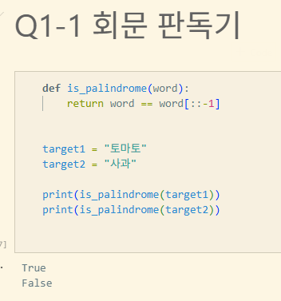
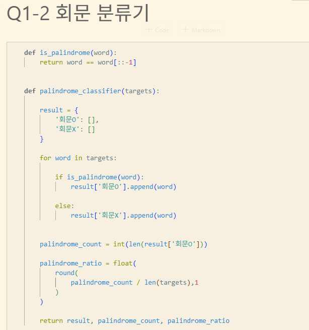
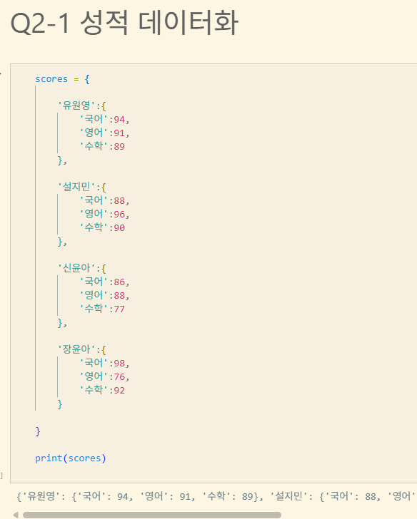
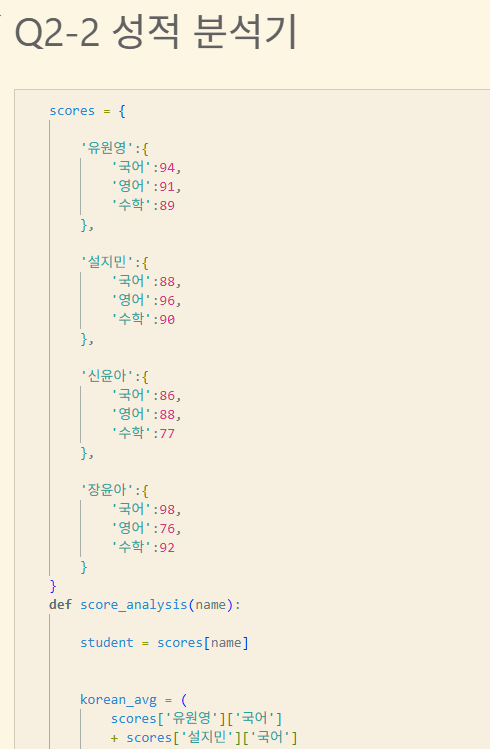

# AIFFEL Campus Online Code Peer Review Templete
- 코더 : 이소영.
- 리뷰어 : 이예령


# PRT(Peer Review Template)
- [x]  **1. 주어진 문제를 해결하는 완성된 코드가 제출되었나요?**
    - 제출 되었습니다  
    
    
    
            

- [x]  **2. 전체 코드에서 가장 핵심적이거나 가장 복잡하고 이해하기 어려운 부분에 작성된 주석 또는 doc string을 보고 해당 코드가 잘 이해되었나요?**  
    - 네 전체적인 코드 이해에 무리가 없었습니다. 
   
        
    
        
- [ ]  **3. 에러가 난 부분을 디버깅하여 문제를 해결한 기록을 남겼거나 새로운 시도 또는 추가 실험을 수행해봤나요?**
    - 디버깅과 에러에 관한 기록은 없었습니다.   
        
- [ ]  **4. 회고를 잘 작성했나요?**
    - 회고가 없었습니다   
        
- [ ]  **5. 코드가 간결하고 효율적인가요?**
    - 전체적으로 깔끔한 코드입니다만 Q2-2의 코드는 더 효율적으로 작성가능 할 수 있는 방법이 많지 않을까 합니다.   


# 회고(참고 링크 및 코드 개선)  

    Q1-2  
    - round함수로 소수점 첫째자리까지 반올림한게 디테일 했습니다.   
    Q2-2  
    - f-string을 사용하여 깔끔하게 출력했습니다. 
    - 소수점 자리수 포맷팅으로 round함수 사용없이 간단하게 소수점 자리수를 맞추었고 float타입임을 명시했습니다  
    - 부호표시 강제 옵션을 사용해서 별도의 조건문을 작성하지 않고 통일감 있는 성적표 양식을 출력할 수 있었습니다. 

- 인공지능을 사용하여 개선한 코드는 다음과 같습니다.   
```
def score_analysis_improved(name):
    student = scores[name]
    students_list = list(scores.keys())
    num_students = len(students_list)
    subjects = list(student.keys())
    num_subjects = len(subjects)
    
    # 1. 과목별 학급 평균 동적 계산
    class_subject_avg = {}
    for subj in subjects:
        total = sum(scores[s][subj] for s in students_list)
        class_subject_avg[subj] = total / num_students
        
    # 2. 학생 개인 평균 및 학급 전과목 평균 계산
    student_avg = sum(student.values()) / num_subjects
    class_avg = sum(class_subject_avg.values()) / num_subjects
    
    # 3. 결과 출력
    print(f'[{name} 성적 분석]')
    for subj in subjects:
        score = student[subj]
        avg = class_subject_avg[subj]
        diff = score - avg
        print(f'{subj}: {score}점, 학급 평균({avg:.2f}) 대비 {diff:+.2f}')
        
    print()
    print(f'전과목 평균:{student_avg:.2f}점, 학급 평균({class_avg:.2f}) 대비 {student_avg - class_avg:+.2f}')

```

