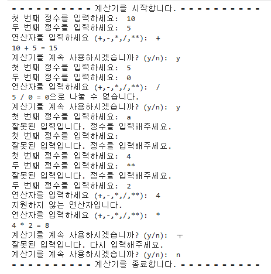
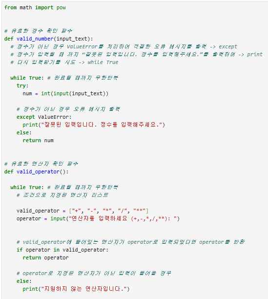
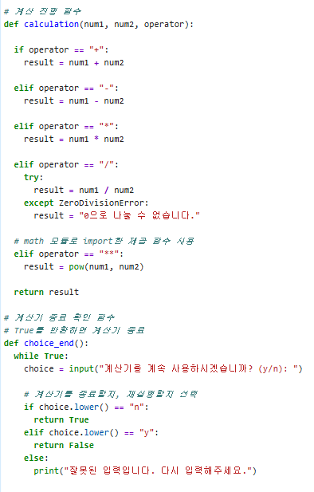
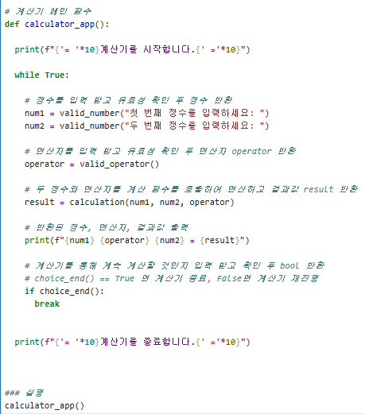
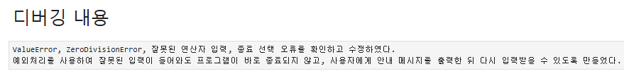
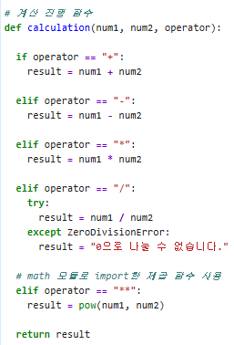
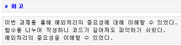

# AIFFEL Campus Online Code Peer Review Templete
- 코더 : 이소연
- 리뷰어 : 천세문


# PRT(Peer Review Template)
- [x]  **1. 주어진 문제를 해결하는 완성된 코드가 제출되었나요?**
    - 문제에서 요구하는 최종 결과물이 첨부되었는지 확인
        - 중요! 해당 조건을 만족하는 부분을 캡쳐해 근거로 첨부

      

    
- [x]  **2. 전체 코드에서 가장 핵심적이거나 가장 복잡하고 이해하기 어려운 부분에 작성된 
주석 또는 doc string을 보고 해당 코드가 잘 이해되었나요?**
    - 해당 코드 블럭을 왜 핵심적이라고 생각하는지 확인
    - 해당 코드 블럭에 doc string/annotation이 달려 있는지 확인
    - 해당 코드의 기능, 존재 이유, 작동 원리 등을 기술했는지 확인
    - 주석을 보고 코드 이해가 잘 되었는지 확인
        - 중요! 잘 작성되었다고 생각되는 부분을 캡쳐해 근거로 첨부

      
      
    

- 모든 코드 작성이 핵심적임
- 각 코드 블럭마다 기능과 작동 원리 등을 잘 기술되어 있음
        
- [x]  **3. 에러가 난 부분을 디버깅하여 문제를 해결한 기록을 남겼거나
새로운 시도 또는 추가 실험을 수행해봤나요?**
    - 문제 원인 및 해결 과정을 잘 기록하였는지 확인
    - 프로젝트 평가 기준에 더해 추가적으로 수행한 나만의 시도, 
    실험이 기록되어 있는지 확인
        - 중요! 잘 작성되었다고 생각되는 부분을 캡쳐해 근거로 첨부

      
      

- 사진과 같이 디버깅을 진행하였음
- 예외처리를 사용하여 잘못된 입력이 들어와도 프로그램이 바로 종료되지 않게 하였음
        
- [x]  **4. 회고를 잘 작성했나요?**
    - 주어진 문제를 해결하는 완성된 코드 내지 프로젝트 결과물에 대해
    배운점과 아쉬운점, 느낀점 등이 기록되어 있는지 확인
    - 전체 코드 실행 플로우를 그래프로 그려서 이해를 돕고 있는지 확인
        - 중요! 잘 작성되었다고 생각되는 부분을 캡쳐해 근거로 첨부
     
      

- 회고 잘 작성되었음
        
- [x]  **5. 코드가 간결하고 효율적인가요?**
    - 파이썬 스타일 가이드 (PEP8) 를 준수하였는지 확인
    - 코드 중복을 최소화하고 범용적으로 사용할 수 있도록 함수화/모듈화했는지 확인
        - 중요! 잘 작성되었다고 생각되는 부분을 캡쳐해 근거로 첨부

      

- 코드 진행 함수에 if, elif 구문 안에 try-except 예외처리를 사용하여 코드 내용 최소화 하였음


# 회고(참고 링크 및 코드 개선)
```
# 나의 퀘스트와 비교하였을 때 다른 점을 볼 수 있었다
# 나는 def 함수를 1번 사용하였고 소연님은 2번 사용하였다
# 유효 연산자를 확인하는 def valid_operator(): 함수를 이용하여 지정된 연산자를 입력하였는지 확인할 수 있다
# 이처럼 같은 퀘스트이지만 다른 방식으로도 작성할 수 있다는 것을 알았고 각 코드마다 무엇이 더 효율적이고 불필요하는지는 아직 상세히 알 수 없으나 지속적으로 체크해가면서 서로가 좋은 결과물 볼 수 있으면 좋겠다
```
