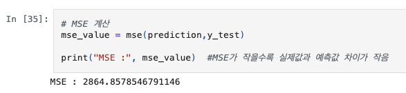
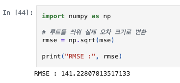
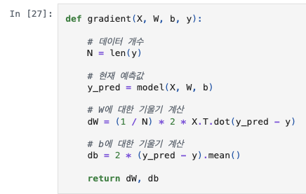
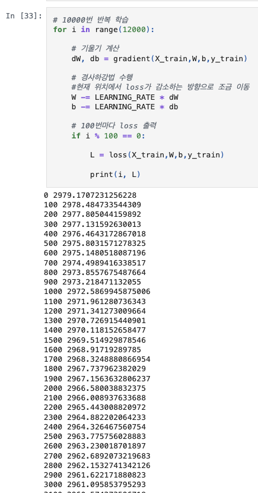
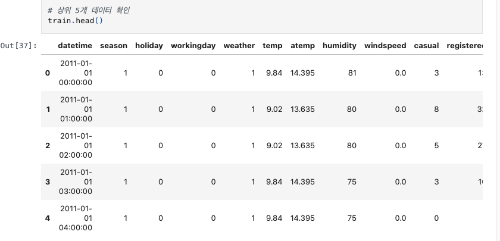
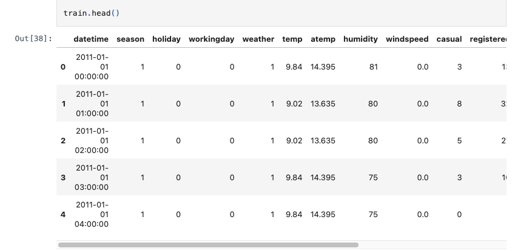
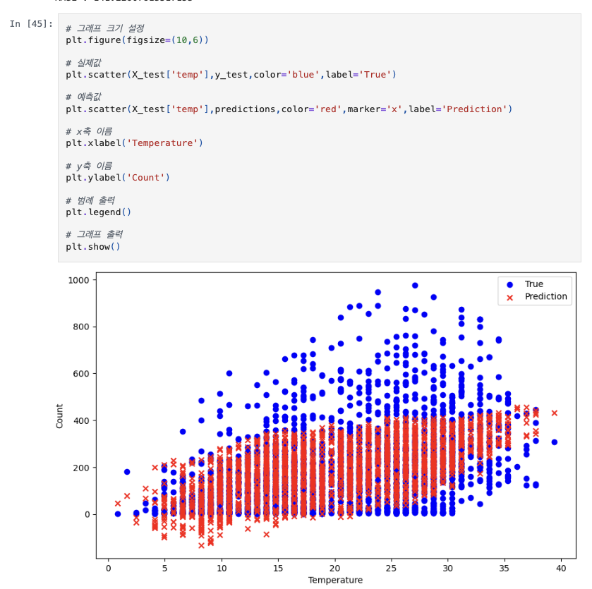
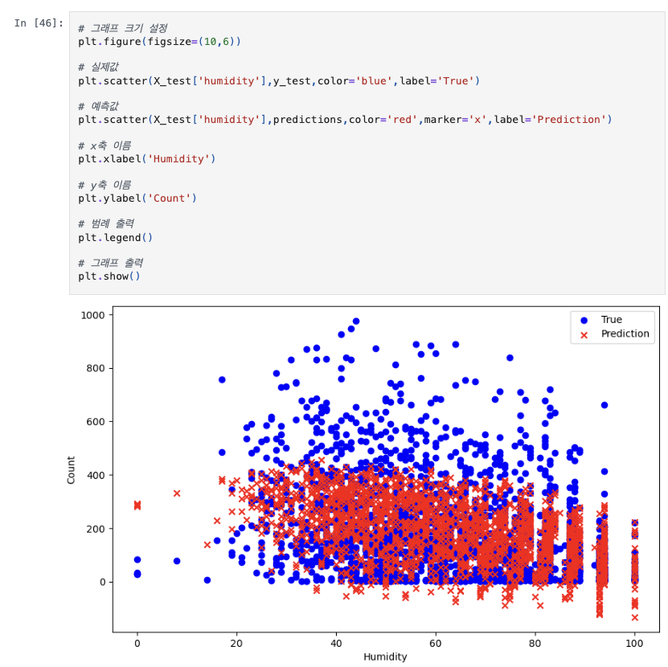

# AIFFEL Campus Online Code Peer Review Templete
- 코더 : 이소연
- 리뷰어 : 김민욱


# PRT(Peer Review Template)
- [x]  **1. 주어진 문제를 해결하는 완성된 코드가 제출되었나요?**
    - 문제에서 요구하는 최종 결과물이 첨부되었는지 확인
    - 프로젝트1(당뇨병 선형회귀 직접 구현), 프로젝트2(자전거 대여 수요 예측) 두 가지가 모두 끝까지 완성되어 있습니다.
    - 프로젝트1은 `model / mse / loss / gradient` 를 직접 구현하고 경사하강법으로 학습하여 **테스트 MSE 2864.86 (기준 3000 미만 충족)** 을 달성했습니다.
          
    - 프로젝트2는 `datetime`을 year/month/day/hour 로 분해해 feature로 추가한 뒤 LinearRegression으로 학습하여 **RMSE 141.23 (기준 150 미만 충족)** 을 얻었습니다.
          
- [x]  **2. 전체 코드에서 가장 핵심적이거나 가장 복잡하고 이해하기 어려운 부분에 작성된 주석 또는 doc string을 보고 해당 코드가 잘 이해되었나요?**
    - 가장 핵심적인 부분은 경사하강법의 기울기를 직접 계산하는 `gradient()` 함수라고 생각합니다. 손실(MSE)을 W, b에 대해 편미분한 식을 코드로 옮긴 부분이라 가장 이해가 까다로운 지점인데, 각 줄마다 주석이 잘 달려 있어 수식과 코드를 바로 연결해 이해할 수 있었습니다.  
          
      
    - 전체적으로 모든 셀에 한국어 주석이 충실히 달려 있어 코드의 의도를 따라가는 데 어려움이 없었습니다.

- [x]  **3. 에러가 난 부분을 디버깅하여 문제를 해결한 기록을 남겼거나 새로운 시도 또는 추가 실험을 수행해봤나요?**
    - 학습 반복 횟수를 주석의 10000번에서 실제 `range(12000)` 으로 늘려 손실이 더 떨어지도록 조정한 흔적이 보입니다.  
          
    - 프로젝트2에서 데이터 확인으로 상위 5개 데이터를 확인해보는 시도가 좋은 내용이라고 생각합니다.  
          
          
    - 프로젝트2에서 temperature뿐 아니라 humidity 기준으로도 산점도를 추가로 그려, 예측값이 실제값 분포를 어떻게 따라가는지 두 가지 관점에서 살펴본 점이 좋았습니다.  
          
          

- [ ]  **4. 회고를 잘 작성했나요?**
    - 노트북 마지막에 별도의 회고(배운 점/아쉬운 점/느낀 점) 셀이 비어 있어 회고 내용은 확인하지 못했습니다. 두 프로젝트에서 느낀 점을 간단히 정리해 주시면 좋을 것 같습니다.

- [x]  **5. 코드가 간결하고 효율적인가요?**
    - 전반적으로 변수명이 직관적이고 셀이 단계별로 잘 나뉘어 있어 흐름을 따라가기 쉬웠습니다.
    - 다만 `model()` 함수에서 `for i in range(10)` 으로 feature 개수를 직접 적어둔 부분은, `range(len(W))` 로 바꾸면 feature 수가 바뀌어도 그대로 동작합니다 (아래 회고 참고).  


# 회고(참고 링크 및 코드 개선)
```
[잘한 점]
- 주석이 수식 단위로 꼼꼼해서 리뷰하기 편했습니다.

[개선 제안 — model() 의 feature 개수 하드코딩]
현재 코드:

    def model(X, W, b):
        predictions = 0
        for i in range(10):              # 10이 직접 박혀 있어 feature가 바뀌면 같이 고쳐야 함
            predictions += X[:, i] * W[i]
        predictions += b
        return predictions

제안 코드 (range(10) → range(len(W))):

    def model(X, W, b):
        predictions = 0
        for i in range(len(W)):          # 가중치 개수만큼 자동으로 반복
            predictions += X[:, i] * W[i]
        predictions += b
        return predictions

- 로직은 그대로 두고 `10` → `len(W)` 만 바꾼 것이라 결과는 동일합니다.
- feature 개수가 데이터에 따라 자동으로 맞춰지므로, 프로젝트2처럼 feature 수가
  다른 경우에도 model() 을 고치지 않고 재사용할 수 있습니다.
```
