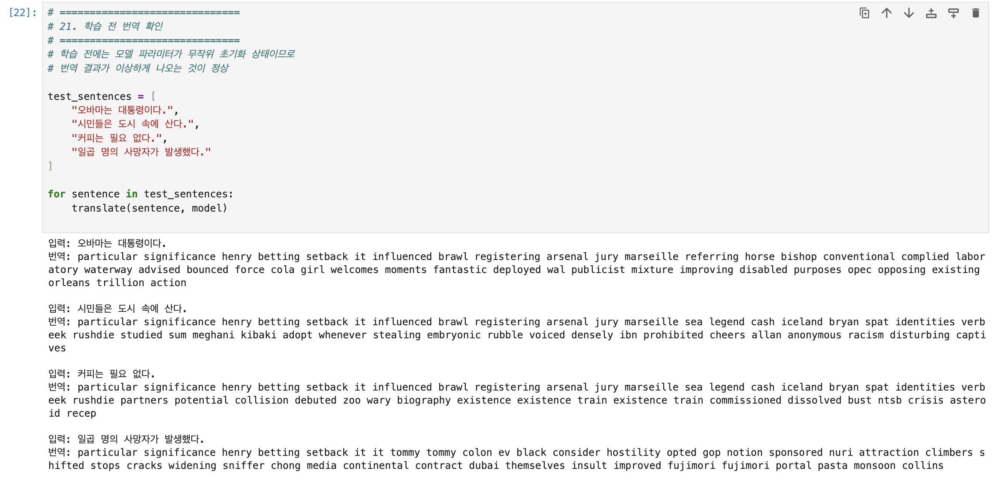
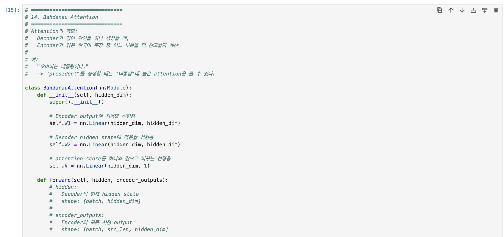
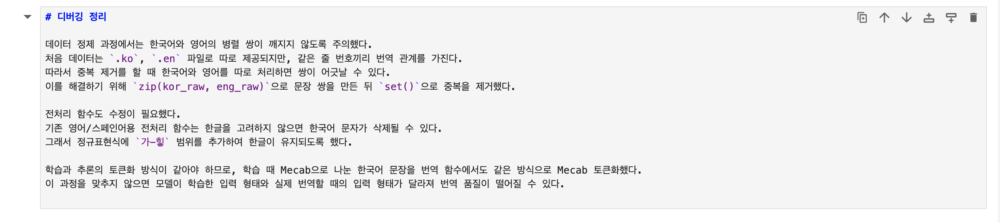
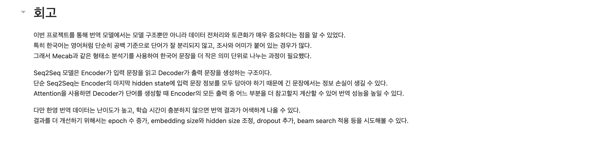
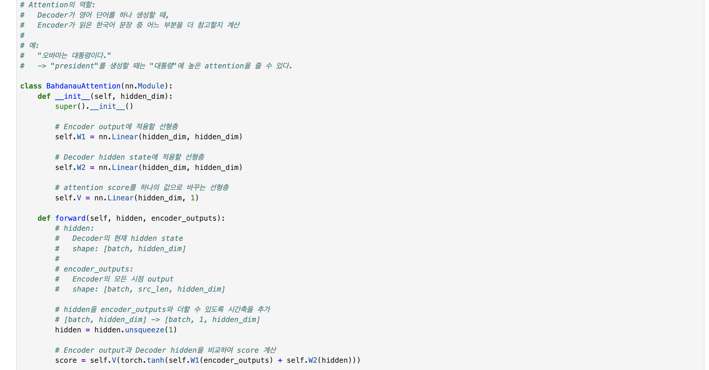

# AIFFEL Campus Online Code Peer Review Templete
- 코더 : 이소연
- 리뷰어 : 강경수

# PRT(Peer Review Template)
- [x]  **1. 주어진 문제를 해결하는 완성된 코드가 제출되었나요?**
  

> 데이터 다운로드 → 정제 → 토큰화 → Attention Seq2Seq → 훈련 → 번역까지 전 과정이 완성되어 에러 없이 동작합니다.
    
- [x]  **2. 전체 코드에서 가장 핵심적이거나 가장 복잡하고 이해하기 어려운 부분에 작성된 
주석 또는 doc string을 보고 해당 코드가 잘 이해되었나요?**
    

> Bahdanau Attention 셀에 **"역할 + 구체적 예시"**까지 주석으로 설명했습니다.
        
- [x]  **3. 에러가 난 부분을 디버깅하여 문제를 해결한 기록을 남겼거나
새로운 시도 또는 추가 실험을 수행해봤나요?**
      

> 별도 "디버깅 정리" 섹션을 두고 막힌 부분과 해결법을 명확히 기록했습니다.
        
- [x]  **4. 회고를 잘 작성했나요?**
  

> 전처리·토큰화의 중요성, Attention이 단순 Seq2Seq의 정보 손실을 어떻게 보완하는지까지 개념을 회고로 잘 정리되었습니다.
        
- [x]  **5. 코드가 간결하고 효율적인가요?**
  

> tokenize / Encoder / Decoder / Attention / train 등 기능별 함수·클래스로 깔끔하게 분리되어 재사용성이 좋습니다.

# 회고(참고 링크 및 코드 개선)

> 디버깅 정리 섹션에서 "왜 이렇게 했는지"를 명확히 기록한 점이 특히 인상적이었고, 주석에 예시까지 넣어 이해를 도운 게 좋았습니다. 번역 결과가 아직 거칠지만 회고에서 원인과 개선 방향을 잘 짚어두셔서 좋았습니다
