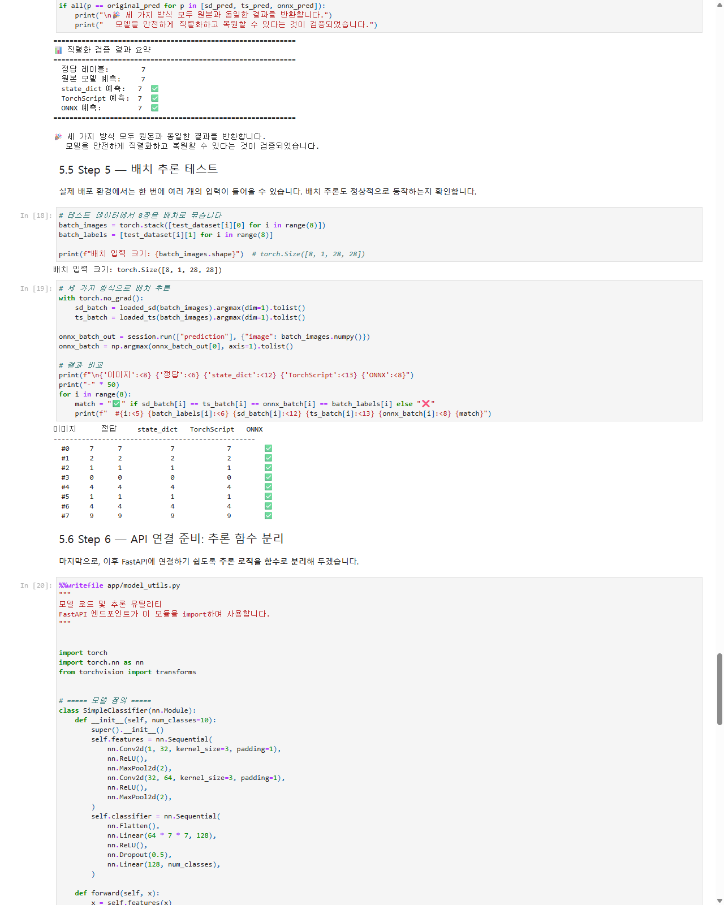
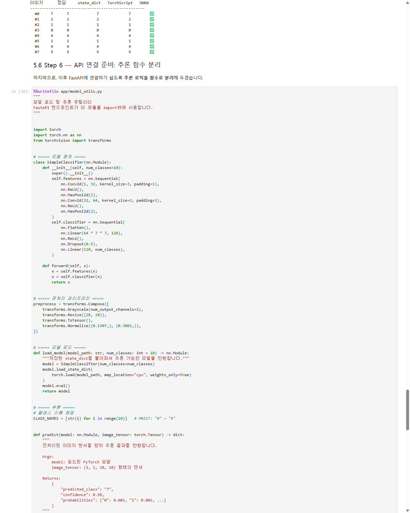
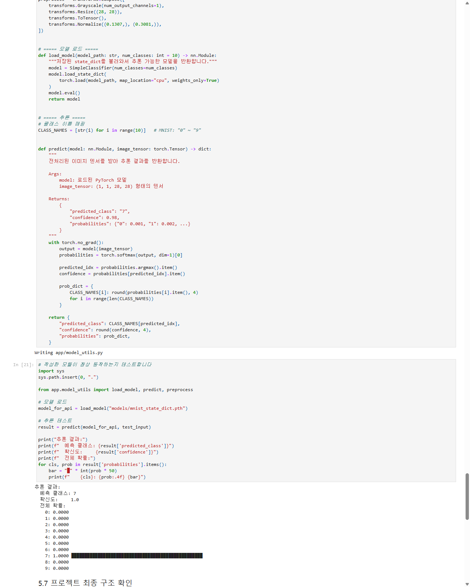
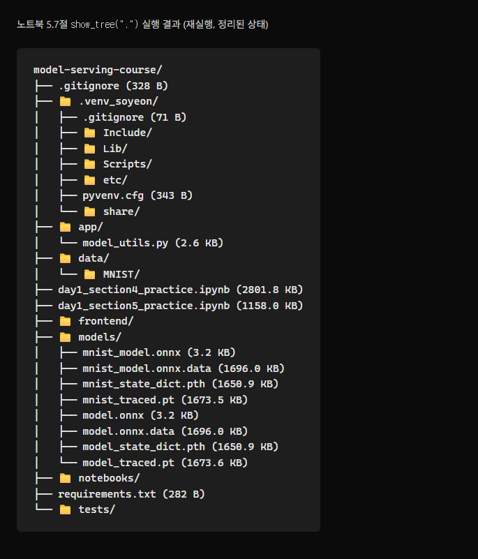

# 모델 배포 개론 — Day 1 제출

작성자: 이소연
날짜: 2026-08-13

---

## 1. 5-7절(배치 추론 / API 연결 준비 / 최종 구조 확인) 수행 내역 캡쳐

> `day1_section5_practice.ipynb`(섹션 5 전체를 추출한 실습 노트북)를 `jupyter nbconvert --execute`로 직접 실행한 결과입니다.
> MNIST 3 epoch 학습 결과 train accuracy 98.3%, 원본/`state_dict`/`TorchScript`/`ONNX` 네 가지 추론이 모두 동일 예측(정답 7)로 일치함을 확인했습니다.
>
> 최종 구조 확인(5.7) 전에 섹션 2.4~2.5(`requirements.txt` 작성, `app/frontend/notebooks/data/tests` 폴더 세팅)와 섹션 4의 실습 코드(랜덤 초기화 모델을 `models/model_state_dict.pth · model_traced.pt · model.onnx`로 저장·검증)도 별도 노트북(`day1_section4_practice.ipynb`)으로 실행해, 최종 트리에 두 세트(섹션 4의 `model_*` + 섹션 5의 `mnist_*`)가 모두 반영되도록 했습니다.

### Step 5 — 배치 추론 테스트
8장 배치 입력에 대해 `state_dict` / `TorchScript` / `ONNX` 세 방식의 예측이 모두 정답과 일치(8/8 ✅)하는지 확인했습니다.



### Step 6 — API 연결 준비: 추론 함수 분리
추론 로직을 `app/model_utils.py`(`load_model`, `predict`, `preprocess`)로 분리하고, 분리된 모듈을 다시 `import`하여 정상 동작(예측 클래스 7, 확신도 1.0)함을 검증했습니다.




### Step 7 — 최종 프로젝트 구조 확인
`models/`, `app/` 하위에 직렬화 파일과 유틸 모듈이, 프로젝트 루트에 `frontend/notebooks/tests/requirements.txt`가 정상 생성되었는지 트리로 확인했습니다.



> `models/`에 `mnist_*`(섹션 5, 학습된 MNIST 모델)와 `model_*`(섹션 4, 랜덤 초기화 데모 모델) 두 세트가 함께 있는 것이 정상입니다. `*.onnx.data`는 사용한 PyTorch ONNX exporter의 외부 데이터 저장 방식에 따라 생성된 파일입니다. 실행 환경이나 exporter 설정에 따라 `.onnx` 파일 하나만 생성될 수도 있습니다.

(전체 실행 로그와 셀 출력은 `day1_section4_practice.ipynb` / `day1_section5_practice.ipynb` / `day1_section5_practice.html` 참고)

---

## 2. 각 섹션의 체크포인트 답변

### 섹션 1 — 들어가며 (모델 학습 vs 배포)

**Q1. `.pth` 파일만 전달했을 때, 상대방이 모델을 바로 사용할 수 없는 이유는 무엇입니까?**
`.pth`(state_dict)에는 가중치(숫자) 값만 들어 있고 모델의 구조(클래스 정의)는 포함되어 있지 않기 때문입니다. 상대방은 동일한 모델 클래스 코드, 동일(또는 호환)한 PyTorch·라이브러리 버전, 그리고 실행 환경(파이썬 패키지 등)까지 갖추어야 `load_state_dict`로 복원해 사용할 수 있습니다. 이 중 하나라도 어긋나면 `ModuleNotFoundError`나 `size mismatch` 같은 에러가 발생합니다.

**Q2. 모델 학습(Training)과 모델 배포(Serving)의 핵심 차이를 한 문장으로 설명할 수 있습니까?**
학습은 "내가, 같은 환경에서, 정확도가 높은 모델을 만드는 것"이고, 배포는 "그 모델을 다른 환경·다른 사람·다른 언어에서도 안정적으로 쓸 수 있도록 세상에 꺼내놓는 것"입니다.

**Q3. 모델 배포에서 사용자와 서버가 소통하는 방식은 무엇입니까?**
HTTP 기반의 RESTful API(주로 JSON 요청/응답)를 통해 소통합니다. 사용자는 PyTorch나 모델 구조를 몰라도, 약속된 형식(JSON)으로 요청만 보내면 서버가 전처리→추론→후처리를 수행해 결과를 JSON으로 돌려줍니다.

---

### 섹션 2 — 환경 세팅 (venv / requirements.txt)

**Q1. 가상환경 없이 `pip install`을 하면 패키지가 어디에 설치됩니까? 그것이 왜 문제가 될 수 있습니까?**
전역(시스템) Python 환경에 설치됩니다. 이 경우 여러 프로젝트가 같은 패키지의 서로 다른 버전을 요구할 때 충돌이 발생하고, 한 프로젝트에서 설치·업그레이드한 패키지가 다른 프로젝트를 깨뜨릴 수 있습니다. 즉 "내 컴퓨터에서는 되는데" 문제의 주요 원인이 됩니다.

**Q2. `pip freeze`로 생성한 파일과 직접 작성한 `requirements.txt`의 차이는 무엇입니까?**
`pip freeze`는 현재 가상환경에 설치된 모든 패키지(의존성의 의존성까지 포함)와 정확한 버전을 그대로 덤프합니다. 재현성은 높지만 불필요한 패키지까지 포함될 수 있습니다. 반면 직접 작성한 `requirements.txt`는 프로젝트가 실제로 필요로 하는 핵심 패키지만 명시적으로 관리해 가독성과 유지보수성이 좋습니다.

**Q3. 동료에게 프로젝트를 전달할 때, `.venv` 폴더 대신 무엇을 공유해야 합니까?**
`.venv` 폴더 자체(수백 MB~수 GB, OS/경로 종속적)를 공유하는 대신 `requirements.txt`(또는 `pyproject.toml`)와 소스 코드만 공유합니다. 동료는 자신의 환경에서 `python -m venv`로 가상환경을 만들고 `pip install -r requirements.txt`로 동일한 패키지 구성을 재현하면 됩니다.

---

### 섹션 3 — RESTful API의 이해

**Q1. 모델 추론 요청에 GET이 아닌 POST를 사용하는 이유는 무엇입니까?**
GET은 주로 리소스를 조회하는 용도로 사용하며, 요청 본문을 일반적으로 사용하지 않습니다. 반면 모델 추론 입력은 이미지나 구조화된 JSON처럼 크고 복잡한 경우가 많으므로, 요청 본문에 데이터를 안정적으로 전달하고 처리 결과를 받을 수 있는 POST가 적합합니다.

**Q2. 상태 코드 `422`는 어떤 상황에서 발생합니까?**
요청은 서버에 도달했지만 입력 데이터의 형식이나 값이 서버가 기대하는 규약(예: Pydantic 스키마)과 맞지 않을 때, 즉 "입력 검증 실패" 상황에서 발생합니다(Unprocessable Entity).

**Q3. `requests.post(url, json=data)`에서 `json=` 파라미터는 내부적으로 어떤 일을 합니까?**
전달한 Python dict를 `json.dumps`로 직렬화해 요청 본문으로 넣고, `Content-Type: application/json` 헤더를 자동으로 설정해 보냅니다. 즉 직렬화와 헤더 설정을 한 번에 처리해 줍니다.

**Q4. Python의 `True`는 JSON에서 어떻게 표현됩니까?**
소문자 `true`로 표현됩니다 (마찬가지로 `None`은 `null`, 문자열은 반드시 큰따옴표로 표현됩니다).

**Q5. 상태 코드 `200`, `400`, `500`은 각각 어떤 상황을 의미합니까?**
`200 OK`는 요청이 정상적으로 처리된 경우, `400 Bad Request`는 요청의 문법이나 형식이 잘못된 경우, `500 Internal Server Error`는 서버 코드나 모델 추론 과정에서 내부 오류가 발생한 경우를 의미합니다. FastAPI에서는 요청 데이터가 Pydantic 스키마와 맞지 않을 때 일반적으로 `422 Unprocessable Entity`가 반환됩니다.

---

### 섹션 4 — 모델 직렬화 (state_dict / TorchScript / ONNX)

**Q1. `state_dict`로 저장한 `.pth` 파일을 불러올 때, 모델 클래스 정의가 필요한 이유는 무엇입니까?**
`state_dict`에는 가중치 텐서(숫자)만 저장되고 모델의 레이어 구성·연결 구조(forward 로직)는 저장되지 않기 때문입니다. 따라서 먼저 동일한 모델 클래스를 인스턴스화한 뒤 `load_state_dict`로 그 안에 가중치를 채워 넣어야 합니다.

**Q2. `torch.jit.trace`와 `torch.jit.script`는 각각 어떤 상황에서 사용합니까?**
`trace`는 더미 입력을 한 번 통과시켜 그 실행 경로(연산 그래프)를 기록하는 방식으로, 입력에 따라 분기(if/else)가 없는 대부분의 모델에서 안정적으로 동작합니다. `script`는 Python 코드 자체를 정적으로 분석·컴파일하기 때문에 입력값에 따라 실행 경로가 달라지는 동적 제어 흐름(조건문, 반복문)이 있는 모델을 변환할 때 사용합니다.

**Q3. ONNX의 가장 큰 장점은 무엇이며, 어떤 상황에서 선택해야 합니까?**
가장 큰 장점은 프레임워크 독립성입니다. PyTorch 등에서 학습한 모델을 ONNX라는 공용 형식으로 변환하여 ONNX Runtime, TensorRT, OpenVINO와 같은 다양한 추론 런타임과 C++·C#·Java·JavaScript 등 여러 언어 환경에서 실행할 수 있습니다. 프레임워크 간 호환성이나 추론 속도 최적화가 중요한 프로덕션 배포 상황에서 선택하는 것이 적합합니다.

**Q4. `torch.onnx.export()`에서 `dynamic_axes`를 지정하지 않으면 어떤 문제가 생길 수 있습니까?**
내보낼 때 사용한 더미 입력의 배치 크기(batch_size)로 고정되어 버립니다. 그러면 배포 후 실제 서비스에서 배치 크기가 1이 아닌 다른 값으로 들어올 경우 추론이 실패하거나 제한됩니다. 따라서 배치 크기가 가변적인 배포 환경에서는 `dynamic_axes`로 배치 축을 가변으로 지정해야 합니다.

---

### 섹션 5 — 실습 (모델 저장·불러오기·검증)

**Q1. 모델 저장 전에 `model.eval()`을 호출해야 하는 이유는?**
`model.eval()`은 Dropout을 비활성화하고 BatchNorm이 학습 중 누적한 통계를 사용하도록 모델을 추론 모드로 전환합니다. 특히 추론 결과를 검증하거나 TorchScript·ONNX로 내보내기 전에 호출하지 않으면 학습 모드의 동작이 반영되어 결과가 달라질 수 있습니다. 다만 `state_dict`의 가중치를 저장하는 행위 자체와 평가 모드 전환은 별개의 과정입니다.

**Q2. `predict()` 함수를 별도 모듈로 분리한 이유는 무엇입니까?**
추론 로직(전처리 → 모델 호출 → 후처리)을 노트북에서 `app/model_utils.py`라는 독립 모듈로 분리하면, 이후 FastAPI 서버가 이 모듈을 그대로 `import`해서 재사용할 수 있습니다. 즉 실험 코드와 서빙 코드를 분리해 재사용성과 유지보수성을 높이고, REST API 엔드포인트 구현 시 로직 중복을 없애기 위함입니다.

---

## 3. 프로젝트 구조

```
model-serving-course/
├── .venv_soyeon/                   # 가상환경 (고유 이름, Git 제외)
├── app/
│   └── model_utils.py              # load_model / predict / preprocess (섹션 5.6)
├── data/MNIST/                     # MNIST 원본 데이터 (Git 제외)
├── frontend/                       # Streamlit 프론트엔드 자리 (섹션 2.5, 추후 사용)
├── notebooks/                      # 노트북 보관 자리 (섹션 2.5)
├── tests/                          # 테스트 코드 자리 (섹션 2.5)
├── models/
│   ├── mnist_state_dict.pth / mnist_traced.pt / mnist_model.onnx   # 섹션 5, 학습된 모델
│   └── model_state_dict.pth / model_traced.pt / model.onnx         # 섹션 4, 데모(랜덤 초기화) 모델
├── requirements.txt                 # 섹션 2.4
├── day1_section4_practice.ipynb    # 섹션 4 실습 노트북 (실행 완료)
├── day1_section5_practice.ipynb    # 섹션 5(5.1~5.7) 실습 노트북 (실행 완료)
├── day1_section5_practice.html     # 위 노트북의 HTML 변환본 (캡쳐 원본)
├── captures/                       # 5-7절 수행 내역 스크린샷
│   ├── step5_batch_inference.png
│   ├── step6_api_prep.png
│   ├── step6_api_prep_output.png
│   └── step7_final_structure.png
├── .gitignore
└── Day1_제출.md                     # 본 제출 파일
```

> `models/*.pth·*.pt·*.onnx`, `data/`, `.venv_soyeon/`는 용량 문제로 Git에는 포함하지 않았습니다 (`.gitignore` 참고).
