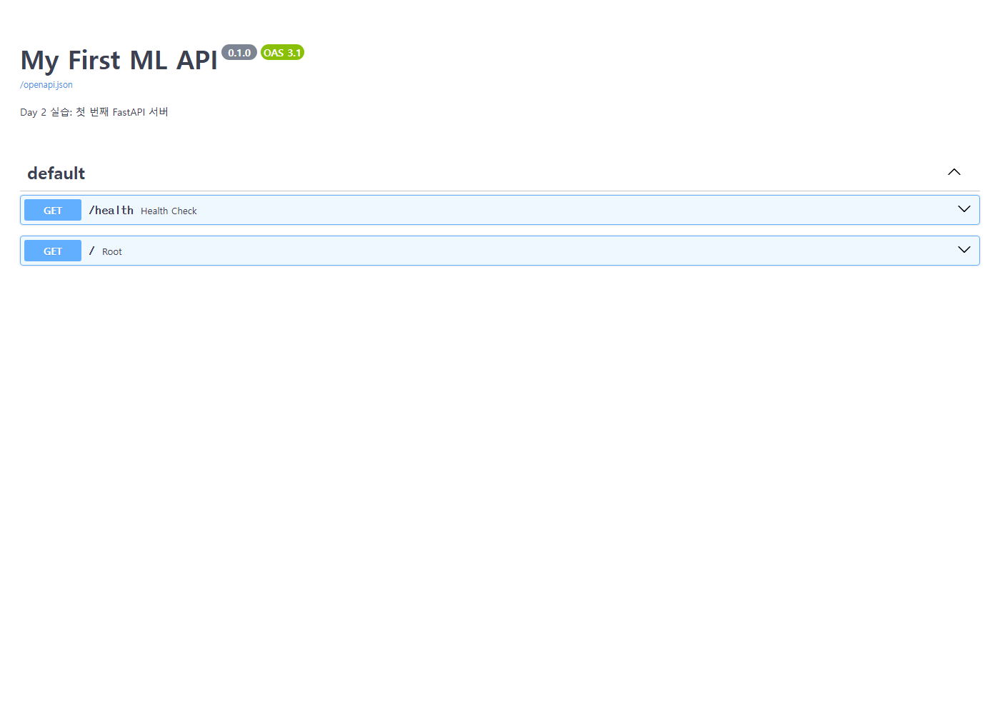
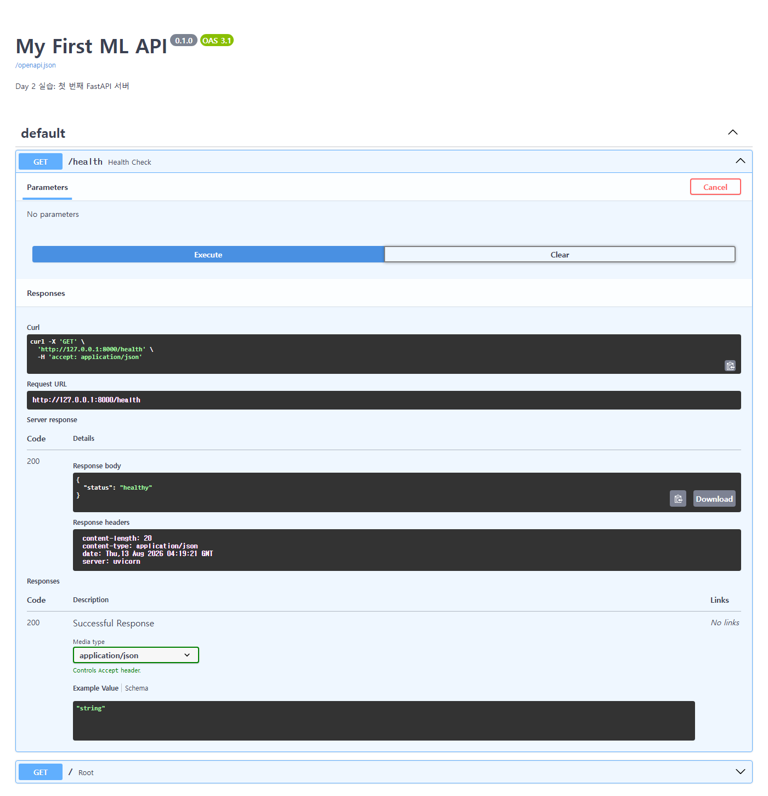
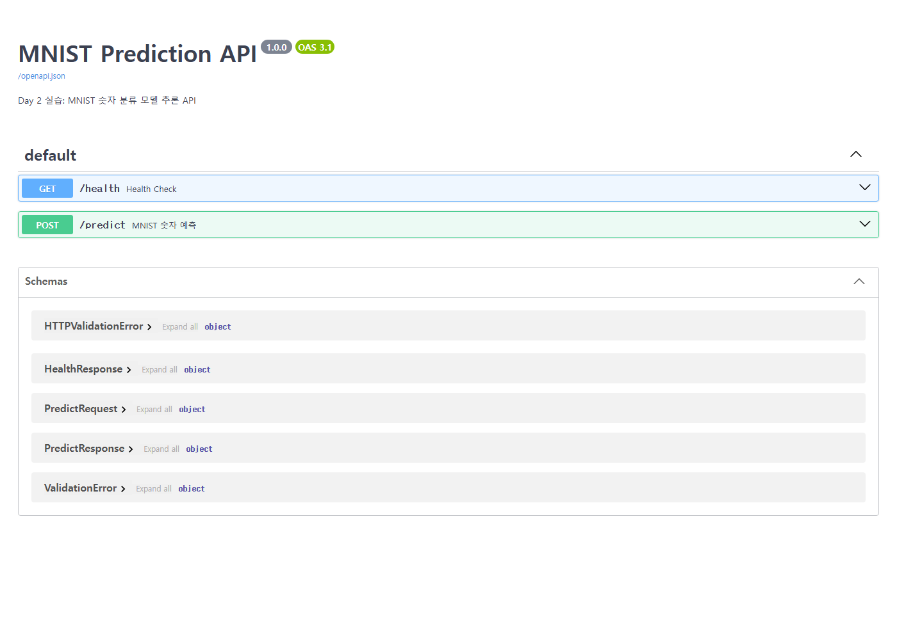
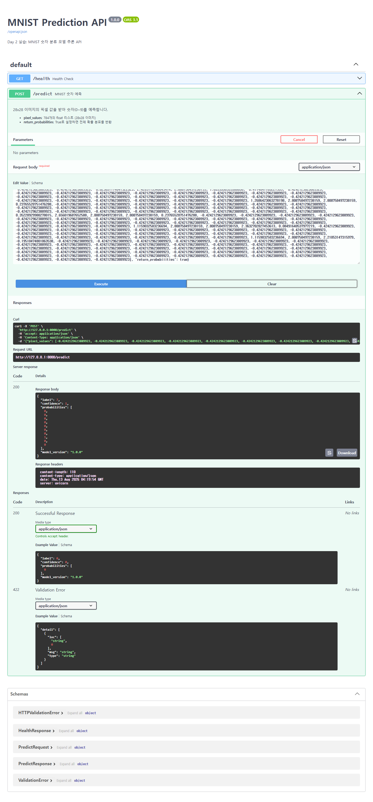
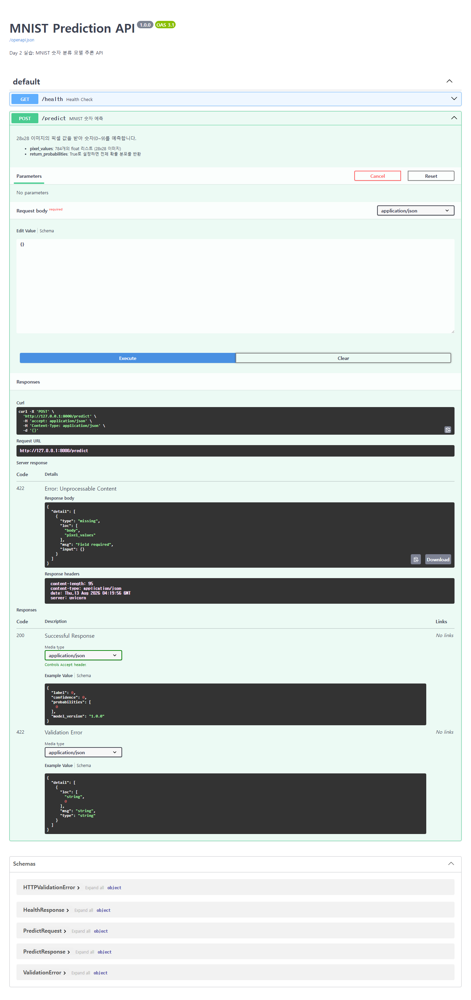

# 모델 배포 개론 — Day 2 제출

작성자: 이소연
날짜: 2026-08-13

---

## 1. 섹션 1.5 / 섹션 5 수행 내역

> 로컬 가상환경에서 Day 2 실습에 필요한 코드 셀을 실행했습니다. Day 1에서 준비한 `models/mnist_state_dict.pth`를 불러와 FastAPI 서버를 실행하고, 아래처럼 노트북 코드 셀과 그 실제 출력을 그대로 옮겨 정리했습니다. Swagger UI의 **[Try it out] → [Execute]** 기능으로 API를 직접 호출한 화면도 캡처로 함께 첨부합니다.

### 섹션 1.5 — 최소한의 FastAPI 서버 실행

**① 서버 코드 작성** (`%%writefile app/main_basic.py`)
```python
"""
최소한의 FastAPI 서버
"""
from fastapi import FastAPI

# FastAPI 인스턴스 생성
app = FastAPI(
    title="My First ML API",
    description="Day 2 실습: 첫 번째 FastAPI 서버",
    version="0.1.0",
)

# 엔드포인트 1: 헬스체크 (서버가 살아있는지 확인)
@app.get("/health")
def health_check():
    return {"status": "healthy"}

# 엔드포인트 2: 루트 경로
@app.get("/")
def root():
    return {
        "message": "ML Model Serving API",
        "docs_url": "/docs",
    }
```
```text
Writing app/main_basic.py
```

**② 서버 실행**
```python
serve_in_thread("app.main_basic:app", port=8000)
```
```text
서버 실행됨: http://127.0.0.1:8000
```

**③ 헬스체크 / 루트 엔드포인트 호출**
```python
import requests

response = requests.get("http://localhost:8000/health")
print(f"상태 코드: {response.status_code}")
print(f"응답: {response.json()}")
```
```text
상태 코드: 200
응답: {'status': 'healthy'}
```

```python
response = requests.get("http://localhost:8000/")
print(f"상태 코드: {response.status_code}")
print(f"응답: {response.json()}")
```
```text
상태 코드: 200
응답: {'message': 'ML Model Serving API', 'docs_url': '/docs'}
```

Swagger UI(`/docs`)에서 동일한 `GET /health`를 [Try it out] → [Execute]로 직접 실행한 화면입니다.




### 섹션 5 — 모델 추론 엔드포인트 구현 및 테스트

**① `app/model_utils.py` 작성 (Day 1 버전을 Day 2 요구사항에 맞게 갱신) 및 import 검증**
```python
from app.model_utils import load_model, predict, preprocess
print("✅ model_utils import 성공")

# 모델 로드 테스트
model = load_model("models/mnist_state_dict.pth")
print(f"✅ 모델 로드 성공: {type(model).__name__}")
```
```text
✅ model_utils import 성공
✅ 모델 로드 성공: SimpleClassifier
```

**② `app/schemas.py` 작성** (`%%writefile app/schemas.py`)
```python
"""
API 입출력 스키마 정의
"""

from pydantic import BaseModel, Field
from typing import Optional


class PredictRequest(BaseModel):
    """모델 추론 요청 스키마"""
    pixel_values: list[float] = Field(
        ...,
        min_length=784,       # 28 * 28 = 784
        max_length=784,
        description="28x28 이미지의 픽셀 값 (784개). 0.0~1.0 범위.",
        examples=[[0.0] * 784],   # Swagger UI에 예시로 표시
    )
    return_probabilities: bool = Field(
        default=False,
        description="True로 설정하면 전체 클래스별 확률을 함께 반환합니다.",
    )


class PredictResponse(BaseModel):
    """모델 추론 응답 스키마"""
    label: int = Field(description="예측된 숫자 (0~9)")
    confidence: float = Field(description="예측 확신도 (0.0~1.0)")
    probabilities: Optional[list[float]] = Field(
        default=None,
        description="각 클래스(0~9)별 확률. return_probabilities=True일 때만 포함.",
    )
    model_version: str = Field(default="1.0.0", description="사용된 모델 버전")


class HealthResponse(BaseModel):
    """헬스체크 응답 스키마"""
    status: str
    model_loaded: bool
```
```text
Writing app/schemas.py
```

**③ `app/main.py` 작성** (`%%writefile app/main.py`)
```python
"""
Day 2 실습: 모델 추론 API 서버
"""

from fastapi import FastAPI, HTTPException
import torch

from app.model_utils import load_model, predict
from app.schemas import (
    PredictRequest,
    PredictResponse,
    HealthResponse,
)

# ===== FastAPI 앱 생성 =====
app = FastAPI(
    title="MNIST Prediction API",
    description="Day 2 실습: MNIST 숫자 분류 모델 추론 API",
    version="1.0.0",
)

# ===== 모델을 서버 시작 시 한 번만 로드 =====
try:
    model = load_model("models/mnist_state_dict.pth")
    model_loaded = True
    print("✅ 모델 로드 완료")
except Exception as e:
    model = None
    model_loaded = False
    print(f"❌ 모델 로드 실패: {e}")


# ===== 엔드포인트 1: 헬스체크 =====
@app.get("/health", response_model=HealthResponse)
def health_check():
    """서버 상태와 모델 로드 여부를 확인합니다."""
    return HealthResponse(status="healthy", model_loaded=model_loaded)


# ===== 엔드포인트 2: 모델 추론 =====
@app.post("/predict", response_model=PredictResponse, summary="MNIST 숫자 예측")
def predict_digit(request: PredictRequest):
    """
    28x28 이미지의 픽셀 값을 받아 숫자(0~9)를 예측합니다.

    - **pixel_values**: 784개의 float 리스트 (28x28 이미지)
    - **return_probabilities**: True로 설정하면 전체 확률 분포를 반환
    """
    if not model_loaded:
        raise HTTPException(status_code=503, detail="모델이 로드되지 않았습니다. 서버 로그를 확인하세요.")

    try:
        input_tensor = torch.tensor(request.pixel_values, dtype=torch.float32)
        input_tensor = input_tensor.reshape(1, 1, 28, 28)  # (batch, channel, H, W)
    except Exception as e:
        raise HTTPException(status_code=400, detail=f"입력 데이터를 텐서로 변환할 수 없습니다: {str(e)}")

    try:
        result = predict(model, input_tensor)
    except Exception as e:
        raise HTTPException(status_code=500, detail=f"모델 추론 중 에러가 발생했습니다: {str(e)}")

    response = PredictResponse(
        label=result["label"],
        confidence=result["confidence"],
        model_version="1.0.0",
    )

    if request.return_probabilities:
        response.probabilities = [round(p, 4) for p in result["probabilities"]]

    return response
```
```text
Writing app/main.py
```

**④ 서버 실행 및 헬스체크**
```python
serve_in_thread("app.main:app", port=8000)
```
```text
✅ 모델 로드 완료
서버 실행됨: http://127.0.0.1:8000
```

```python
response = requests.get("http://localhost:8000/health")
print(f"상태 코드: {response.status_code}")
print(f"응답: {response.json()}")
```
```text
상태 코드: 200
응답: {'status': 'healthy', 'model_loaded': True}
```

**⑤ 실제 MNIST 테스트 이미지로 추론**
```python
from torchvision import datasets, transforms

test_dataset = datasets.MNIST(
    root="data", train=False, download=True,
    transform=transforms.Compose([
        transforms.ToTensor(),
        transforms.Normalize((0.1307,), (0.3081,)),
    ])
)

test_image, true_label = test_dataset[0]
print(f"이미지 크기: {test_image.shape}")
print(f"정답 레이블: {true_label}")

pixel_values = test_image.flatten().tolist()
print(f"픽셀 값 개수: {len(pixel_values)}")
```
```text
이미지 크기: torch.Size([1, 28, 28])
정답 레이블: 7
픽셀 값 개수: 784
```

```python
import json

response = requests.post(
    "http://localhost:8000/predict",
    json={
        "pixel_values": pixel_values,
        "return_probabilities": False,
    }
)

print(f"상태 코드: {response.status_code}")
print(f"응답:")
print(json.dumps(response.json(), indent=2, ensure_ascii=False))
```
```text
상태 코드: 200
응답:
{
  "label": 7,
  "confidence": 1.0,
  "probabilities": null,
  "model_version": "1.0.0"
}
```

정답(`7`)과 예측(`7`)이 정확히 일치했습니다.

**⑥ 확률 분포 포함 요청**
```python
response = requests.post(
    "http://localhost:8000/predict",
    json={
        "pixel_values": pixel_values,
        "return_probabilities": True,
    }
)

result = response.json()
print(f"예측: {result['label']} (확신도: {result['confidence']})")
print(f"\n클래스별 확률:")
for i, prob in enumerate(result['probabilities']):
    bar = "█" * int(prob * 50)
    print(f"  {i}: {prob:.4f} {bar}")
```
```text
예측: 7 (확신도: 1.0)

클래스별 확률:
  0: 0.0000 
  1: 0.0000 
  2: 0.0000 
  3: 0.0000 
  4: 0.0000 
  5: 0.0000 
  6: 0.0000 
  7: 1.0000 ██████████████████████████████████████████████████
  8: 0.0000 
  9: 0.0000 
```

**⑦ 10장 연속 테스트**
```python
print(f"{'이미지':<8} {'정답':<6} {'예측':<6} {'확신도':<10} {'결과'}")
print("-" * 45)

correct = 0
for i in range(10):
    image, true_label = test_dataset[i]
    pixel_values = image.flatten().tolist()

    response = requests.post(
        "http://localhost:8000/predict",
        json={"pixel_values": pixel_values}
    )
    result = response.json()

    is_correct = result["label"] == true_label
    if is_correct:
        correct += 1

    mark = "✅" if is_correct else "❌"
    print(f"  #{i:<5} {true_label:<6} {result['label']:<6} {result['confidence']:<10} {mark}")

print(f"\n정확도: {correct}/10 ({correct * 10}%)")
```
```text
이미지      정답     예측     확신도        결과
---------------------------------------------
  #0     7      7      1.0        ✅
  #1     2      2      1.0        ✅
  #2     1      1      1.0        ✅
  #3     0      0      1.0        ✅
  #4     4      4      1.0        ✅
  #5     1      1      1.0        ✅
  #6     4      4      0.9955     ✅
  #7     9      9      0.9955     ✅
  #8     5      5      0.9942     ✅
  #9     9      9      0.9999     ✅

정확도: 10/10 (100%)
```

**⑧ 에러 상황 4종 테스트**
```python
# 에러 1: 784개가 아닌 100개만 전송
response = requests.post("http://localhost:8000/predict", json={"pixel_values": [0.0] * 100})
print(f"상태 코드: {response.status_code}")
print(f"에러 메시지: {response.json()['detail'][0]['msg']}")
```
```text
상태 코드: 422
에러 메시지: List should have at least 784 items after validation, not 100
```

```python
# 에러 2: 숫자가 아닌 문자열 전달
response = requests.post("http://localhost:8000/predict", json={"pixel_values": "이것은 이미지가 아닙니다"})
print(f"상태 코드: {response.status_code}")
```
```text
상태 코드: 422
```

```python
# 에러 3: pixel_values 없이 요청
response = requests.post("http://localhost:8000/predict", json={"return_probabilities": True})
print(f"상태 코드: {response.status_code}")
print(f"에러: {response.json()['detail'][0]['msg']}")
```
```text
상태 코드: 422
에러: Field required
```

```python
# 에러 4: 빈 JSON 전송
response = requests.post("http://localhost:8000/predict", json={})
print(f"상태 코드: {response.status_code}")
```
```text
상태 코드: 422
```

Swagger UI에서 동일한 `POST /predict`를 [Try it out] → [Execute]로 직접 실행한 화면입니다.





> `day2_section5_predict_execute.png`는 노트북과 동일하게 MNIST 테스트셋의 첫 번째 이미지(정답 `7`)를 `pixel_values`(784개)로 그대로 전송한 것이며, 응답 `{"label": 7, "confidence": 1, ...}`이 위 노트북 실행 결과와 정확히 일치합니다.

(전체 실행 로그와 셀 출력은 `모델배포개론02.ipynb` / `모델배포개론02.html` 참고)

---

## 2. 섹션 2, 3 셀 출력

### 섹션 2 — Path / Query / Body 파라미터

**Path 파라미터**
```python
@app.get("/models/{model_name}")
def get_model_info(model_name: str):
    """특정 모델의 정보를 반환합니다."""
    return {
        "model_name": model_name,
        "status": "running",
        "version": "1.0.0",
    }
```
```python
response = requests.get("http://localhost:8000/models/sentiment-v1")
print(response.json())

response = requests.get("http://localhost:8000/models/image-classifier")
print(response.json())
```
```text
{'model_name': 'sentiment-v1', 'status': 'running', 'version': '1.0.0'}
{'model_name': 'image-classifier', 'status': 'running', 'version': '1.0.0'}
```

**Path 파라미터 + 타입 검증(int)**
```python
@app.get("/predictions/{prediction_id}")
def get_prediction(prediction_id: int):
    """특정 예측 결과를 조회합니다."""
    return {
        "prediction_id": prediction_id,
        "label": "긍정",
        "confidence": 0.92,
    }
```
```python
response = requests.get("http://localhost:8000/predictions/42")
print(f"상태: {response.status_code}, 응답: {response.json()}")

response = requests.get("http://localhost:8000/predictions/abc")
print(f"상태: {response.status_code}")
print(f"에러: {response.json()}")
```
```text
상태: 200, 응답: {'prediction_id': 42, 'label': '긍정', 'confidence': 0.92}
상태: 422
에러: {'detail': [{'type': 'int_parsing', 'loc': ['path', 'prediction_id'], 'msg': 'Input should be a valid integer, unable to parse string as an integer', 'input': 'abc'}]}
```

**Query 파라미터**
```python
@app.get("/models")
def list_models(status: str = None, limit: int = 10):
    models = [
        {"name": "sentiment-v1", "status": "running"},
        {"name": "image-clf-v2", "status": "running"},
        {"name": "ner-v1", "status": "stopped"},
    ]
    if status:
        models = [m for m in models if m["status"] == status]
    models = models[:limit]
    return {"total": len(models), "models": models}
```
```python
response = requests.get("http://localhost:8000/models")
print("전체 모델:", response.json())

response = requests.get("http://localhost:8000/models?status=running")
print("running만:", response.json())

response = requests.get("http://localhost:8000/models?status=running&limit=1")
print("running, 1개만:", response.json())
```
```text
전체 모델: {'total': 3, 'models': [{'name': 'sentiment-v1', 'status': 'running'}, {'name': 'image-clf-v2', 'status': 'running'}, {'name': 'ner-v1', 'status': 'stopped'}]}
running만: {'total': 2, 'models': [{'name': 'sentiment-v1', 'status': 'running'}, {'name': 'image-clf-v2', 'status': 'running'}]}
running, 1개만: {'total': 1, 'models': [{'name': 'sentiment-v1', 'status': 'running'}]}
```

**Request Body**
```python
class PredictRequest(BaseModel):
    text: str
    return_probabilities: bool = False

class PredictResponse(BaseModel):
    label: str
    confidence: float
    probabilities: Optional[dict] = None

@app.post("/predict", response_model=PredictResponse)
def predict(request: PredictRequest):
    result = {"label": "긍정", "confidence": 0.92}
    if request.return_probabilities:
        result["probabilities"] = {"긍정": 0.92, "부정": 0.05, "중립": 0.03}
    return result
```
```python
response = requests.post("http://localhost:8000/predict", json={"text": "이 영화 정말 재밌다"})
print("기본 응답:", response.json())

response = requests.post(
    "http://localhost:8000/predict",
    json={"text": "이 영화 정말 재밌다", "return_probabilities": True}
)
print("확률 포함:", response.json())
```
```text
기본 응답: {'label': '긍정', 'confidence': 0.92, 'probabilities': None}
확률 포함: {'label': '긍정', 'confidence': 0.92, 'probabilities': {'긍정': 0.92, '부정': 0.05, '중립': 0.03}}
```

**Body 검증 실패**
```python
# text 필드 누락
response = requests.post("http://localhost:8000/predict", json={"return_probabilities": True})
print(f"상태: {response.status_code}")
print(f"에러: {response.json()['detail'][0]['msg']}")

# text에 잘못된 타입 전달
response = requests.post("http://localhost:8000/predict", json={"text": 12345})
print(f"상태: {response.status_code}")
print(f"에러: {response.json()['detail'][0]['msg']}")
```
```text
상태: 422
에러: Field required
상태: 422
에러: Input should be a valid string
```

### 섹션 3 — Swagger UI / OpenAPI

**등록된 엔드포인트 확인 (`/openapi.json`)**
```python
response = requests.get("http://localhost:8000/openapi.json")
spec = response.json()

print(f"API 제목: {spec['info']['title']}")
print(f"API 버전: {spec['info']['version']}")
print(f"\n등록된 엔드포인트:")
for path, methods in spec['paths'].items():
    for method in methods:
        print(f"  {method.upper():6s} {path}")
```
```text
API 제목: Parameter Examples
API 버전: 0.1.0

등록된 엔드포인트:
  GET    /models/{model_name}
  GET    /predictions/{prediction_id}
  GET    /models
  POST   /predict
```

**`PredictRequest`의 JSON Schema 확인**
```python
predict_schema = spec['components']['schemas']['PredictRequest']
print("PredictRequest 스키마:")
print(json.dumps(predict_schema, indent=2, ensure_ascii=False))
```
```text
PredictRequest 스키마:
{
  "properties": {
    "text": {
      "type": "string",
      "title": "Text"
    },
    "return_probabilities": {
      "type": "boolean",
      "title": "Return Probabilities",
      "default": false
    }
  },
  "type": "object",
  "required": [
    "text"
  ],
  "title": "PredictRequest"
}
```

**ReDoc 동작 확인**
```python
resp = requests.get("http://localhost:8000/redoc")
print(f"상태: {resp.status_code}")
print(f"내용 길이: {len(resp.text)}")
```
```text
상태: 200
내용 길이: 902
```

(전체 셀 출력은 `모델배포개론02.ipynb` / `모델배포개론02.html`의 섹션 2, 3 참고)

---

## 3. 각 섹션의 체크포인트 답변

### 섹션 1 — FastAPI를 선택하는 이유

**Q1. FastAPI가 Flask보다 모델 배포에 적합한 이유 세 가지는 무엇입니까?**
① 자동 데이터 검증 — Pydantic이 내장되어 있어 요청이 모델에 도달하기 전에 타입·범위·길이를 자동 검증합니다. ② 자동 API 문서화 — 코드만 작성하면 Swagger UI(`/docs`)·ReDoc(`/redoc`) 문서가 자동 생성되어 별도 문서 작성이 필요 없습니다. ③ 비동기 처리 — async/await 기반(ASGI)이라 추론처럼 시간이 걸리는 작업 중에도 다른 요청을 동시에 처리할 수 있습니다.

**Q2. Uvicorn의 역할은 무엇이며, 왜 FastAPI와 함께 사용합니까?**
Uvicorn은 HTTP 요청을 받아 FastAPI 애플리케이션에 전달하는 ASGI 서버(웹 서버의 "문지기")입니다. FastAPI 자체는 요청을 직접 수신하는 기능이 없는 프레임워크이므로, ASGI 표준을 구현한 Uvicorn 같은 서버가 반드시 앞단에 필요합니다.

**Q3. `@app.get("/health")`에서 `get`과 `"/health"`는 각각 무엇을 의미합니까?**
`get`은 이 엔드포인트가 처리할 HTTP 메서드(GET)를, `"/health"`는 이 엔드포인트가 매핑되는 URL 경로를 의미합니다.

**Q4. FastAPI에서 dict를 반환하면 어떤 일이 자동으로 일어납니까?**
`json.dumps()`를 직접 호출하지 않아도 FastAPI가 반환된 dict를 자동으로 JSON 문자열로 직렬화하고, `Content-Type: application/json` 헤더를 설정해 응답합니다.

---

### 섹션 2 — Path, Query, Body

**Q1. `/models/sentiment-v1`에서 `sentiment-v1`은 어떤 종류의 파라미터입니까?**
Path 파라미터입니다. URL 경로 자체의 일부로 특정 리소스(모델)를 식별합니다.

**Q2. `/models?status=running&limit=5`에서 `status`와 `limit`은 어떤 종류의 파라미터입니까?**
Query 파라미터입니다. `?key=value` 형태로 필터링·검색 조건을 전달합니다.

**Q3. 모델 추론 요청에 Request Body를 사용하는 이유는 무엇입니까?**
모델 추론 입력은 텍스트·옵션 등 여러 필드로 구성된 복잡하고 구조화된 데이터이며, URL 길이 제한 없이 대량의 데이터를 담을 수 있어야 하기 때문입니다. "리소스를 처리해 달라"는 의미의 POST와 결합해, Body에 JSON으로 담아 보내는 것이 가장 자연스럽습니다.

**Q4. FastAPI에서 함수의 파라미터가 Path, Query, Body 중 어디서 오는지 어떻게 판별합니까?**
함수 파라미터 이름이 데코레이터의 URL 경로 `{}` 안에 선언되어 있으면 Path 파라미터로, Pydantic `BaseModel`을 타입으로 가지면 Request Body로 판별합니다. 그 외 `str`, `int` 같은 단순 타입이면서 경로에 없는 파라미터는 자동으로 Query 파라미터로 처리됩니다.

---

### 섹션 3 — Swagger UI

**Q1. FastAPI에서 Swagger UI에 접속하려면 어떤 URL로 이동합니까?**
`http://localhost:8000/docs` 입니다.

**Q2. Swagger UI가 코드와 항상 동기화될 수 있는 이유는 무엇입니까?**
Swagger UI는 별도로 관리되는 정적 문서가 아니라, FastAPI가 코드(타입 힌트·Pydantic 모델·데코레이터)로부터 매 요청 시 자동 생성하는 `/openapi.json` 스펙을 읽어 그 자리에서 렌더링하기 때문입니다. 코드가 바뀌면 스펙도 즉시 함께 바뀌므로 수동 동기화가 필요 없습니다.

**Q3. Pydantic 모델의 `Field(description=, examples=)`는 Swagger UI의 어디에 반영됩니까?**
해당 필드의 설명 텍스트와, Request body 입력란의 예시값(Example Value/Schema)에 반영되어 표시됩니다.

**Q4. Swagger UI와 ReDoc의 핵심 차이는 무엇입니까?**
Swagger UI(`/docs`)는 [Try it out]으로 브라우저에서 직접 요청을 실행해볼 수 있는 대화형 문서이고, ReDoc(`/redoc`)은 실행 기능 없이 스펙을 읽기 좋게 3단 레이아웃으로 보여주는 데 특화된 읽기 전용 문서입니다.

---

### 섹션 4 — Pydantic 입력 검증

**Q1. `text: str`과 `text: str = "기본값"`의 차이는 무엇입니까?**
전자는 기본값이 없는 필수 필드로, 요청에 값이 없으면 `ValidationError`(422)가 발생합니다. 후자는 기본값이 지정된 선택적 필드로, 생략하면 자동으로 `"기본값"`이 사용됩니다.

**Q2. `Field(..., min_length=1, max_length=5000)`에서 `...`은 무엇을 의미합니까?**
Python의 `Ellipsis` 객체이며, Pydantic에서는 "기본값이 없음 = 이 필드는 필수"라는 의미로 사용되는 관용적인 표기입니다.

**Q3. 422 에러 응답에서 `loc` 필드는 어떤 정보를 담고 있습니까?**
검증에 실패한 값의 위치 경로를 담습니다. 예를 들어 `["body", "text"]`는 요청 본문(body)의 `text` 필드에서 에러가 발생했다는 뜻입니다.

**Q4. `response_model`을 지정하면 어떤 이점이 있습니까?**
Swagger UI에 응답 스키마가 자동 문서화되고, 스키마에 정의되지 않은 필드는 응답에서 자동으로 제거되어 내부 데이터가 실수로 노출되는 것을 막을 수 있으며, 응답 데이터의 타입과 구조가 항상 보장됩니다.

---

### 섹션 5 — 모델 추론 엔드포인트 구현

**Q1. 모델을 서버 시작 시 한 번만 로드해야 하는 이유는 무엇입니까?**
모델 로드는 파일 I/O가 포함된 무거운 작업이라, 요청마다 로드하면 응답 시간이 수 초로 늘어나기 때문입니다. `app/main.py`에서 모델을 모듈 레벨(서버 시작 시 1회)에서 로드해 전역 변수로 유지하고, 이후 모든 `/predict` 요청은 이미 메모리에 올라온 동일 모델 객체를 재사용합니다.

**Q2. `pixel_values`가 784개가 아닌 요청이 들어오면 어떤 일이 발생합니까? 이를 처리하는 코드를 직접 작성했습니까?**
`app/schemas.py`의 `PredictRequest.pixel_values`에 `min_length=784, max_length=784`를 선언해 두었기 때문에, 개수가 다르면 요청이 엔드포인트 함수 안으로 들어오기도 전에 Pydantic이 자동으로 `422 Validation Error`로 거부합니다. 실제로 100개만 보냈을 때 `"List should have at least 784 items after validation, not 100"` 메시지를 그대로 확인했습니다. 즉 길이를 검사하는 `if`/`len()` 코드는 직접 작성하지 않았고, Pydantic `Field` 제약 선언만으로 검증이 이루어졌습니다.

**Q3. `HTTPException(status_code=503)`은 어떤 상황에서 사용했습니까? 왜 500이 아니라 503입니까?**
서버 시작 시 `load_model()`이 실패해 `model_loaded=False`인 상태로 `/predict`가 호출되었을 때 사용했습니다. `500`은 "요청 처리 도중 예기치 못한 서버 내부 오류"를 뜻하는 반면, `503(Service Unavailable)`은 "서비스 자체를 일시적으로 제공할 수 없음"을 의미합니다. 모델이 아예 준비되지 않아 애초에 추론을 수행할 수 없는 상황이므로, 요청 처리 중 발생한 오류(500)가 아니라 서비스 불가 상태(503)로 표현하는 것이 클라이언트 입장에서 더 정확한 정보입니다.

**Q4. Swagger UI에서 `PredictRequest`의 `description`과 `examples`가 어디에 표시됩니까?**
`POST /predict`를 펼쳤을 때 각 필드(`pixel_values`, `return_probabilities`) 옆의 설명 텍스트와, Request body 입력란에 자동으로 채워지는 예시(Example Value) JSON에 표시됩니다.

---

## 4. 프로젝트 구조

```
model-serving-course/
├── .venv_soyeon/                   # 가상환경 (Day 2에서 fastapi/uvicorn/pydantic/python-multipart 추가 설치)
├── app/
│   ├── main_basic.py                # 섹션 1.5, 최소 FastAPI 서버
│   ├── main_params.py               # 섹션 2, Path/Query/Body 실습 서버
│   ├── main.py                      # 섹션 5, 최종 MNIST 추론 API 서버
│   ├── schemas.py                   # 섹션 5, PredictRequest/PredictResponse/HealthResponse
│   └── model_utils.py               # load_model / predict / preprocess (Day 2 버전으로 갱신)
├── data/MNIST/                      # MNIST 원본 데이터 (Git 제외)
├── models/
│   └── mnist_state_dict.pth         # Day 1에서 저장한 학습된 모델 (그대로 재사용)
├── 모델배포개론02.ipynb              # Day 2 실습 노트북 및 실행 결과
├── 모델배포개론02.html               # 위 노트북의 HTML 변환본
├── captures/
│   ├── day2_section1_5_docs_overview.png    # 섹션 1.5, Swagger UI 개요
│   ├── day2_section1_5_health_execute.png   # 섹션 1.5, GET /health 실행 결과
│   ├── day2_section5_docs_overview.png      # 섹션 5, Swagger UI 개요
│   ├── day2_section5_predict_execute.png    # 섹션 5, POST /predict 실제 MNIST 추론 실행 결과
│   └── day2_section5_predict_422_error.png  # 섹션 5, POST /predict 에러 케이스(422) 실행 결과
├── Day1_제출.md
└── Day2_제출.md                     # 본 제출 파일
```

> Colab 전용 실행 부분을 제외하고 Day 2 실습에 필요한 서버 실행 및 API 테스트를 완료했으며, 주요 실행 결과와 Swagger UI 테스트 화면을 캡처로 첨부했습니다.

---

## 5. 최종 결과 및 회고

### 5.1 실습 목표와 구현 과정

이번 실습의 목표는 Day 1에서 학습하고 저장한 MNIST 분류 모델을 주피터 노트북 밖에서도 사용할 수 있도록 FastAPI 기반의 추론 API로 만드는 것이었습니다. 이전에는 노트북에서 직접 모델을 불러오고 추론 코드를 실행해야 결과를 확인할 수 있었지만, 이번에는 클라이언트가 HTTP 요청으로 데이터를 보내면 서버가 모델 추론을 수행하고 JSON 형식으로 결과를 반환하도록 구현했습니다. 이를 통해 학습된 모델이 실제 애플리케이션이나 다른 서비스에서 사용되기 위해서는 어떤 구조가 필요한지 전체 흐름을 경험할 수 있었습니다.

먼저 `app/main_basic.py`에 최소한의 FastAPI 애플리케이션을 작성하고 `GET /health`와 `GET /` 엔드포인트를 만들었습니다. Uvicorn으로 서버를 실행한 뒤 `/health`를 호출했을 때 상태 코드 `200`과 `{"status": "healthy"}`가 반환됐고, 루트 경로에서도 API 안내 메시지가 정상적으로 출력됐습니다. 이 과정을 통해 FastAPI가 API의 경로와 동작을 정의하는 프레임워크이고, Uvicorn은 실제로 HTTP 요청을 받아 애플리케이션에 전달하는 ASGI 서버라는 점을 이해했습니다.

그다음에는 Path, Query, Request Body 파라미터를 각각 구현하고 호출했습니다. 특정 모델이나 예측 결과처럼 하나의 리소스를 식별할 때는 Path 파라미터를 사용하고, 상태나 조회 개수처럼 검색 조건을 전달할 때는 Query 파라미터를 사용했습니다. 모델 추론에 필요한 텍스트나 픽셀 데이터처럼 구조가 복잡하고 양이 많은 입력은 Request Body에 JSON으로 전달했습니다. 단순히 세 가지 문법을 구분하는 데서 그치지 않고, 전달하려는 데이터의 역할에 따라 적절한 방식을 선택해야 한다는 점을 실제 요청 결과를 통해 확인했습니다.

### 5.2 모델 추론 API의 구성

최종 추론 API는 역할에 따라 파일을 분리해 구성했습니다. `app/model_utils.py`에는 모델 구조와 모델 로드 및 추론 기능을 두고, `app/schemas.py`에는 `PredictRequest`, `PredictResponse`, `HealthResponse`를 정의했습니다. `app/main.py`에서는 이 기능과 스키마를 불러와 `/health`와 `/predict` 엔드포인트를 연결했습니다. 기능을 하나의 파일에 모두 작성하지 않고 모델 처리, 데이터 규격, API 라우팅을 분리하니 각 파일의 책임이 명확해지고 코드를 수정하거나 오류를 확인하기도 쉬웠습니다.

모델은 서버가 시작될 때 `models/mnist_state_dict.pth`에서 한 번만 불러오도록 구현했습니다. 모델 파일을 요청마다 다시 읽으면 파일 입출력과 초기화가 반복되어 응답 속도가 느려지고 서버 자원이 낭비될 수 있기 때문입니다. 서버 시작 시 모델을 메모리에 올린 뒤 모든 `/predict` 요청에서 같은 모델 객체를 재사용하는 구조가 실제 모델 서빙에서 중요한 기본 원칙이라는 점을 배웠습니다. 모델 로드 성공 여부를 `model_loaded`로 관리하고 `/health` 응답에 포함함으로써, 서버 프로세스뿐 아니라 추론에 필요한 모델까지 준비됐는지 확인할 수 있도록 한 점도 의미가 있었습니다.

### 5.3 Pydantic 입력 검증을 통해 배운 점

이번 실습에서 가장 인상적이었던 부분은 Pydantic을 이용한 자동 입력 검증이었습니다. MNIST 이미지는 28×28 크기이므로 `pixel_values`가 정확히 784개여야 합니다. `PredictRequest`의 `Field`에 `min_length=784`와 `max_length=784`를 선언하자 길이를 검사하는 별도의 조건문을 작성하지 않아도 FastAPI가 엔드포인트 실행 전에 요청을 검증했습니다.

실제로 픽셀 값을 100개만 전송한 경우, 문자열을 전달한 경우, 필수 필드를 누락한 경우, 빈 JSON을 전송한 경우를 테스트했으며 모두 상태 코드 `422`로 거부됐습니다. 특히 빈 JSON 요청에서는 오류 위치가 `["body", "pixel_values"]`로 표시되고 `"Field required"`라는 메시지가 반환되어, 클라이언트가 어떤 값을 수정해야 하는지 구체적으로 알 수 있었습니다. 잘못된 데이터가 모델까지 전달되기 전에 요청 단계에서 차단되므로 서버 오류를 예방할 수 있고, 직접 검증 코드를 반복해서 작성하는 것보다 코드도 간결해진다는 장점을 확인했습니다.

응답에는 `response_model=PredictResponse`를 적용했습니다. 이를 통해 `label`, `confidence`, `probabilities`, `model_version`으로 응답 구조를 일정하게 유지하고 Swagger UI에도 같은 구조를 자동으로 문서화할 수 있었습니다. `return_probabilities`를 `False`로 보내면 기본 예측 결과만 반환하고, `True`로 보내면 숫자 0부터 9까지의 확률 분포를 추가로 반환하도록 구현하면서 필수 필드, 기본값, 선택적 필드의 차이도 이해할 수 있었습니다.

### 5.4 Swagger UI와 자동 문서화

Swagger UI는 단순히 API 목록을 보여주는 문서가 아니라, 브라우저에서 요청을 직접 실행할 수 있는 테스트 도구라는 점을 확인했습니다. `/docs`에 접속하자 코드에 정의한 `/health`와 `/predict`가 자동으로 나타났고, Pydantic 모델에 작성한 필드 설명과 예시도 요청 및 응답 스키마에 반영됐습니다. `[Try it out]`과 `[Execute]`를 이용해 실제 MNIST 픽셀 값을 전송하고 정상 응답과 `422` 오류 응답을 모두 확인할 수 있었습니다.

별도의 API 문서를 수동으로 작성하면 코드 변경 후 문서와 실제 동작이 달라질 수 있지만, FastAPI는 타입 힌트와 Pydantic 스키마를 바탕으로 OpenAPI 문서를 자동 생성합니다. 따라서 코드와 문서가 함께 갱신되고, 프론트엔드 개발자나 다른 사용자가 요청 형식과 응답 구조를 쉽게 확인할 수 있다는 장점을 체감했습니다. ReDoc 역시 같은 OpenAPI 정보를 읽기 편한 형태로 제공한다는 점을 확인했습니다.

### 5.5 실행 결과와 의미

실제 MNIST 테스트셋의 첫 번째 이미지에 대해 픽셀 값 784개를 `/predict`로 전송한 결과, 서버는 상태 코드 `200`, 예측값 `7`, 확신도 `1.0`을 반환했으며 실제 정답과 일치했습니다. `return_probabilities=True` 요청에서도 숫자 7에 가장 높은 확률이 부여된 전체 확률 분포가 정상적으로 반환됐습니다. 또한 테스트 이미지 10장을 연속으로 요청한 결과 10장 모두 정답과 같은 값을 예측했습니다.

이 결과는 저장된 모델이 정상적으로 로드됐고, MNIST 전처리 결과가 JSON 리스트로 변환된 뒤 API에 전달되고, 다시 PyTorch 텐서로 복원되어 추론과 응답 생성까지 이어지는 전체 과정이 올바르게 연결됐다는 것을 의미합니다. 다만 10장에 대한 `10/10` 결과는 이번 API 연결을 확인하기 위한 소규모 기능 테스트 결과이므로, 모델의 전체 정확도가 100%라는 뜻은 아닙니다. 모델 성능을 정확하게 평가하려면 전체 테스트셋에 대한 정확도, 클래스별 성능, 혼동 행렬 등을 추가로 확인해야 합니다.

오류 테스트에서도 서버가 중단되지 않고 모든 잘못된 입력에 적절한 `422` 응답을 반환했습니다. 정상 요청에서 원하는 예측값을 반환하는 것뿐 아니라 비정상 요청을 안전하게 처리했다는 점에서, 이번 실습의 API가 기본적인 안정성까지 확보했다고 판단했습니다. 또한 모델 미로드 시 `503`, 텐서 변환 실패 시 `400`, 추론 과정의 예상하지 못한 오류에는 `500`을 사용하도록 구분하면서 오류 원인에 맞는 HTTP 상태 코드의 중요성도 이해했습니다.

### 5.6 어려웠던 점과 해결 과정

주피터 노트북에서 서버를 실행하고 같은 노트북에서 다시 HTTP 요청을 보내야 했기 때문에, 일반적인 Python 코드 실행과 달리 서버가 계속 실행되는 상태를 관리해야 했습니다. 같은 포트에 이전 서버가 남아 있으면 새 코드가 반영되지 않거나 포트 충돌이 발생할 수 있으므로, 서버 실행 상태와 포트를 확인하는 과정이 중요했습니다. 또한 Colab 전용 코드와 로컬 환경에서 필요한 코드를 구분하고, 로컬에서는 이미 저장된 모델 파일을 재사용하도록 실행 순서를 정리해야 했습니다.

MNIST 이미지를 API로 전달할 때는 텐서를 그대로 보낼 수 없으므로 `flatten().tolist()`를 이용해 784개의 숫자 리스트로 바꿔야 했고, 서버에서는 다시 `torch.tensor`로 변환한 뒤 `(1, 1, 28, 28)` 형태로 복원해야 했습니다. 이 과정을 통해 모델이 기대하는 입력 형태와 API가 전송할 수 있는 JSON 데이터 사이에 변환 과정이 필요하다는 점을 알게 됐습니다. 추론 결과 역시 PyTorch 텐서 상태로 바로 반환하는 것이 아니라 Python의 숫자와 리스트 형태로 바꿔 응답 스키마에 맞춰야 했습니다.

### 5.7 아쉬운 점과 향후 개선 방향

이번 실습은 로컬 환경에서 모델 추론 API가 정상적으로 동작하는 단계까지 진행했기 때문에, 실제 외부 사용자가 접속하는 배포 환경까지는 확인하지 못했습니다. 다음 단계에서는 Docker를 사용해 Python과 패키지 버전을 포함한 실행 환경을 고정하고, 클라우드 서버에 배포해 외부 요청을 처리해 보고 싶습니다. 운영 환경에서는 요청 및 오류 로그, 응답 시간 측정, 인증과 접근 제어, CORS 설정, 동시 요청 처리, 모델 버전 관리도 함께 고려해야 합니다.

현재 API는 사용자가 784개의 픽셀 값을 직접 JSON으로 보내는 방식이므로 실제 사용성에는 한계가 있습니다. 향후에는 FastAPI의 `UploadFile`을 이용해 PNG나 JPG 이미지를 직접 업로드받고, 서버에서 크기 조정, 흑백 변환, 정규화까지 자동 처리하도록 개선할 수 있습니다. 여러 이미지를 한 번에 받는 배치 추론, 입력값의 범위와 비정상 수치 검증, 전체 테스트셋 기반의 성능 평가도 추가한다면 더욱 신뢰할 수 있는 서비스가 될 것입니다.

### 5.8 종합 회고

이번 실습을 통해 모델 배포는 학습된 가중치 파일을 저장하는 것으로 끝나는 것이 아니라는 점을 분명히 이해했습니다. 외부 서비스가 모델을 안정적으로 사용하려면 서버 실행, 엔드포인트 설계, 요청과 응답 스키마 정의, 입력 검증, 전처리, 모델 로드, 추론, 오류 처리 및 문서화가 하나의 흐름으로 연결돼야 합니다. FastAPI, Uvicorn, Pydantic, Swagger UI가 각각 어떤 역할을 담당하며 서로 어떻게 연결되는지 직접 구현하고 확인한 것이 가장 큰 학습 성과였습니다.

최종적으로 최소 FastAPI 서버 실행, Path·Query·Body 파라미터 처리, Pydantic 자동 검증, MNIST 모델 로드, 실제 이미지 추론, 확률 분포 반환, Swagger UI 테스트 및 오류 응답 확인까지 모두 정상적으로 완료했습니다. 이번 실습은 노트북 안에 있던 머신러닝 모델을 다른 프로그램에서 호출할 수 있는 서비스 형태로 전환해 본 경험이었으며, 앞으로는 실제 배포와 운영 단계까지 확장해 모델 서빙의 전체 과정을 익혀 보고 싶습니다.
