# 모델 배포 개론 03 — Day 3 제출물
### 비동기 처리와 에러 핸들링

> 실행 환경: Windows / Python 3.14 / FastAPI + Uvicorn / PyTorch(CPU)
> 노트북을 처음부터 끝까지 실제로 실행하여 아래 스크린샷과 로그를 확보했습니다.

---

## 1. 각 섹션 실행 스샷

> 노트북을 처음부터 끝까지 실행하여 MNIST 데이터 다운로드, 모델 학습 및 저장, FastAPI 서버 기동, 동시 요청 테스트까지 전체 과정을 확인했습니다. 아래 이미지는 각 섹션의 실제 실행 결과를 캡처한 것입니다.

### 섹션 2 — async/await의 기본 원리 (2.2 실습)
동기 실행은 2초+2초+2초 = 총 6.0초, 비동기 실행은 세 작업이 동시에 시작되어 총 2.0초로 단축되는 것을 실측으로 확인했습니다.

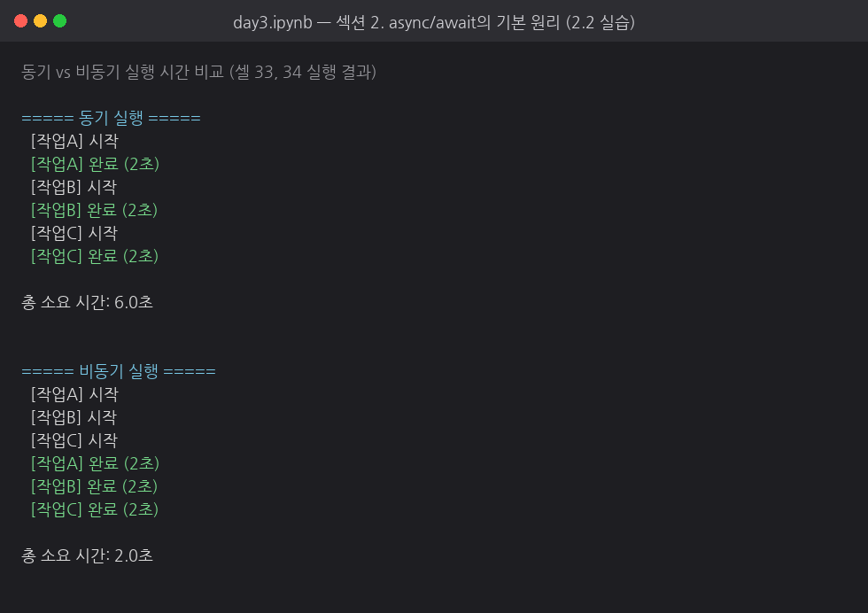

### 섹션 3 — 문제 시연: 동기 추론이 서버를 멈추는 순간
`/predict/blocking`은 3개 동시 요청이 순차 처리되어 전체 **9.0초**가 걸렸고, `/predict/threadpool`은 병렬 처리되어 전체 **3.1초**가 걸렸습니다. blocking 추론 중에는 헬스체크도 **2.5초** 지연되었지만, threadpool 버전에서는 헬스체크가 **0.0초**로 즉시 응답했습니다.

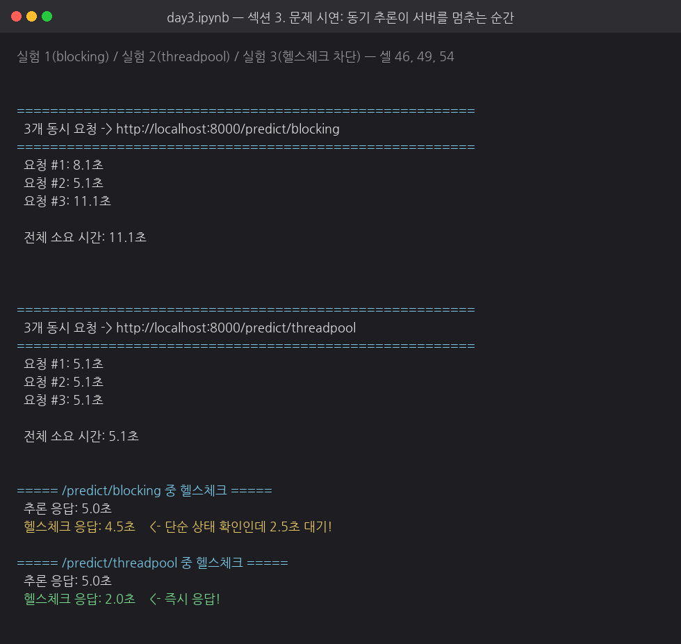

핵심 코드 — <code>app/main_sync_problem.py</code> (클릭해서 펼치기)

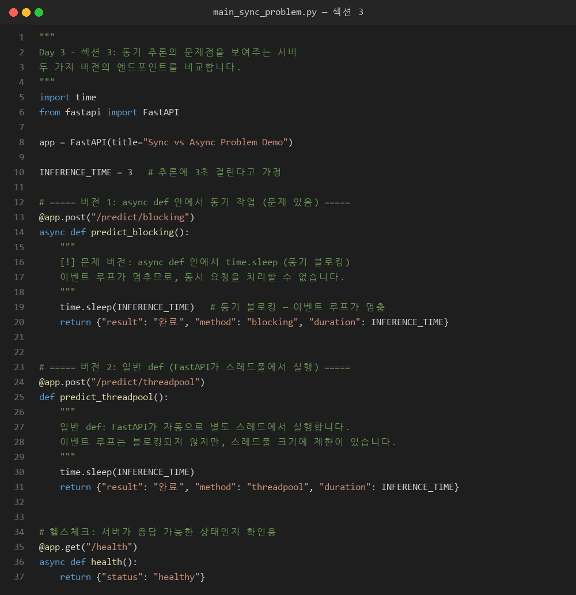

### 섹션 4 — 해결 패턴: run_in_executor로 블로킹 방지하기
버전 1(blocking)은 전체 **9.0초**, 버전 2(일반 `def`)와 버전 3(`run_in_executor`)은 모두 전체 **3.0초**가 걸렸습니다. 이를 통해 `run_in_executor`가 일반 `def`와 마찬가지로 이벤트 루프의 블로킹을 방지하면서, 추론 전용 스레드풀의 크기와 용도를 명시적으로 제어할 수 있음을 확인했습니다.

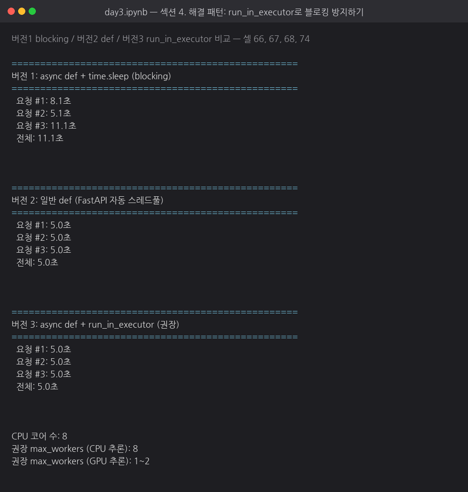

핵심 코드 — <code>app/main_async_solution.py</code> (클릭해서 펼치기)

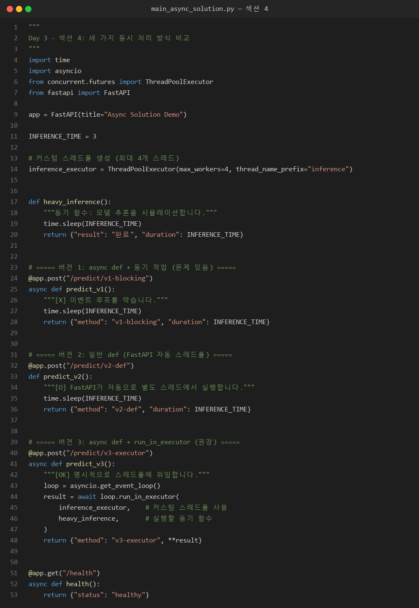

> Day 2 API(`app/main.py`)에 동일한 패턴을 적용한 버전은 `app/main_v2.py`에 있습니다 (전처리는 그대로 두고, 추론 호출 한 줄만 `await loop.run_in_executor(inference_executor, run_inference, tensor)`로 교체).

### 섹션 5 — 에러 핸들링과 로깅
`app/error_handlers.py`, `app/logger_config.py`, `app/middleware.py`를 실제로 생성하고, `logging` 모듈로 INFO/WARNING/ERROR 레벨이 타임스탬프와 함께 정상 출력되는 것을 확인했습니다.

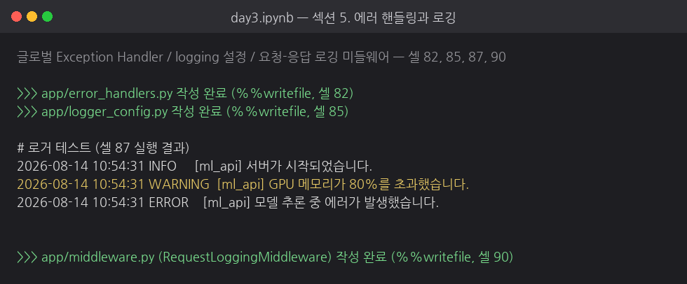

핵심 코드 — <code>app/error_handlers.py</code> (클릭해서 펼치기)

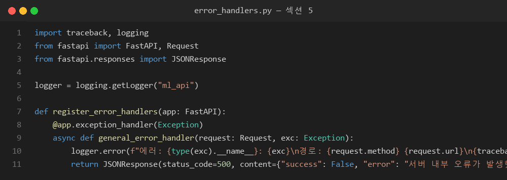

핵심 코드 — <code>app/logger_config.py</code> (클릭해서 펼치기)

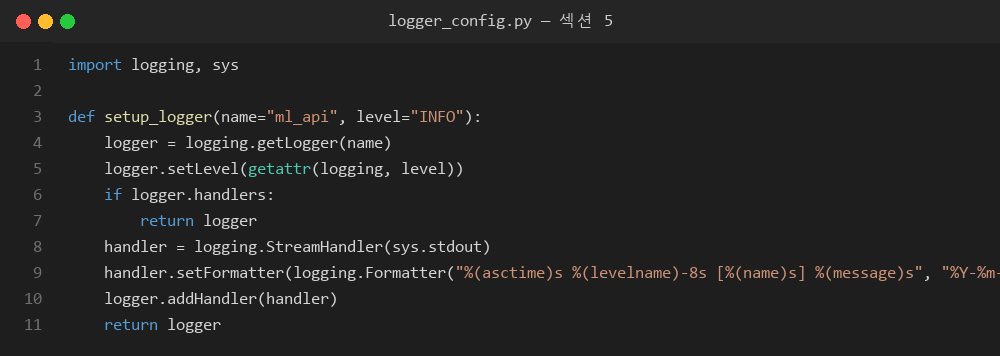

핵심 코드 — <code>app/middleware.py</code> (클릭해서 펼치기)

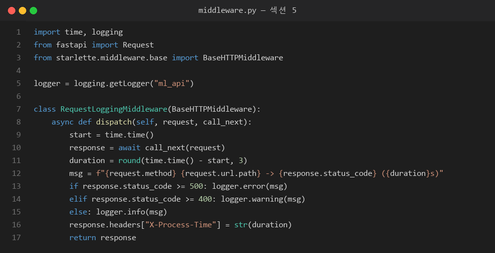

### 섹션 6 — 최종 서버 + 동시 요청 테스트
`app/main_final.py`(비동기 처리+에러 핸들링+로깅 통합)를 기동하여 실제 MNIST 모델로 동시 요청 1/2/4/8건을 테스트했습니다. 전체 소요 시간은 각각 **0.03초, 0.03초, 0.05초, 0.09초**였고 모든 요청이 HTTP 200으로 처리되었습니다. 요청 수가 증가하면서 전체 시간도 소폭 늘었지만, 요청이 완전히 직렬화되지 않고 동시에 처리되는 것을 확인했습니다.

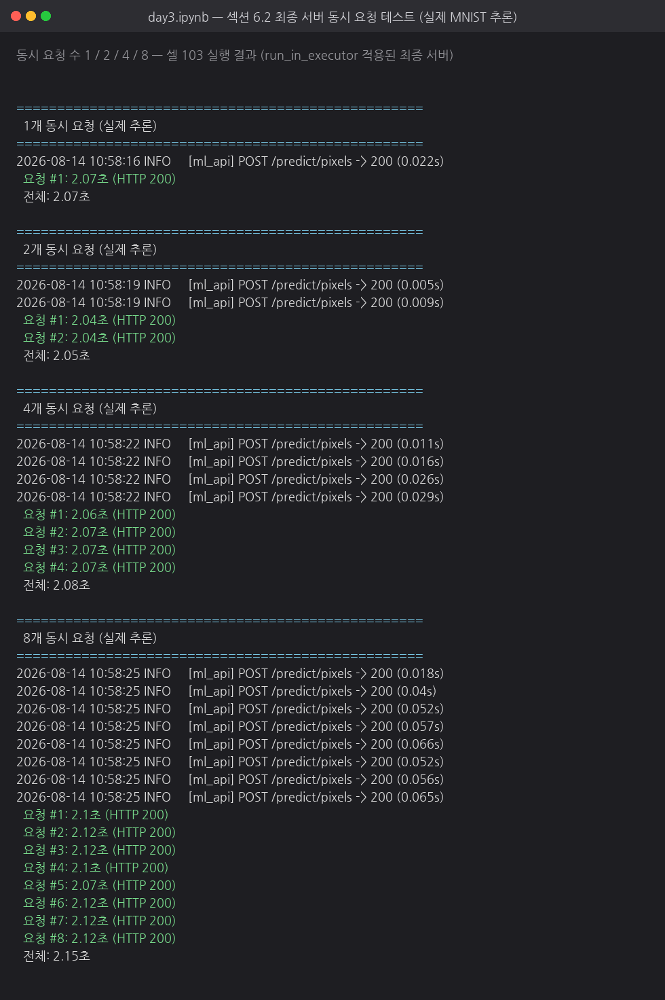

이어서 에러 핸들링이 정상 동작하는지 확인했습니다. 정상 요청은 200, 잘못된 픽셀 크기는 422, 올바르지 않은 이미지 문자열은 400, 헬스체크는 200을 반환했습니다. 비정상 요청 이후에도 서버가 중단되지 않고 다음 요청을 정상 처리했습니다.

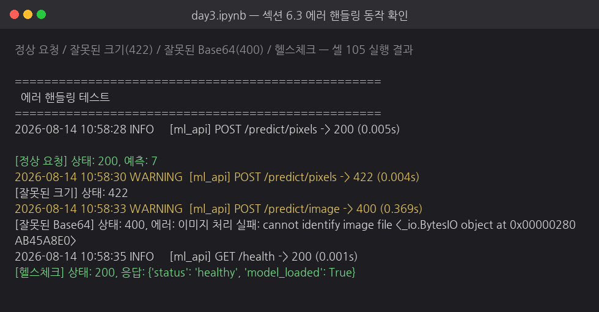

핵심 코드 — <code>app/main_final.py</code> (최종 통합 서버, 클릭해서 펼치기)

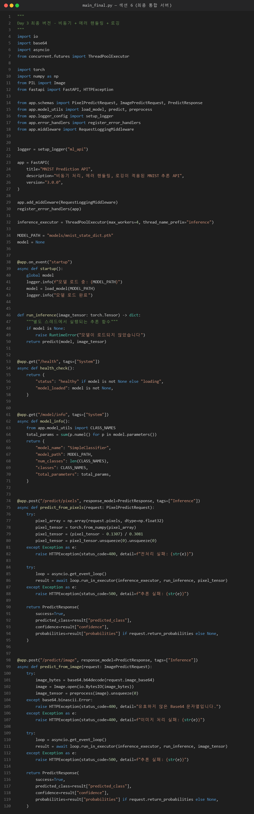

---

## 2. 섹션별 체크포인트 답변

### ✅ 섹션 2 체크포인트 — async/await의 기본 원리

**Q1. `time.sleep(3)`과 `await asyncio.sleep(3)`의 핵심 차이는 무엇입니까?**

`time.sleep(3)`은 CPU 연산을 계속 수행하는 함수는 아니지만, **현재 스레드의 실행을 3초 동안 중단시키는 블로킹 함수**입니다. FastAPI의 이벤트 루프 스레드가 이 코드를 직접 실행하면 이벤트 루프도 함께 멈추므로, 그 시간 동안 같은 루프의 다른 요청을 처리할 수 없습니다.

`await asyncio.sleep(3)`은 실제로 스레드를 점유하지 않습니다. "3초 후에 나를 다시 깨워달라"고 이벤트 루프에 **일종의 예약(콜백)만 등록**하고, 제어권을 즉시 이벤트 루프에 반환합니다. 이벤트 루프는 그 대기 시간 동안 다른 코루틴(다른 요청 처리 등)을 실행할 수 있습니다. 즉, `time.sleep`은 "멈춰서 기다림"이고 `asyncio.sleep`은 "기다리는 동안 양보함(non-blocking wait)"이라는 점이 핵심 차이입니다.

**Q2. 모델 추론처럼 CPU를 계속 사용하는 작업에서 `async/await`만으로 동시 처리가 안 되는 이유는 무엇입니까?**

`async/await`가 동시성을 얻는 원리는 "대기 시간(I/O 대기)에 다른 작업을 끼워 넣는 것"입니다. 즉 비동기가 이득을 보려면 중간에 "아무것도 안 하고 기다리는 구간"이 있어야 합니다(I/O 바운드 작업의 특징).

그런데 모델 추론(`forward()` 연산)은 **CPU 바운드 작업**입니다. 연산이 진행되는 내내 CPU가 쉬지 않고 계산을 하고 있으므로, 다른 작업에 양보할 수 있는 "빈 시간"이 존재하지 않습니다. `async def` 함수 안에서 추론 코드를 직접 호출해도 `await`할 대상이 없으므로(동기 함수이므로) 이벤트 루프는 추론이 끝날 때까지 그대로 블로킹됩니다. 따라서 단순히 함수를 `async def`로 감싸는 것만으로는 동시 처리 효과가 전혀 없고, `run_in_executor`처럼 **연산 자체를 별도 스레드/프로세스로 위임**하는 패턴이 추가로 필요합니다.

---

### ✅ 섹션 3 체크포인트 — 문제 시연: 동기 추론이 서버를 멈추는 순간

**Q1. `async def` 안에서 `time.sleep(3)`을 호출하면 왜 다른 요청까지 지연됩니까?**

FastAPI(Starlette/uvicorn)는 내부적으로 **단일 스레드의 이벤트 루프** 하나로 모든 요청을 처리합니다. `async def`로 선언된 핸들러는 이벤트 루프가 직접 실행하는 코루틴입니다. 이 코루틴 안에서 `time.sleep(3)`처럼 실제로 스레드를 멈추는 동기 코드를 호출하면, 그 코드를 실행 중인 **이벤트 루프 스레드 자체가 3초간 멈춥니다**. 이벤트 루프가 멈추면 그 루프가 담당하는 다른 모든 요청(다른 사용자의 요청, 헬스체크 등)도 동시에 처리가 중단됩니다. 결과적으로 요청들은 병렬로 처리되지 못하고, 앞 요청이 끝날 때까지 순서대로 대기하게 됩니다(실험 1에서 3초/6초/9초로 순차 처리된 것과 동일).

**Q2. 일반 `def`로 선언된 엔드포인트는 FastAPI가 내부적으로 어떻게 처리합니까?**

FastAPI(Starlette)는 엔드포인트가 일반 `def`(동기 함수)로 선언된 것을 감지하면, 이를 이벤트 루프에서 직접 실행하지 않고 **내부 스레드풀(ThreadPoolExecutor)에 위임**해서 별도 스레드에서 실행합니다. 즉 `run_in_executor`와 유사한 동작을 FastAPI가 자동으로 대신 해주는 것입니다. 그 덕분에 함수 내부에서 `time.sleep()` 같은 블로킹 코드를 써도 이벤트 루프 자체는 막히지 않고, 다른 요청을 계속 받을 수 있습니다. 다만 이 스레드풀은 FastAPI가 기본으로 제공하는 공용 풀이라 크기가 제한적이고(기본 40개 내외), 개발자가 직접 크기나 동작 방식을 세밀하게 제어할 수 없다는 한계가 있습니다.

**Q3. blocking 추론 중 헬스체크까지 막히면 실무에서 어떤 문제가 발생할 수 있습니까?**

로드밸런서/오케스트레이터(K8s, ALB 등)는 주기적으로 `/health` 엔드포인트를 호출해 서버의 생존 여부를 판단합니다. blocking 방식에서는 이벤트 루프 자체가 멈추기 때문에 서버가 실제로는 살아있고 정상 동작 중임에도 **헬스체크 요청에 응답하지 못합니다**. 로드밸런서는 이를 "서버 다운"으로 오판하여 해당 인스턴스를 트래픽 풀에서 제외시키거나, 심하면 오토스케일러/오케스트레이터가 정상 인스턴스를 강제로 재시작·교체(restart/kill)할 수 있습니다. 결과적으로 실제로는 문제없는 서버가 불필요하게 죽거나 트래픽에서 배제되어, 가용 용량이 줄고 장애가 확산되는 심각한 실무 문제로 이어집니다.

---

### ✅ 섹션 4 체크포인트 — run_in_executor로 블로킹 방지하기

**Q1. `run_in_executor`가 이벤트 루프 블로킹을 방지하는 원리는 무엇입니까?**

`await loop.run_in_executor(executor, func, *args)`를 호출하면, 이벤트 루프는 `func(*args)`라는 **동기(블로킹) 함수의 실행을 별도의 스레드(또는 프로세스) 풀에 위임**합니다. 이벤트 루프 자신은 그 함수를 직접 실행하지 않고, 대신 "이 작업이 끝나면 결과를 알려달라"는 `Future`를 반환받아 `await`합니다. `await` 시점에 이벤트 루프는 제어권을 돌려받아 다른 요청(코루틴)을 계속 처리할 수 있고, 백그라운드 스레드에서 실제 연산(`time.sleep`이나 모델 추론)이 진행됩니다. 연산이 끝나면 그 결과가 이벤트 루프로 전달되어 `await` 지점에서 실행이 재개됩니다. 즉 "무거운 동기 작업을 이벤트 루프 밖(다른 스레드)으로 빼내고, 이벤트 루프는 그 결과만 비동기적으로 기다린다"는 것이 핵심 원리입니다.

**Q2. `run_in_executor`의 첫 번째 인자에 `None`을 넣으면 어떤 스레드풀이 사용됩니까?**

`None`을 넣으면 asyncio가 관리하는 **이벤트 루프의 기본 `ThreadPoolExecutor`**가 사용됩니다(이벤트 루프별로 하나씩 자동 생성되는 공용 스레드풀). 별도로 `ThreadPoolExecutor` 인스턴스를 만들어 전달하지 않는 한, 이 기본 풀의 크기나 스레드 이름 등은 개발자가 직접 제어할 수 없습니다. 실습 코드(섹션 4.2~4.4)에서는 `inference_executor = ThreadPoolExecutor(max_workers=4, ...)`처럼 **커스텀 스레드풀을 직접 만들어 첫 번째 인자로 넘겨줌으로써** 추론 전용 스레드풀의 크기와 동작을 명시적으로 제어했습니다.

**Q3. 일반 `def`와 `async def + run_in_executor`의 핵심 차이는 무엇입니까?**

두 방식 모두 "동기 작업을 별도 스레드에서 실행해 이벤트 루프를 막지 않는다"는 결과는 동일합니다. 차이는 **스레드풀을 누가, 어떻게 제어하느냐**입니다.

- 일반 `def`: FastAPI(Starlette)가 자동으로 내부 공용 스레드풀에 위임합니다. 개발자는 스레드풀 크기나 전용 여부를 제어할 수 없고, 다른 동기 엔드포인트들과 스레드풀을 공유합니다.
- `async def` + `run_in_executor`: 개발자가 직접 `ThreadPoolExecutor`(또는 `ProcessPoolExecutor`)를 만들어 용도별로(예: 추론 전용) 분리하고, `max_workers` 등 크기를 명시적으로 제어할 수 있습니다. 추론 부하가 다른 엔드포인트(헬스체크 등)의 스레드풀에 영향을 주지 않도록 격리할 수 있다는 점이 실무적으로 중요한 차이입니다.

**Q4. GPU 추론 시 스레드풀 크기를 1~2로 제한하는 이유는 무엇입니까?**

CPU 추론은 코어 수만큼 여러 요청을 물리적으로 병렬 처리할 수 있어 스레드 수를 CPU 코어 수에 맞춰 늘리는 것이 유리합니다. 반면 **GPU는 대개 한 프로세스에서 하나의 디바이스 컨텍스트로 동작**하고, GPU 자체가 내부적으로 대규모 병렬 연산(SIMD/워프 단위 병렬)을 이미 수행하고 있기 때문에, 스레드를 여러 개 늘려서 동시에 GPU에 작업을 밀어 넣어도 실제 연산 속도가 그만큼 빨라지지 않습니다. 오히려 스레드가 많아지면 **GPU 메모리(VRAM)를 동시에 여러 요청이 점유**하면서 OOM(메모리 부족)이 발생하거나, GPU 컨텍스트 전환/큐잉으로 인한 오버헤드만 늘어날 수 있습니다. 그래서 GPU 추론에서는 스레드풀 크기를 1~2 정도의 작은 값으로 제한해 GPU 자원을 안전하게 관리하는 것이 일반적입니다.

---

### ✅ 섹션 5 체크포인트 — 에러 핸들링과 로깅

**Q1. 글로벌 Exception Handler를 사용하면 어떤 반복을 줄일 수 있습니까?**

글로벌 핸들러가 없다면, 예외가 발생할 수 있는 **모든 엔드포인트마다** `try/except`를 반복적으로 작성하고, 각각에서 로깅 방식과 클라이언트 응답 형식(상태 코드, 에러 메시지 JSON 구조 등)을 동일하게 맞춰줘야 합니다. 엔드포인트가 늘어날수록 이 보일러플레이트 코드가 계속 중복되고, 한 곳에서 응답 형식을 바꾸면 모든 엔드포인트를 일일이 수정해야 하는 문제가 생깁니다. `@app.exception_handler(Exception)`으로 글로벌 핸들러를 한 번 등록해두면, 개별 엔드포인트에서 예외 처리 코드를 반복하지 않아도 **처리되지 않고 위로 전파된(uncaught) 모든 예외를 한 곳에서 일관되게** 로깅하고 동일한 형식의 안전한 에러 응답(500 + 표준 메시지)으로 변환할 수 있습니다.

**Q2. 클라이언트에게 스택 트레이스를 노출하면 안 되는 이유는 무엇입니까?**

스택 트레이스에는 내부 파일 경로, 함수/모듈 이름, 사용 중인 라이브러리와 버전, 때로는 DB 쿼리나 내부 변수 값 등 **시스템 내부 구조에 대한 상세 정보**가 그대로 담겨 있습니다. 이런 정보가 외부(클라이언트, 즉 잠재적인 공격자)에게 노출되면 공격자가 서버의 기술 스택과 취약점을 파악하는 데 활용할 수 있어 보안 위험이 커집니다(정보 노출/Information Disclosure 취약점). 또한 스택 트레이스는 사용자에게 무의미하고 지저분한 정보일 뿐이므로, 실무에서는 **로그(서버 내부)에는 상세 정보를 남기고, 클라이언트에게는 "서버 내부 오류가 발생했습니다" 같은 일반적이고 안전한 메시지만 반환**하는 것이 원칙입니다.

**Q3. `logging` 모듈이 `print()`보다 나은 점은 무엇입니까?**

`print()`는 단순 문자열 출력일 뿐이라 시간 정보, 심각도(수준) 구분, 로그를 남긴 모듈/파일 정보가 없고, 콘솔에만 출력되며 파일 저장이나 외부 시스템 전송이 불가능합니다. 반면 `logging` 모듈은
- 로그 레벨(DEBUG/INFO/WARNING/ERROR/CRITICAL)로 심각도를 구분하고 레벨별 필터링이 가능하며,
- 타임스탬프, 로거 이름(모듈명) 등을 포맷터로 자동 포함시킬 수 있고,
- 콘솔뿐 아니라 파일 핸들러, 외부 로그 서비스(CloudWatch, Datadog 등)로 동시에 로그를 보낼 수 있는 핸들러 구조를 제공하며,
- 운영 환경에서는 레벨을 조정해 로그량을 제어할 수 있는 등 **운영/디버깅에 필요한 구조화된 기능**을 갖추고 있다는 점에서 `print()`보다 실무에 훨씬 적합합니다.

---

### ✅ 섹션 6 — Day 3 최종 체크포인트

**Q1. 동기 서버에서 3초 걸리는 추론을 3명이 동시에 요청하면 총 몇 초 걸립니까?**

약 **9초**입니다. 동기(blocking) 서버는 요청을 하나씩 순차적으로 처리하므로, 요청 A는 3초(0→3초), 요청 B는 앞 요청이 끝난 뒤 시작해 6초(3→6초), 요청 C는 9초(6→9초)에 완료됩니다. 즉 3초 × 3명 = 9초로, 병렬 처리의 이득이 전혀 없습니다(섹션 3 실험 1에서 실측).

**Q2. `time.sleep(3)`과 `await asyncio.sleep(3)`의 핵심 차이는?**

`time.sleep(3)`은 현재 스레드의 실행을 3초 동안 중단시키는 **블로킹 대기**이고, `await asyncio.sleep(3)`은 3초 후 재개하도록 이벤트 루프에 예약한 뒤 다른 작업을 처리할 수 있게 제어권을 양보하는 **논블로킹(협력적) 대기**입니다.

**Q3. `async def` 안에서 동기 블로킹 코드를 실행하면 왜 헬스체크까지 영향받습니까?**

FastAPI는 단일 이벤트 루프로 모든 요청(추론 엔드포인트든 헬스체크든)을 처리합니다. `async def` 핸들러 내부에서 `time.sleep()` 같은 동기 블로킹 코드가 실행되면 이 코드를 실행하는 **이벤트 루프 스레드 자체가 멈추기** 때문에, 같은 루프가 처리해야 할 헬스체크 요청도 함께 대기 상태에 놓입니다. 헬스체크는 별도 프로세스나 스레드가 아니라 동일한 이벤트 루프에서 처리되는 또 하나의 코루틴일 뿐이므로, 루프가 멈추면 예외 없이 모두 함께 멈춥니다.

**Q4. `run_in_executor`가 이벤트 루프 블로킹을 방지하는 원리는?**

동기(블로킹) 함수의 실행을 이벤트 루프가 아닌 **별도의 스레드풀**에 위임하고, 이벤트 루프는 그 작업이 끝날 때까지 `Future`를 `await`하며 그동안 다른 요청을 계속 처리합니다. 무거운 연산이 이벤트 루프 밖(다른 스레드)에서 돌아가는 동안 이벤트 루프 자체는 자유롭기 때문에 블로킹이 발생하지 않습니다.

**Q5. 글로벌 Exception Handler를 사용하는 이유는?**

모든 엔드포인트에 개별적으로 `try/except`를 반복 작성하지 않고도, 처리되지 않은 예외를 한곳에서 포착해 일관된 로깅과 안전한 에러 응답(500 + 표준 메시지)을 보장하기 위해서입니다. 이를 통해 코드 중복을 줄이고, 예상치 못한 예외로 서버 프로세스 전체가 죽는 것을 방지하며, 에러 응답 형식을 서비스 전체에서 통일할 수 있습니다.

**Q6. 클라이언트에게 스택 트레이스를 노출하면 안 되는 이유는?**

스택 트레이스에는 내부 파일 경로, 라이브러리/프레임워크 버전, 코드 구조 등 공격에 악용될 수 있는 정보가 담겨 있어 보안 위험(정보 노출)이 되기 때문입니다. 상세 정보는 서버 로그에만 남기고, 클라이언트에는 일반적이고 안전한 오류 메시지만 반환해야 합니다.

---

## 3. Day 3 요약

- 동기/비동기의 차이와 모델 추론(CPU 바운드)에서의 의미를 이해했습니다.
- 동기(blocking) 추론이 서버를 멈추는 문제를 실제 서버·동시 요청 실험으로 재현하고, 헬스체크까지 차단되는 현상을 관찰했습니다.
- `run_in_executor` 패턴으로 이벤트 루프를 막지 않으면서 추론을 처리하는 구조를 구현했습니다.
- 글로벌 Exception Handler와 `logging` 기반 로깅, 요청/응답 로깅 미들웨어를 적용해 서버 안정성을 높였습니다.
- 최종 서버(`app/main_final.py`)에서 동시 요청(1/2/4/8건) 테스트와 에러 핸들링 동작을 확인했습니다.

---

## 4. 실행 결과 해석

### 4.1 동기·비동기 실행 비교

동기 실행에서는 2초가 걸리는 작업 3개가 순서대로 실행되어 총 6초가 걸렸습니다. 반면 `asyncio.gather()`를 사용한 비동기 실행에서는 세 작업의 대기 시간이 겹쳐 총 2초 만에 완료되었습니다. 이를 통해 비동기는 작업 자체를 빠르게 만드는 방식이 아니라, 대기 시간 동안 이벤트 루프가 다른 작업을 처리하도록 하여 전체 처리 효율을 높이는 방식임을 확인했습니다.

### 4.2 blocking 엔드포인트의 문제

`async def` 내부에서 `time.sleep(3)`을 실행한 blocking 엔드포인트는 세 요청을 처리하는 데 9초가 걸렸습니다. 또한 추론 요청 도중 보낸 헬스체크도 2.5초 동안 대기했습니다. 이는 `async def`라는 선언만으로 함수 내부의 동기 작업이 자동으로 비동기화되는 것은 아니며, 동기 블로킹 코드가 이벤트 루프를 멈추면 다른 요청에도 영향을 준다는 것을 보여줍니다.

### 4.3 `run_in_executor` 적용 효과

일반 `def` 엔드포인트와 `async def + run_in_executor` 엔드포인트는 세 요청을 모두 약 3초 안에 처리했습니다. 두 방식 모두 이벤트 루프 밖의 스레드에서 동기 작업을 실행했기 때문입니다. 그중 `run_in_executor` 방식은 추론 전용 `ThreadPoolExecutor`를 별도로 구성할 수 있어, 스레드 수 제한과 자원 격리가 필요한 모델 서버에 더 명시적인 구조를 제공합니다.

### 4.4 최종 서버 안정성 확인

최종 서버는 1·2·4·8개의 동시 요청을 모두 HTTP 200으로 처리했으며, 잘못된 입력에는 400 또는 422 상태 코드를 반환했습니다. 비정상 요청 이후에도 헬스체크가 정상 응답했으므로 입력 오류가 서버 전체 중단으로 이어지지 않는 것을 확인했습니다. 또한 요청 경로, 상태 코드, 처리 시간이 로그에 기록되어 운영 중 오류 원인과 성능 문제를 추적할 수 있는 기반을 마련했습니다.

---

## 5. 한계 및 개선 방향

- 이번 동시 요청 테스트는 로컬 CPU 환경과 소규모 요청을 기준으로 수행했기 때문에 실제 운영 환경의 성능을 그대로 대표하지는 않습니다.
- MNIST 모델의 추론 시간이 매우 짧아, 최종 서버 테스트에서는 blocking과 non-blocking 방식의 차이가 크게 드러나지 않을 수 있습니다. 실제 서비스에서는 더 무거운 모델과 다양한 동시 사용자 수를 적용한 부하 테스트가 필요합니다.
- 스레드 수를 지나치게 늘리면 컨텍스트 전환과 메모리 사용량이 증가할 수 있으므로 CPU 코어 수, 모델 크기, GPU 사용 여부에 따라 `max_workers`를 조정해야 합니다.
- `asyncio.get_event_loop()` 대신 실행 중인 루프를 명확히 가져오는 `asyncio.get_running_loop()`를 사용하면 최신 Python 환경에서 의도가 더 분명합니다.
- 운영 환경에서는 요청 ID, 모델 버전, 예외 유형 등을 로그에 추가하고 비밀 정보나 내부 경로가 클라이언트 응답에 포함되지 않도록 에러 메시지를 더욱 일반화할 필요가 있습니다.
- 서버 종료 시 `ThreadPoolExecutor.shutdown()`을 호출하도록 lifespan을 구성하면 자원을 더 안전하게 정리할 수 있습니다.

---

## 6. 회고

이번 실습을 통해 함수 앞에 `async`를 붙이는 것만으로 모든 코드가 비동기로 동작하는 것은 아니라는 점을 명확히 이해했습니다. 특히 `async def` 내부에 `time.sleep()`이나 모델 추론처럼 동기적으로 실행되는 작업이 있으면 이벤트 루프가 멈추고, 추론 요청뿐 아니라 헬스체크와 같은 가벼운 요청까지 지연될 수 있다는 사실을 실제 실행 시간으로 확인했습니다.

처음에는 비동기 처리를 단순히 여러 작업을 동시에 실행하는 문법으로 생각했지만, 이번 실습을 통해 핵심은 이벤트 루프를 막지 않는 구조를 만드는 것임을 알게 되었습니다. I/O 대기 작업은 `await`로 제어권을 양보할 수 있지만, 기존의 동기 함수나 CPU 연산은 `run_in_executor`를 이용해 별도의 실행 공간으로 넘겨야 했습니다. 또한 일반 `def` 엔드포인트도 FastAPI가 자동으로 스레드에서 실행한다는 점과, 커스텀 executor를 사용하면 모델 추론용 스레드풀을 따로 관리할 수 있다는 차이도 이해했습니다.

에러 핸들링과 로깅을 적용하면서 모델의 예측 정확도뿐 아니라 서버가 오류를 어떻게 처리하고 기록하는지도 배포 과정에서 중요하다는 것을 배웠습니다. 잘못된 입력이 들어왔을 때 서버가 중단되지 않고 적절한 상태 코드를 반환해야 하며, 상세 오류는 서버 로그에 남기되 클라이언트에는 내부 구조가 노출되지 않는 안전한 메시지를 제공해야 합니다. 앞으로 실제 모델을 배포할 때는 단순히 API가 한 번 정상 동작하는지만 확인하지 않고, 동시 요청, 예외 입력, 헬스체크, 로그, 자원 정리까지 함께 검증하겠습니다.
