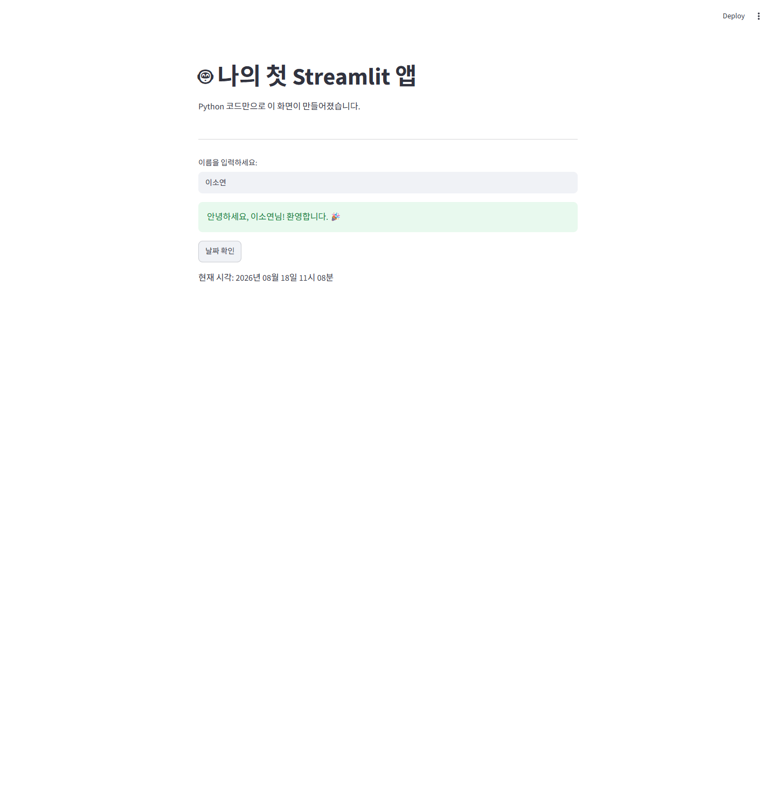
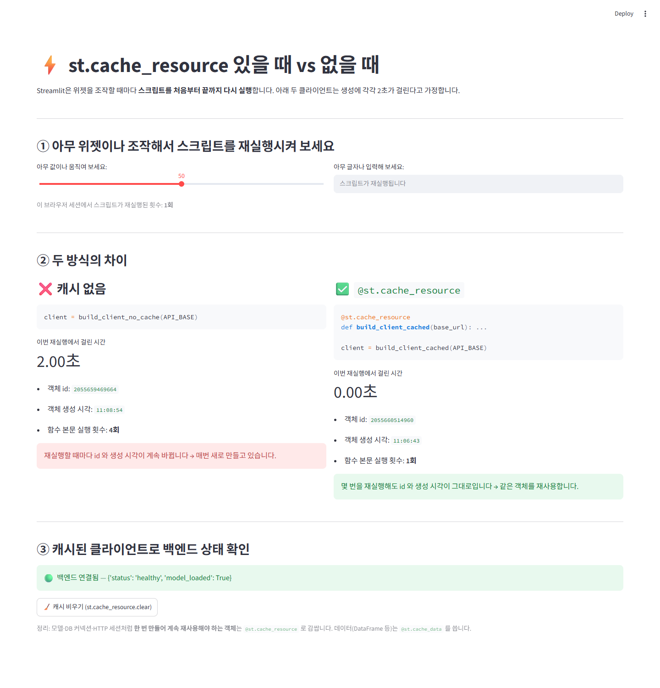
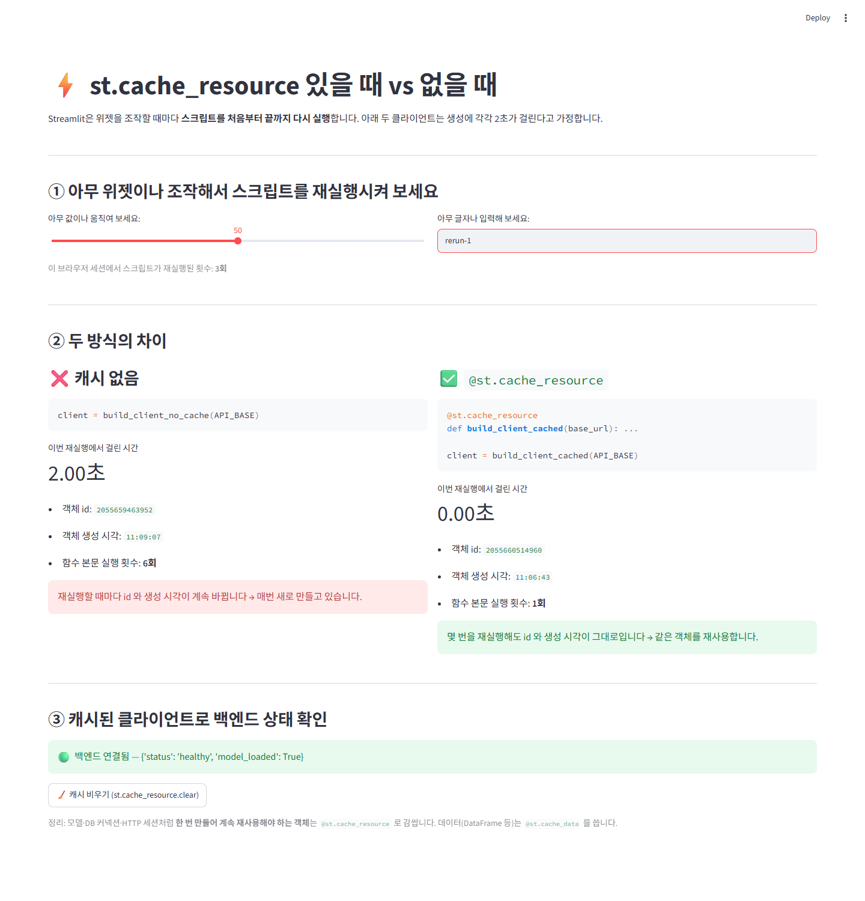
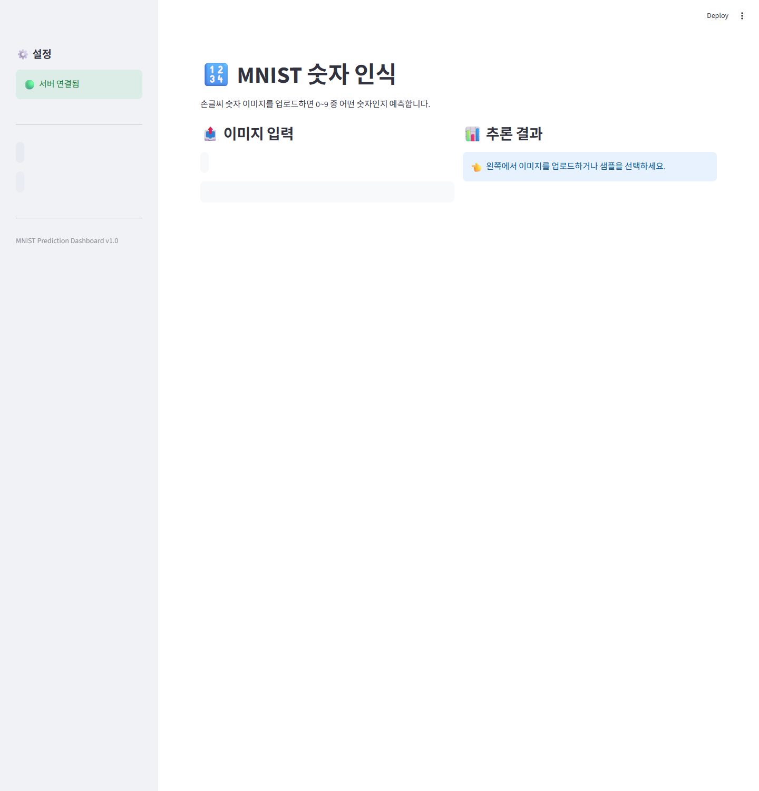
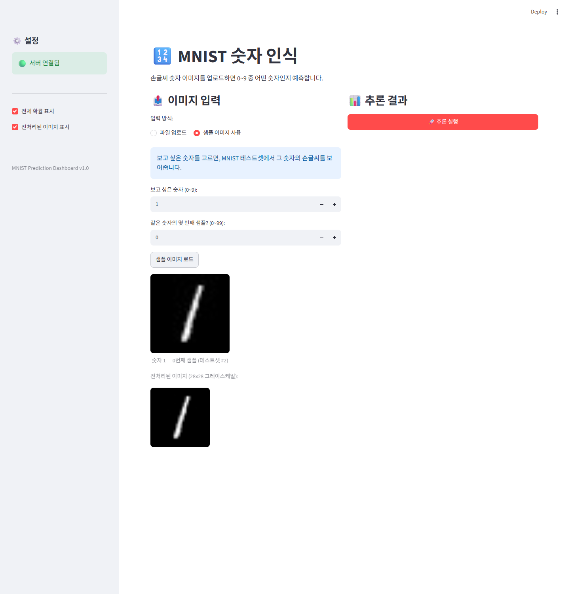
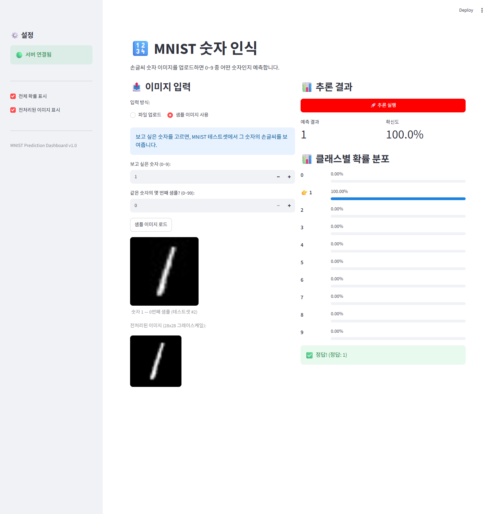
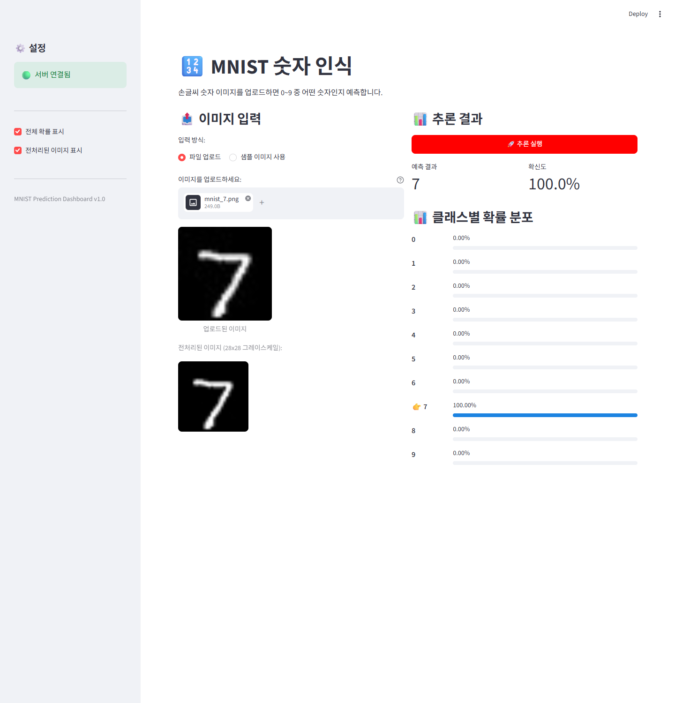
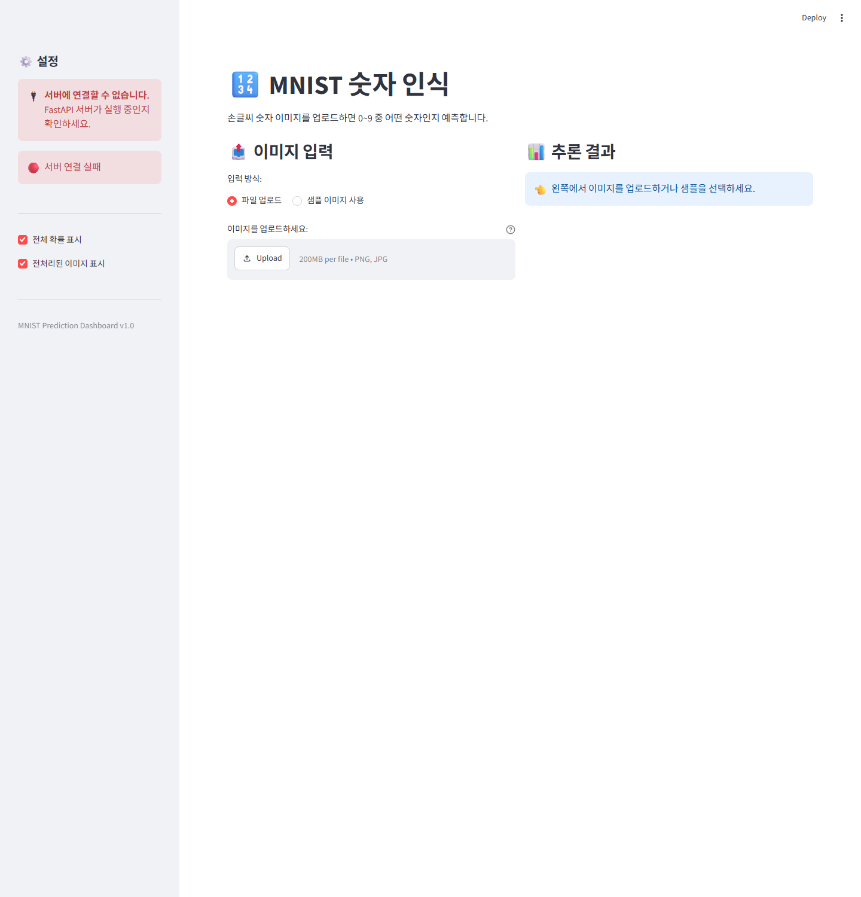

# Day 4 제출 — Streamlit & System Architecture

- 실행 환경: Windows 11 / Python 3.14.5 / FastAPI 0.141.1 / Streamlit 1.61.1 / PyTorch 2.13.0+cpu
  (`python --version`, `pip show fastapi streamlit torch` 로 확인)
- 백엔드: `uvicorn app.main_final:app --port 8000`
- 프론트엔드: `streamlit run frontend/app_dashboard.py --server.port 8501`
- 노트북: [`notebooks/모델배포개론04.ipynb`](notebooks/모델배포개론04.ipynb) — 커널 재시작 후 전체 실행, 출력 저장 완료

## 제출 파일

```
day4/
├── SUBMISSION.md              ← 이 문서
├── README.md
├── verify_e2e.py              ← Day 1~4 통합 검증 스크립트
├── notebooks/
│   └── 모델배포개론04.ipynb    ← 전체 실행 완료 (In[1]~In[13], 에러 0건)
├── frontend/                  ← app_hello.py / app_cache_demo.py / app_dashboard.py
├── app/                       ← Day 1~3 백엔드 6개 파일
├── models/mnist_state_dict.pth
├── samples/                   ← 테스트용 MNIST PNG 3장
└── docs/                      ← 실행 결과 캡처 8장 (01~08)
```

> MD의 이미지들은 `docs/`를 상대경로로 참조합니다. **MD 단독이 아니라 위 폴더 전체를 함께 제출**해야 이미지가 보입니다.

## 노트북 실행 흔적

원본 강의 노트북에 아래를 반영하고, **커널 재시작 → 위에서 아래로 전체 실행 → 출력 저장** 했습니다.

| 반영한 것 | 위치 |
|---|---|
| 섹션 2.4 — `frontend/app_cache_demo.py` 생성 실습 (캐시 유무 비교) 추가 | `%%writefile` 셀 In[5] |
| 대시보드에 `@st.cache_resource`로 `requests.Session` 캐싱 적용 | `%%writefile frontend/app_dashboard.py` 셀 In[6] |
| 업로드 이미지가 바뀌면 이전 결과를 지우는 처리 추가 | 같은 셀 |
| `!pip list \| grep streamlit` → Windows에 grep이 없어 파이썬 버전 확인으로 교체 | In[2] |
| 캐시 비교 앱(8502) 백그라운드 실행 + iframe 표시 셀 추가 | In[11], In[12] |
| 통합 검증 `!python verify_e2e.py` 셀 추가 | In[13] |

실행 결과: **코드 셀 13개 전부 실행번호 기록, 에러 0건**, 소요 70.9초.
노트북 안에서는 백엔드가 커널 스레드로 뜨므로 로그 대조 항목만 생략되어 **11/11 PASS**,
터미널로 따로 띄운 경우 로그 대조까지 포함해 **12/12 PASS** 입니다.

---

## 미션 1 — 첫 번째 Streamlit 앱 실행 & 코드 한 줄씩 뜯어보기

파일: [`frontend/app_hello.py`](frontend/app_hello.py) · 실행: `streamlit run frontend/app_hello.py --server.port 8503`



이름을 입력하니 초록색 성공 메시지가, 「날짜 확인」 버튼을 누르니 현재 시각이 출력됐습니다.
파이썬 코드 약 30줄로 인터랙티브한 웹 페이지가 만들어졌습니다.

### 코드 한 줄씩

| 코드 | 하는 일 |
|---|---|
| `import streamlit as st` | 모든 기능은 `st` 모듈로 접근합니다. |
| `st.set_page_config(page_title=..., page_icon=..., layout=...)` | 탭 제목·아이콘·레이아웃 설정. **반드시 첫 번째 Streamlit 호출**이어야 합니다. |
| `st.title(...)` / `st.write(...)` / `st.divider()` | H1 제목 / 범용 출력(타입에 맞춰 자동 렌더링) / 수평선. |
| `name = st.text_input(...)` | 입력 위젯. 값이 바뀌면 **스크립트 전체가 재실행**되고 `name`에 새 값이 들어옵니다. |
| `if name:` | 첫 실행에는 `""`(falsy)이라 `st.info`, 입력 후 재실행에는 `st.success`가 그려집니다. |
| `st.success / info / warning / error` | 초록·파랑·노랑·빨강 상태 메시지. API 응답 결과 안내에 그대로 씁니다. |
| `if st.button("날짜 확인"):` | 버튼은 **클릭한 그 한 번의 재실행에서만 `True`** 입니다. 다음 재실행에는 다시 `False`가 되어 출력이 사라집니다. |

> 여기서 얻은 감각이 미션 2(`cache_resource`)와 미션 3(`session_state`)의 이유가 됩니다.
> "스크립트가 통째로 다시 돈다" 는 것이 Streamlit의 모든 것을 설명합니다.

---

## 미션 2 — `st.cache_resource` 있을 때 vs 없을 때

파일: [`frontend/app_cache_demo.py`](frontend/app_cache_demo.py) · 실행: `streamlit run frontend/app_cache_demo.py --server.port 8502`

생성에 2초가 걸리는 `APIClient`(requests.Session 보유)를 **캐시 없이** / **`@st.cache_resource`로** 각각 만들고,
재실행마다 ① 걸린 시간 ② 객체 id ③ 함수 본문이 실제로 실행된 횟수를 나란히 비교했습니다.

최초 실행:



위젯을 조작해 스크립트를 2번 더 재실행한 뒤 (총 3회 실행):



### 결과

| 항목 | ❌ 캐시 없음 | ✅ `@st.cache_resource` |
|---|---|---|
| 이번 재실행에서 걸린 시간 | **2.00초** (매번) | **0.00초** |
| 객체 id | 재실행마다 계속 바뀜 | 항상 동일 |
| 객체 생성 시각 | 재실행 시각으로 갱신됨 | 최초 1회 시각 그대로 |
| 함수 본문 실행 횟수 | 재실행 횟수와 같음 (3회) | **1회** |

**차이**: 캐시가 없으면 사용자가 슬라이더를 한 번 움직일 때마다 2초를 다시 기다립니다.
`@st.cache_resource`는 함수의 반환 객체를 **앱 전역에 하나만** 두고 재사용하므로, 두 번째 재실행부터 비용이 0이 됩니다.
모델, DB 커넥션, HTTP 세션처럼 "한 번 만들어 계속 쓰는 객체"가 대상입니다.
데이터(DataFrame 등)에는 `@st.cache_data`를 씁니다.

이 원리를 대시보드에도 적용해, `requests.Session`을 `@st.cache_resource`로 감싸 재사용했습니다.

```python
@st.cache_resource
def get_session() -> requests.Session:
    return requests.Session()
```

---

## 미션 3 — 이미지 업로드 → FastAPI 호출 → 결과 시각화 (MNIST 추론 대시보드)

파일: [`frontend/app_dashboard.py`](frontend/app_dashboard.py)

### 초기 화면 — 사이드바 🟢 서버 연결됨



### 테스트 1 — 샘플 이미지 사용

「샘플 이미지 로드」로 MNIST 테스트셋에서 숫자 1의 손글씨를 불러왔습니다.



「🚀 추론 실행」 결과 — **예측 1 / 확신도 100.0%**, 클래스별 확률 분포와 정답 비교(✅ 정답! (정답: 1))까지 표시됩니다.



### 테스트 2 — 파일 업로드

`samples/mnist_7.png`를 업로드 → 원본과 전처리된 28×28 그레이스케일 이미지가 함께 표시되고,
**예측 7 / 확신도 100.0%** 가 나왔습니다.



### 테스트 3 — 에러 상황 (백엔드 종료)

백엔드 프로세스를 종료한 뒤 대시보드를 새로고침하면, 사이드바가 🔴 **서버 연결 실패**로 바뀌고
`requests.exceptions.ConnectionError`가 스택 트레이스 대신 사용자용 안내 메시지로 표시됩니다.
앱은 죽지 않고 계속 동작합니다.



### 상태 관리 보완 — 이미지를 바꿨는데 옛 결과가 남는 문제

`last_result`를 `session_state`에 저장하면 재실행되어도 결과가 유지되지만,
**다른 이미지를 새로 올렸을 때도 이전 결과가 그대로 붙어 보이는** 부작용이 있습니다.
업로드된 바이트가 바뀌면 결과를 무효화하도록 처리했습니다.

```python
if uploaded:
    image_bytes = uploaded.getvalue()
    # 다른 이미지를 올렸으면 이전 추론 결과를 지웁니다
    if st.session_state.get("uploaded_image") != image_bytes:
        st.session_state["uploaded_image"] = image_bytes
        st.session_state.pop("last_result", None)
    st.image(uploaded, caption="업로드된 이미지", width=200)
```

샘플 이미지 쪽은 「샘플 이미지 로드」 시점에 `st.session_state.pop("last_result", None)`으로 같은 처리를 합니다.

### 통신 흐름 (실제 검증 로그)

백엔드를 직접 호출해 API 단독 동작도 확인했습니다.

```
정답=1 예측=1 conf=1.0000 status=200 -> samples/mnist_1.png
정답=7 예측=7 conf=1.0000 status=200 -> samples/mnist_7.png
정답=3 예측=3 conf=0.6181 status=200 -> samples/mnist_3.png

GET /model/info
{'model_name': 'SimpleClassifier', 'model_path': 'models/mnist_state_dict.pth',
 'num_classes': 10, 'classes': ['0'..'9'], 'total_parameters': 421642}
```

백엔드 로그(미들웨어)에도 요청이 그대로 남습니다.

```
2026-08-18 11:01:59 INFO  [ml_api] 모델 로드 중: models/mnist_state_dict.pth
2026-08-18 11:01:59 INFO  [ml_api] 모델 로드 완료
2026-08-18 11:02:05 INFO  [ml_api] GET /health → 200 (0.003s)
```

### 대시보드 핵심 패턴

| 패턴 | 코드 | 용도 |
|---|---|---|
| API 호출 | `call_api(url, json_data)` | FastAPI와 통신, 실패 시 `None` 반환 |
| 세션 재사용 | `@st.cache_resource def get_session()` | HTTP 세션을 한 번만 생성 |
| Base64 인코딩 | `base64.b64encode(image_bytes).decode()` | 이미지를 JSON에 담기 |
| 에러 처리 | `try/except` → `st.error()` | 실패 시 사용자 안내 |
| 상태 유지 | `st.session_state["last_result"]` | 재실행되어도 결과 유지 |
| 상태 무효화 | 업로드 바이트가 바뀌면 `last_result` 삭제 | 새 이미지에 옛 결과가 남지 않게 |
| 사이드바 | `with st.sidebar:` | 서버 상태·옵션 배치 |
| 컬럼 레이아웃 | `col1, col2 = st.columns(2)` | 입력/결과 나란히 |
| 메트릭 | `st.metric(label, value)` | 예측 결과 강조 |
| 확률 바 | `st.progress(value, text=...)` | 확률 분포 시각화 |

---

## 미션 4 — 백엔드/프론트엔드를 각각 띄워 Day 1~4가 하나의 서비스로 동작하는지 확인

터미널 2개로 각각 실행했고, 두 프로세스가 서로 **독립적으로** 뜨고 내려가는 것까지 확인했습니다.

```
[백엔드]    uvicorn app.main_final:app --host 127.0.0.1 --port 8000
            → {"status":"healthy","model_loaded":true}

[프론트엔드] streamlit run frontend/app_dashboard.py --server.port 8501
            → http://localhost:8501 (200 OK)
```

| Day | 산출물 | 이 서비스에서 하는 일 | 확인 |
|---|---|---|---|
| Day 1 | `models/mnist_state_dict.pth`, `app/model_utils.py` | 학습된 가중치 로드, 전처리·추론 | `model_loaded: true`, 421,642 params |
| Day 2 | `app/schemas.py`, `/predict/image` | Pydantic 입력 검증, 추론 엔드포인트 | HTTP 200 + 예측 JSON |
| Day 3 | `middleware.py`, `error_handlers.py`, `logger_config.py`, `run_in_executor` | 요청 로깅, 안전한 500 응답, 비동기 추론 | 로그에 `GET /health → 200 (0.003s)` |
| Day 4 | `frontend/app_dashboard.py` | 업로드 → Base64 → API 호출 → 시각화 | 위 캡처 전부 |

또한 백엔드만 죽여도 프론트엔드는 살아서 에러를 안내하고(테스트 3), 백엔드를 다시 띄우면 🟢로 복귀했습니다.
**분리 아키텍처의 이점(독립 배포·독립 장애)** 이 실제로 확인됩니다.

### 자동 검증 — `python verify_e2e.py`

"동작한다"를 말로 두지 않기 위해, Day별 산출물이 실제로 한 요청 경로에 물려 있는지 확인하는 스크립트를 함께 두었습니다.
두 서버를 띄운 상태에서 실행하면 됩니다. **12/12 PASS.**

```
Day 1 — 학습된 모델 파일(직렬화 산출물)이 서비스에 실제로 실려 있는가
[PASS] Day1 .pth 파라미터 수 == 서버가 보고한 파라미터 수 — 421642 == 421642
[PASS] 서버가 로드한 경로가 Day1 산출물 — models/mnist_state_dict.pth
[PASS] 모델 로드 완료 상태 — {"status": "healthy", "model_loaded": true}

Day 2 — FastAPI 추론 API + Pydantic 입력 검증
[PASS] POST /predict/image 200 + 정답 예측 — 예측=7 conf=1.0
[PASS] POST /predict/pixels 200 — 예측=7
[PASS] 잘못된 입력(27행) → Pydantic 422 — status=422

Day 3 — 미들웨어 / 에러 핸들링 / 비동기
[PASS] 미들웨어가 X-Process-Time 헤더 부착 — X-Process-Time=0.059
[PASS] 깨진 Base64 → 400 + 사용자용 메시지(스택 트레이스 아님)
       400 이미지 처리 실패: string argument should contain only ASCII characters
[PASS] 추론 8회 연속 처리(run_in_executor 경유) — 0.19초

Day 4 — 브라우저에서 Streamlit 조작 → 백엔드까지 실제로 도달하는가
[PASS] 대시보드 사이드바에 '서버 연결됨' 표시
[PASS] 업로드한 숫자 3을 3으로 예측 (st.metric 값 직접 확인) — 화면 표시값=['3', '61.8%']
[PASS] 브라우저 조작이 백엔드 로그에 POST /predict/image 로 기록됨 — 2건
       2026-08-18 11:33:04 INFO [ml_api] POST /predict/image → 200 (0.01s)
       INFO: 127.0.0.1:58844 - "POST /predict/image HTTP/1.1" 200 OK

  12/12 PASS
```

마지막 항목이 **연결의 결정적 증거**입니다.
브라우저에서 이미지를 올리고 버튼을 누른 그 동작이, 별개 프로세스인 백엔드의 로그에 `POST /predict/image → 200`으로 찍혔습니다.
프론트엔드가 자기 안에서 추론한 게 아니라 **HTTP로 백엔드를 호출했다**는 뜻입니다.

전체 경로:

```
브라우저 파일 업로드
  → Streamlit(:8501)  uploaded.getvalue() → base64.b64encode
  → HTTP POST /predict/image
  → FastAPI(:8000)    Pydantic 검증(Day2) → 미들웨어 로깅(Day3)
                      → base64 디코드 → PIL → preprocess(Day1)
                      → run_in_executor로 model(tensor)(Day1 가중치 + Day3 비동기)
  → JSON {"predicted_class":"3","confidence":0.618,...}
  → Streamlit  st.metric / st.progress 로 시각화
```

---

# 체크포인트 답변

## 섹션 1 — Streamlit 소개

**Q1. Streamlit의 스크립트 재실행 모델이란 무엇입니까?**
사용자가 위젯을 조작할 때마다(버튼 클릭, 값 입력 등) 이벤트 핸들러만 도는 것이 아니라,
**파이썬 스크립트 전체가 위에서 아래로 처음부터 다시 실행**되는 방식입니다.
화면은 이 재실행 결과로 매번 새로 그려집니다. 그래서 지역 변수는 재실행마다 사라지고,
유지하려면 `st.session_state`나 캐시가 필요합니다.

**Q2. `st.text_input()`에 값을 입력하면 내부적으로 어떤 일이 일어납니까?**
브라우저가 새 값을 서버로 보내고 → Streamlit이 그 위젯의 상태를 갱신한 뒤 → **스크립트를 처음부터 다시 실행**합니다.
재실행된 스크립트에서 `st.text_input()`은 이번엔 방금 입력한 값을 반환하므로, 아래쪽 코드가 그 값으로 다시 계산·렌더링됩니다.
(`key`를 주면 `st.session_state[key]`로도 같은 값을 읽을 수 있습니다.)

**Q3. `st.set_page_config()`를 스크립트 중간에 호출하면 어떻게 됩니까?**
에러가 납니다 — `StreamlitSetPageConfigMustBeFirstCommandError`.
페이지 제목·아이콘·레이아웃은 화면을 그리기 전에 정해져야 하므로,
**어떤 `st.*` 호출보다도 먼저, 스크립트당 한 번만** 호출해야 합니다.

## 섹션 2 — 핵심 컨셉

**Q1. `st.file_uploader()`로 업로드된 파일의 바이트 데이터는 어떻게 얻습니까?**
반환된 `UploadedFile` 객체에서 `uploaded.getvalue()`로 `bytes`를 얻습니다. (`uploaded.read()`도 가능)
이 프로젝트에서는 그 바이트를 `base64.b64encode(image_bytes).decode("utf-8")`로 인코딩해 API에 보냅니다.
`getvalue()`는 읽기 포인터를 소비하지 않아 재실행·재사용에 안전합니다.
업로드가 없으면 `None`이므로 `if uploaded:`로 분기합니다.

**Q2. Streamlit에서 `@st.cache_resource`를 사용하는 이유는 무엇입니까?**
스크립트가 매 상호작용마다 통째로 재실행되기 때문입니다.
캐시가 없으면 HTTP 세션·DB 커넥션·모델 같은 **생성 비용이 큰 객체를 재실행마다 새로 만들게** 되어 앱이 느려지고 자원이 낭비됩니다.
`@st.cache_resource`는 그 객체를 앱 전역에 하나만 두고 재사용합니다(미션 2에서 2.00초 → 0.00초로 확인).

## 섹션 3 — System Architecture

**Q1. 모놀리식과 분리 아키텍처의 핵심 차이를 한 문장으로 설명하세요.**
모놀리식은 UI와 모델 추론이 한 프로세스 안에 묶여 함께 배포·확장되지만,
분리 아키텍처는 UI(Streamlit)와 추론(FastAPI)이 HTTP로만 연결된 별개의 서비스라서 **따로 개발·배포·확장**할 수 있습니다.

**Q2. 모델을 업데이트할 때, 분리 아키텍처에서는 어떤 서버만 재배포하면 됩니까?**
**FastAPI 백엔드만** 재배포하면 됩니다. Streamlit 프론트엔드는 손대지 않아도 됩니다.
API의 요청·응답 형태(계약)가 그대로라면 프론트엔드는 바뀐 것을 알 필요조차 없습니다.

**Q3. Streamlit 앱에 PyTorch가 설치되어 있지 않아도 되는 이유는 무엇입니까?**
프론트엔드는 모델을 직접 실행하지 않기 때문입니다.
이미지를 Base64로 바꿔 HTTP로 보내고 JSON 응답을 받아 화면에 그릴 뿐이며,
텐서 변환·추론은 전부 FastAPI 쪽에서 일어납니다. 그래서 프론트엔드에는 `streamlit`, `requests`, `pillow` 정도면 충분합니다.
(단, 이 대시보드의 "샘플 이미지 사용" 기능만 MNIST 테스트셋을 읽으려고 torchvision을 쓰며, 이는 학습용 편의 기능입니다.)

## 섹션 4 — API 호출

**Q1. 이미지를 API에 전송할 때 Base64로 인코딩하는 이유는 무엇입니까?**
JSON은 텍스트 포맷이라 바이너리 바이트를 그대로 담을 수 없기 때문입니다.
Base64는 바이너리를 ASCII 문자열로 바꿔 주므로, 이미지도 다른 옵션 필드(`return_probabilities` 등)와 함께
**하나의 JSON 본문**으로 보낼 수 있고 Pydantic 스키마로 검증할 수 있습니다.
(대신 데이터 크기가 약 33% 늘어납니다. 대용량이라면 `multipart/form-data` 업로드가 더 효율적입니다.)

**Q2. `response.raise_for_status()`는 어떤 역할을 합니까?**
HTTP 상태 코드가 4xx/5xx면 `requests.exceptions.HTTPError`를 발생시킵니다.
이게 없으면 서버가 400·500을 반환해도 코드가 그냥 다음 줄로 진행해서, 에러 본문을 정상 결과처럼 파싱하다 엉뚱한 곳에서 깨집니다.
`raise_for_status()`로 실패를 **즉시 예외로 승격**시켜 `except` 블록에서 사용자 안내로 처리합니다.

## 섹션 5 — 실습 최종 체크포인트

**Q5. API 호출 실패 시 사용자에게 스택 트레이스가 아닌 메시지를 보여줘야 하는 이유는?**
① 보안 — 스택 트레이스에는 파일 경로, 내부 모듈 구조, 때로는 설정값까지 드러나 공격의 단서가 됩니다.
② 사용성 — 비개발자에게 트레이스백은 아무 정보도 주지 못합니다. "서버가 꺼져 있으니 확인하세요"처럼 **다음 행동을 알려주는 문장**이 필요합니다.
상세 정보는 `logger.error(traceback.format_exc())`로 **서버 로그에만** 남깁니다 — Day 3의 `error_handlers.py`가 정확히 이 방식입니다.

**Q6. `st.session_state`에 결과를 저장하는 이유는?**
버튼 클릭은 그 한 번의 재실행에서만 `True`이므로, 결과를 지역 변수에만 두면 다음 재실행(체크박스 토글 등)에서 화면에서 사라집니다.
`st.session_state["last_result"]`에 담아 두면 재실행되어도 결과가 유지되어, 옵션을 바꿔도 직전 추론 결과를 계속 볼 수 있습니다.
샘플 이미지 바이트도 같은 이유로 `session_state`에 보관합니다.

**Q7. 이미지를 API로 전달할 때 Base64 인코딩이 필요한 이유는?**
섹션 4 Q1과 같습니다 — JSON(텍스트)에 바이너리를 실어 보내기 위해서입니다.

---

## 정리

- Streamlit의 스크립트 재실행 모델을 이해하고, 최소 코드로 앱을 띄웠습니다.
- `st.cache_resource`의 유무 차이를 **시간·객체 id·실행 횟수**로 직접 측정했습니다 (2.00초 → 0.00초, 3회 → 1회).
- 파일 업로드·버튼·스피너·사이드바·컬럼 레이아웃으로 MNIST 추론 대시보드를 완성했습니다.
- `requests`로 FastAPI를 호출하고, 이미지를 Base64로 전송하며, 연결 실패·타임아웃·HTTP 에러를 각각 사용자 메시지로 처리했습니다.
- 백엔드/프론트엔드를 각각 띄워 Day 1~4가 하나의 서비스로 동작하는 것을 확인했습니다.
