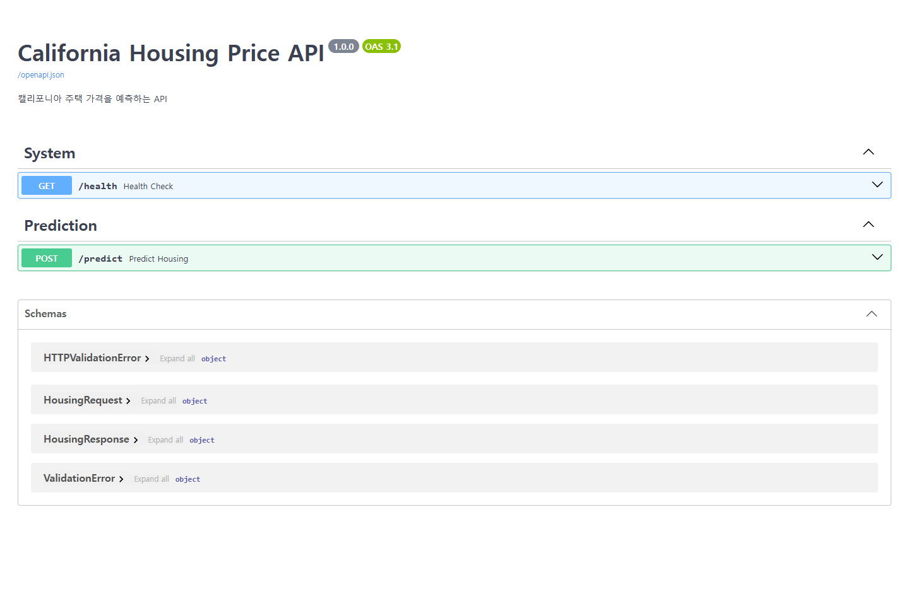
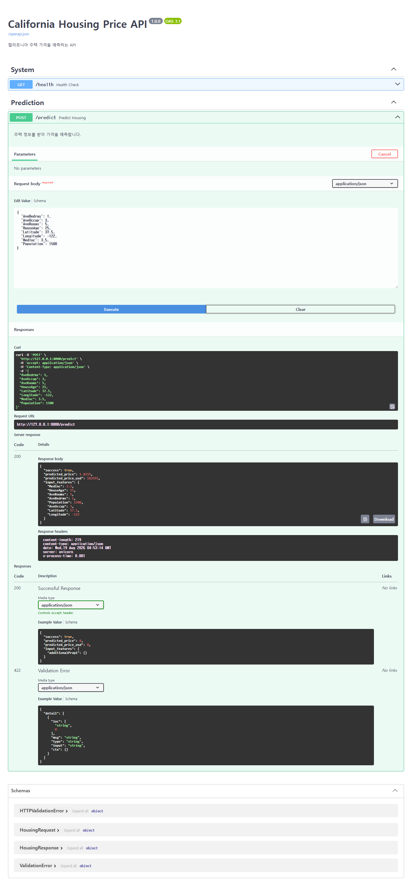
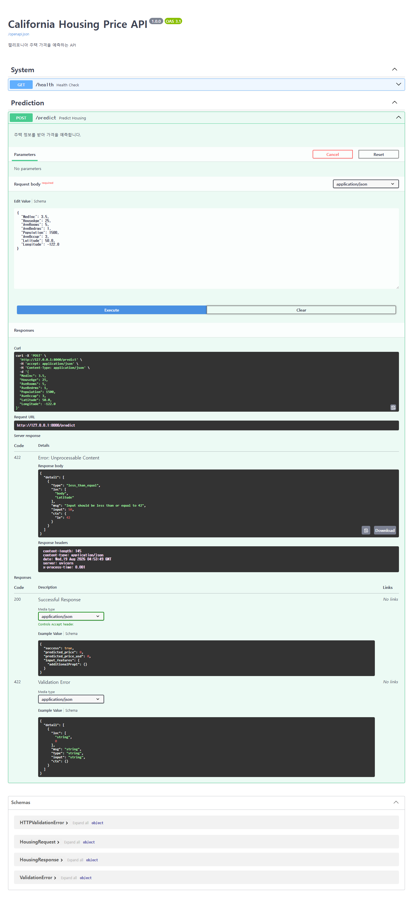
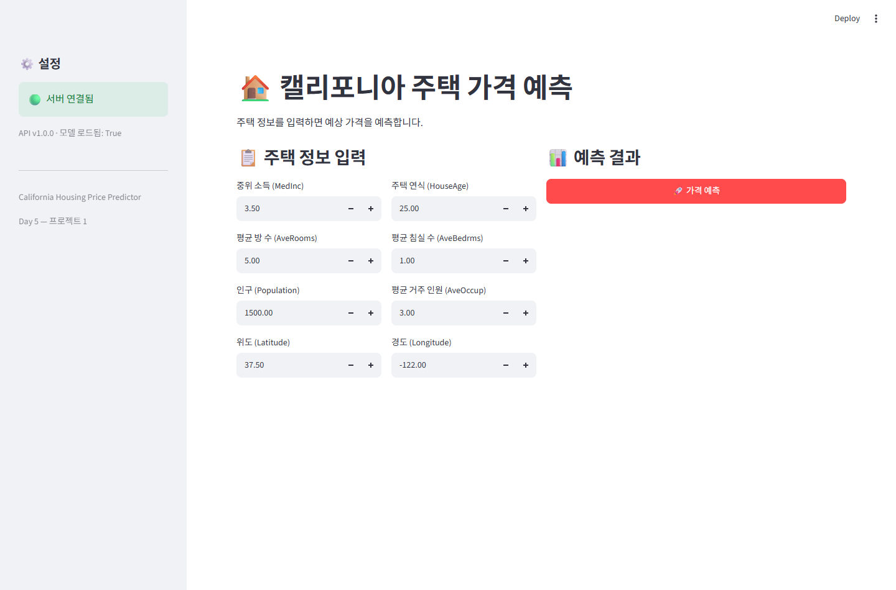
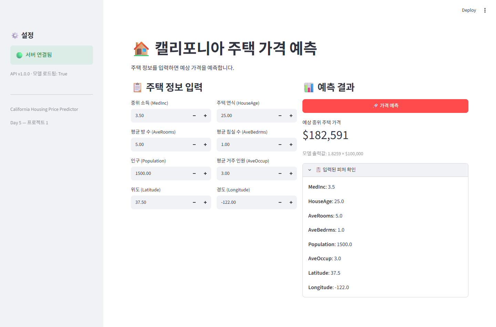
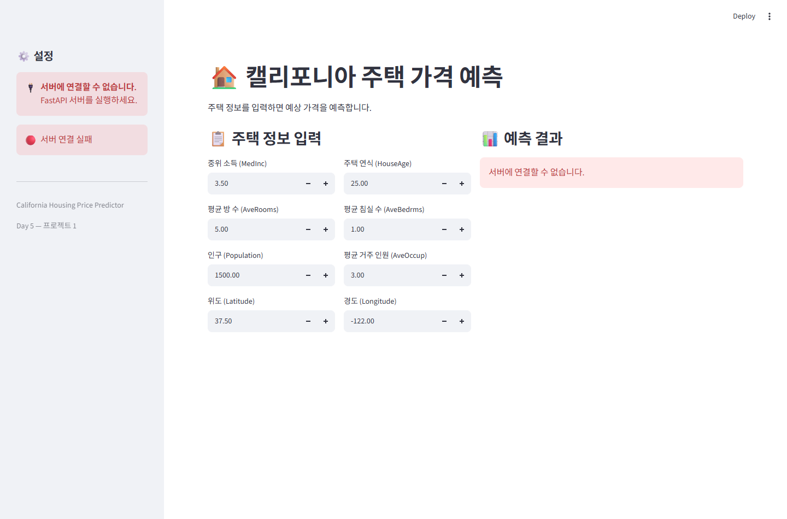
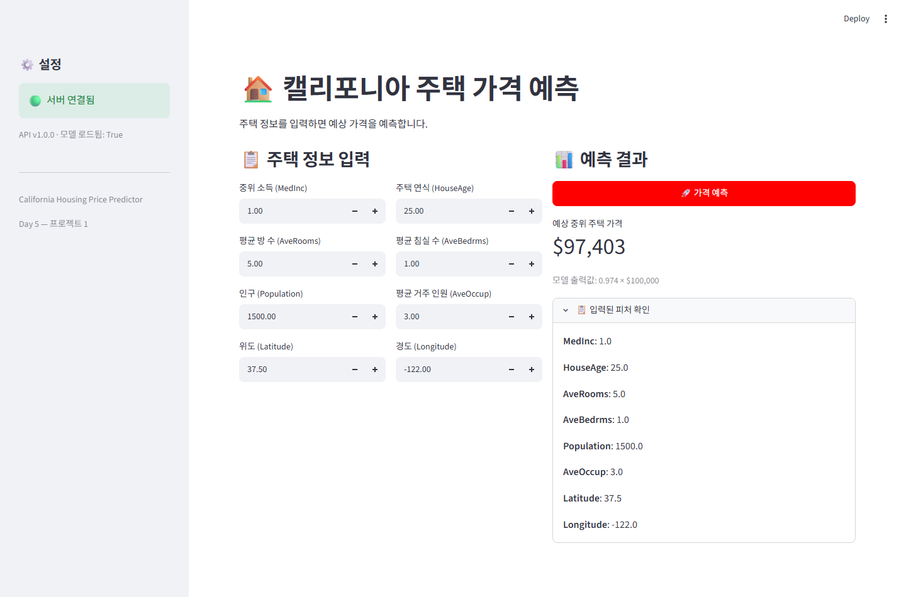

# Day 5 최종 제출 — [프로젝트 1] 정형 데이터 예측 서비스

캘리포니아 주택 정보 8개를 입력하면 예상 가격을 돌려주는 **정형 데이터 회귀 예측 서비스**입니다.
Day 1(학습·저장) → Day 2(스키마) → Day 3(비동기·로깅·에러) → Day 4(Streamlit)를 새로운 데이터·모델로 다시 조립했습니다.

```
Streamlit (입력 폼 :8501) → FastAPI (추론 API :8000) → PyTorch 회귀 모델
```

이 문서의 모든 숫자는 **최종 재실행 결과 그대로**입니다 (추정값·예상값 없음).

## 1. 실행 환경

| 항목 | 값 |
|---|---|
| OS / Python | Windows 11 / Python 3.14.5 |
| 주요 패키지 | FastAPI 0.141.1 · Streamlit 1.61.1 · PyTorch 2.13.0+cpu · scikit-learn 1.9.0 · Pydantic 2.13.4 |
| 백엔드 | `uvicorn app.housing_api:app --host 127.0.0.1 --port 8000` |
| 프론트엔드 | `streamlit run frontend/app_housing.py --server.port 8501` |
| 노트북 | [`notebooks/모델배포개론05_최종.ipynb`](notebooks/모델배포개론05_최종.ipynb) — 커널 재시작 후 전체 실행, **코드 셀 32개 / 에러 0건 / 27.2초** |

## 2. 제출 파일 구조

```
day5/
├── SUBMISSION_최종.md         ← 이 문서
├── README.md
├── train_housing.py           ← 학습 스크립트 (노트북 섹션 2와 동일 순서, SEED=42)
├── integration_test.py        ← 통합 테스트 4종 (assert 기반 자동 검증)
├── notebooks/
│   └── 모델배포개론05_최종.ipynb  ← 문제 노트북 빈칸 13곳을 채우고 전체 실행 (출력 포함)
├── app/
│   ├── housing_model.py       ← 모델 정의 + HousingPredictor (로드·정렬·정규화·추론)
│   ├── housing_schemas.py     ← Pydantic 요청/응답 스키마
│   ├── housing_api.py         ← FastAPI 서버 (/health, /predict)
│   ├── logger_config.py       ← Day 3 재사용
│   ├── error_handlers.py      ← Day 3 재사용
│   └── middleware.py          ← Day 3 재사용
├── frontend/app_housing.py    ← Streamlit 대시보드 (숫자 입력 8개)
├── models/
│   ├── housing_model.pth      ← 학습 가중치 (2,689 params, 13.7 KB)
│   └── housing_preprocessing.json  ← mean · std · feature_names
├── docs/                      ← 실행 결과 캡처 8장 (01~08)
├── requirements.txt · run_backend.ps1 · run_frontend.ps1 · .gitignore
```

> MD의 이미지는 `docs/`를 상대경로로 참조합니다. **폴더 전체를 함께 제출**해야 이미지가 보입니다.

### 문제 노트북에서 채운 빈칸 13곳

| 빈칸 | 채운 답 |
|---|---|
| `train_test_split(..., test_size=____, random_state=____)` | `test_size=0.2, random_state=SEED(42)` |
| `X_train.mean(axis=____)`, `X_train.std(axis=____)` | `axis=0` (피처별 통계) |
| `X_train_norm = (____ - ____) / ____` | `(X_train - train_mean) / train_std` |
| `y_train_tensor = ____` | `torch.FloatTensor(y_train).unsqueeze(1)` |
| `nn.Linear(____, 64)` / `nn.Linear(32, ____)` | `input_dim` / `1` (회귀 출력 1개) |
| `criterion = ____` / `optimizer = ____` | `nn.MSELoss()` / `torch.optim.Adam(model.parameters(), lr=1e-3)` |
| 학습 루프 순전파·손실 | `predictions = model(X_batch)` · `loss = criterion(predictions, y_batch)` |
| 모델 저장 | `torch.save(model.state_dict(), "models/housing_model.pth")` |
| `HousingPredictor` 피처 정렬 / 정규화 | `[features[name] for name in self.feature_names]` · `(values - self.mean) / self.std` |
| 스키마 제약 | `MedInc: gt=0` · `HouseAge: ge=0, le=100` · `Latitude: ge=32, le=42` |
| 스레드풀 · 모델 로드 · dict 변환 · 비동기 추론 | `ThreadPoolExecutor(max_workers=4)` · `HousingPredictor(...)` · `request.model_dump()` · `await loop.run_in_executor(...)` |
| Streamlit 에러 처리 / 입력 범위 / 요청 dict | `resp.raise_for_status()` · `min_value·max_value·value` · 스키마 필드명과 같은 키의 `request_data` |
| 테스트 POST 요청 | `requests.post(f"{API_BASE}/predict", json=case)` |

## 3. 데이터 및 모델

| 항목 | 값 |
|---|---|
| 데이터셋 | scikit-learn 내장 California Housing — 20,640 샘플 / 8 피처 |
| 타겟 | 중위 주택 가격 0.15 ~ 5.00 ($100,000 단위) — **회귀** |
| 분할 | `test_size=0.2, random_state=42` → 학습 16,512 / 테스트 4,128 |
| 모델 | `Linear(8→64) → ReLU → Dropout(0.2) → Linear(64→32) → ReLU → Dropout(0.2) → Linear(32→1)` (2,689 params) |
| 학습 | `MSELoss` + `Adam(lr=1e-3)`, batch 256, 50 epoch |

최종 재실행 결과:

```
Epoch  10/50 — Loss: 0.5632
Epoch  20/50 — Loss: 0.4967
Epoch  30/50 — Loss: 0.4558
Epoch  40/50 — Loss: 0.4332
Epoch  50/50 — Loss: 0.4173

테스트 MSE:  0.3305
테스트 MAE:  0.3970 ($100,000 단위)
테스트 MAE:  $39,703 (실제 금액)
```

### 재현성 — 시드 고정

`random` / `numpy` / `torch` 시드를 42로 고정하고, `DataLoader`에도 `generator=torch.Generator().manual_seed(42)`를 넘겨
**shuffle 순서까지** 재현되게 했습니다. 확인 방법은 결과를 눈으로 비교하는 대신 **가중치 파일 해시 비교**를 썼습니다.

```
노트북이 저장한 models/housing_model.pth : sha256 ec473ffb1f35e626…
train_housing.py 가 저장한 같은 파일     : sha256 ec473ffb1f35e626…
→ 바이트 단위로 동일. 두 경로 어디로 학습해도 같은 모델이 나옵니다.
```

`train_housing.py`도 MSE 0.3305 / MAE 0.3970 ($39,703)로 노트북과 완전히 같은 값을 출력합니다.

## 4. 전처리

- `mean`/`std`는 **학습 데이터에서만** 계산하고, 테스트 데이터에도 그 값을 적용했습니다 (정규화 후 학습셋 평균 ≈ 0, 표준편차 ≈ 1 확인).
- 배포에 필요한 값을 모델과 **함께** 저장합니다 — `models/housing_preprocessing.json`에 `mean`, `std`, `feature_names`.
- 추론(`HousingPredictor`)은 항상 `feature_names` **순서대로** 입력을 세우고, 같은 `mean`/`std`로 정규화합니다.
- `model.eval()` + `torch.no_grad()`로 추론하고, 회귀 출력이 음수가 되면 0으로 잘라 냅니다.

추론 모듈 단독 확인 (테스트셋 첫 샘플):

```
입력: {'MedInc': 1.6812, 'HouseAge': 25.0, 'AveRooms': 4.1922, ... 'Longitude': -119.01}
예측 가격: $73,739 / 실제 가격: $47,700
```

## 5. FastAPI 백엔드

| 메서드 | 경로 | 설명 |
|---|---|---|
| GET | `/health` | 서버 상태 · 모델 로드 여부 · API 버전 |
| POST | `/predict` | 주택 정보 8개 → 예상 가격 |

- **Pydantic 검증** — `MedInc/AveRooms/AveBedrms/Population/AveOccup: gt=0`, `HouseAge: 0~100`,
  `Latitude: 32~42`, `Longitude: -125~-114`. 잘못된 값은 **추론에 도달하기 전에 422**로 끊깁니다.
- **비동기 추론** — `asyncio.get_running_loop()` + `run_in_executor(inference_executor, ...)`로
  CPU 추론을 전용 스레드풀(4개)에서 실행해 이벤트 루프를 막지 않습니다.
- **로깅** — Day 3의 미들웨어/에러 핸들러가 쓰는 `ml_api` 로거를 명시적으로 설정해 모든 요청이 기록됩니다.
- **예외 정보 비노출** — 추론 실패 시 상세 원인은 `logger.exception()`으로 서버 로그에만 남기고,
  클라이언트에는 `"추론 중 서버 오류가 발생했습니다."`만 반환합니다.

`/health` 실제 응답:

```json
{ "status": "healthy", "model": "California Housing", "version": "1.0.0", "model_ready": true }
```

## 6. Swagger UI 테스트



`POST /predict` → Try it out → Execute (기본 예시값):



```json
{ "success": true, "predicted_price": 1.8259, "predicted_price_usd": 182591, "input_features": { "...": "..." } }
```

위도를 캘리포니아 밖(50.0)으로 바꾸면 **422 Unprocessable Content**:



## 7. Streamlit 프론트엔드

숫자 입력 8개 · 사이드바 서버 상태와 API 버전 · 예측 버튼 · 결과 표시 구조입니다.



기본값 그대로 「🚀 가격 예측」 → **$182,591** (모델 출력값 `1.8259 × $100,000`):



- `st.number_input`의 `min_value`/`max_value`를 스키마 제약과 같은 범위로 맞춰 UI에서 1차로 막습니다.
- 결과는 `st.session_state`에 저장 — 다른 위젯을 건드려 rerun이 나도 마지막 결과가 유지됩니다.
- 예외 처리: 연결 실패 / 타임아웃(GET 10초, POST 30초) / HTTP 오류 / 기타를 각각 다른 메시지로 안내합니다.
- 사이드바에 `/health`의 `version`과 `model_ready`를 작게 표시합니다.

백엔드를 내리면 대시보드는 죽지 않고 🔴 상태와 안내 메시지를 띄웁니다:



## 8. 통합 테스트 4종 — assert 기반 자동 검증

`python integration_test.py` (노트북 섹션 5의 테스트 셀도 같은 코드) · **종료 코드 0**

print만 하고 끝나지 않도록 모든 조건을 `assert`로 검사하고, 하나라도 실패하면 종합 셀에서 `AssertionError`를 냅니다.

```
[테스트 1] 정상 요청 — 다양한 입력
케이스                    예측 가격
------------------------------
저소득 지역          $   101,329
고소득 지역          $   462,518
평균적 주택          $   182,591

  새니티 체크 — MedInc만 변경
    소득  1.0 → $   97,403
    소득  3.5 → $  182,591
    소득  8.0 → $  358,102
    ✅ 소득 1.0 < 3.5 < 8.0 순으로 가격 상승 확인

[테스트 2] 에러 상황 — 전부 4xx로 거부되어야 합니다
  필수 필드 누락             → HTTP 422
  위도 50 (범위 초과)        → HTTP 422
  소득 음수                → HTTP 422
  잘못된 포맷               → HTTP 422
  에러 4건 후 정상 요청        → HTTP 200 (서버 생존 확인)

[테스트 3] 동시 요청 (8개)
  요청 #1~#8: 0.007~0.017초 (전부 HTTP 200)
  개별 합계: 0.108초 / 실제 경과: 0.022초
  ✅ 전체 경과 < 개별 합계 — 동시에 처리됨

[테스트 4] 헬스체크
  상태: {'status': 'healthy', 'model': 'California Housing', 'version': '1.0.0', 'model_ready': True}

============================================================
  테스트 결과 종합
============================================================
  ✅ 정상 요청 + 새니티 체크
  ✅ 에러 처리 + 서버 생존
  ✅ 동시 요청 처리
  ✅ 헬스체크

🎉 Day 5 완성 기준 4가지를 모두 자동 검증했습니다.
```

검사 항목:

| 테스트 | assert 내용 |
|---|---|
| 1. 정상 요청 | `status_code == 200`, 응답에 `success`/`predicted_price`/`predicted_price_usd`/`input_features` 존재, `success is True`, 가격 > 0, `input_features == 요청값` |
| 1-1. 새니티 | 다른 값 고정 · `MedInc`만 변경 → `price(1.0) < price(3.5) < price(8.0)` |
| 2. 에러 | 4종 각각 `status_code == 422`, 이어서 정상 요청 `== 200` (서버 생존) |
| 3. 동시 | 8건 전부 `== 200`, `total_elapsed < sum(individual_elapsed)` (절대 시간 기준 미사용) |
| 4. 헬스 | `status == "healthy"`, `model_ready is True`, `version` 비어 있지 않음 |

**assert가 실제로 실패하는지도 확인**했습니다. `REQUIRED_KEYS`에 없는 키를 하나 끼워 넣고 테스트를 호출하니
`AssertionError: 저소득 지역: 응답에 '존재하지_않는_키' 키가 없습니다`가 발생했습니다 — 조건이 깨지면 반드시 실패합니다.

### 완성 기준 4가지 대응표 (수업 자료 기준)

| 완성 기준 | 검증 위치 | 결과 |
|---|---|---|
| 기본값 그대로 예측 → 예상 가격 표시 | 대시보드 캡처 04 · 테스트 1 | ✅ $182,591 |
| 소득 8.0 → 상승 / 1.0 → 하락 | 테스트 1 새니티 체크 · 캡처 05·06 | ✅ $358,102 / $97,403 |
| 잘못된 입력 4xx · 서버 생존 | 테스트 2 | ✅ 4건 모두 422, 이후 200 |
| 동시 8개 · 응답 시간 비누적 | 테스트 3 | ✅ 합계 0.108초 vs 경과 0.022초 |

새니티 체크는 대시보드에서도 같은 값으로 확인했습니다:




## 9. 직접 발견하고 해결한 문제

**① 요청마다 2초씩 느려짐 — `localhost` 이름 해석**

동시 요청 8건이 전부 2.04초씩 걸렸습니다. 서버 로그의 처리 시간은 0.001초, `http.client`로 `127.0.0.1`에
직접 붙으면 0.009초였습니다. 즉 서버가 아니라 **Windows의 `localhost` 해석(IPv6 → IPv4 폴백)** 이 원인이었습니다.
`API_BASE`를 `http://127.0.0.1:8000`으로 통일하자 요청당 **2.04초 → 0.015초**가 됐습니다.
(Streamlit · `integration_test.py` · 노트북 테스트 셀 모두 동일하게 적용. 사람이 브라우저로 여는 안내문은 `localhost:8000/docs` 그대로 둡니다.)

**② 요청 로그가 한 줄도 안 남음 — 로거 이름 불일치**

Day 3의 `middleware.py`·`error_handlers.py`는 `logging.getLogger("ml_api")`를 쓰는데
`housing_api.py`는 `setup_logger("housing_api")`만 호출하고 있었습니다. 핸들러가 없는 `ml_api` 로거의 로그는
그대로 버려져, 미들웨어를 붙여 놓고도 요청 로그가 하나도 남지 않았습니다.
`request_logger = setup_logger("ml_api")`를 추가해 정상화했습니다.

```
2026-08-19 13:51:49 INFO     [ml_api] POST /predict → 200 (0.002s)
2026-08-19 13:51:49 WARNING  [ml_api] POST /predict → 422 (0.001s)
```

**③ 내부 예외 문자열이 클라이언트로 나가던 문제**

`detail=f"추론 실패: {str(e)}"`는 내부 구현 정보를 그대로 노출합니다.
`logger.exception()`으로 스택 트레이스를 서버 로그에만 남기고, 응답은 일반 메시지로 바꿨습니다.

**④ 테스트가 print만 하던 문제**

기존 테스트는 상태 코드를 출력만 해서, 사람이 눈으로 놓치면 그대로 통과였습니다.
전부 `assert`로 바꾸고 응답 키·새니티 순서·서버 생존·시간 비누적까지 검사하게 했습니다.

**⑤ `/health`가 상태만 알려주던 문제**

`model_ready`(모델 로드 완료 여부)와 `version`을 추가했습니다. 대시보드 사이드바에도 표시되어,
"서버는 떴는데 모델은 아직"인 상태를 구분할 수 있습니다.

**⑥ 실행할 때마다 달라지던 학습 결과**

시드 3종 + `DataLoader` generator를 고정해, 노트북과 스크립트가 같은 가중치 파일(해시 동일)을 만들도록 했습니다.

## 10. 체크포인트 답변

노트북의 체크포인트 5블록 **17문항 전부**에 답했고, 같은 답변을 노트북 안에도 「✍️ 내 답변」 셀로 넣어 두었습니다.

### 섹션 1 — 프로젝트 개요

1. **입력과 출력?** 입력은 주택 정보 8개 숫자(`MedInc`, `HouseAge`, `AveRooms`, `AveBedrms`, `Population`,
   `AveOccup`, `Latitude`, `Longitude`), 출력은 중위 주택 가격 **연속값 하나**입니다
   (단위 $100,000 — 모델 출력 1.8259 → $182,591).
2. **MNIST와 데이터 형태 차이?** MNIST는 28×28 픽셀 **이미지 분류**, 오늘은 의미가 서로 다른 숫자 8개를 받는 **정형 데이터 회귀**입니다.
   전처리가 픽셀 정규화 대신 **피처별 표준화(+ mean/std 저장)** 가 되고, 출력도 확률 분포가 아니라 값 하나입니다.
3. **새로 만드는 파일 3개?** `app/housing_model.py`(모델 정의 + `HousingPredictor`),
   `app/housing_schemas.py`(요청·응답 스키마), `app/housing_api.py`(FastAPI 서버).
   여기에 `frontend/app_housing.py`와 저장물 2개가 더해지고, 기존 MNIST 파일은 `housing_` 접두사로 구분해 건드리지 않습니다.

### 섹션 2 — 모델 준비

1. **정규화에 학습 데이터 통계를 쓰는 이유?** 테스트셋은 "배포 후 들어올 새 데이터"를 흉내 냅니다.
   서비스에서는 들어온 값 하나의 평균/표준편차를 알 수 없고, 테스트셋 통계를 쓰면 평가에 정답 분포가 새어 들어갑니다(data leakage).
2. **가중치 외에 함께 저장해야 하는 것?** `mean`, `std`, `feature_names`.
   없으면 배포 환경에서 다른 스케일·다른 순서로 입력이 들어가 **에러 없이 조용히 틀린 가격**이 나옵니다.
3. **`feature_names` 순서로 배열하는 이유?** 모델 입력은 이름 없는 8차원 벡터입니다.
   dict 순서나 UI가 만든 순서에 기대면 소득 자리에 인구가 들어가도 그대로 계산됩니다.

### 섹션 3 — FastAPI 백엔드

1. **`Latitude`에 `ge=32, le=42`?** 캘리포니아 데이터로만 학습했기 때문입니다. 위도 50은 모델이 본 적 없는 구간이라
   예측이 의미가 없는데 숫자이기만 하면 계산은 됩니다. 422로 막는 편이 "그럴듯한 헛소리"보다 낫습니다.
2. **`request.model_dump()`의 역할?** 검증을 통과한 Pydantic 객체를 순수 dict로 바꿉니다.
   `HousingPredictor.predict()`가 FastAPI를 몰라도 되게 하는 경계이고, 응답의 `input_features`로도 그대로 씁니다.
3. **`run_in_executor`를 안 쓰면?** PyTorch 추론은 CPU를 붙잡는 동기 코드라 `async` 함수에서 직접 부르면
   **이벤트 루프 전체가 멈춥니다.** 헬스체크조차 대기하고, 동시 8건이 순차 처리되어 응답 시간이 누적됩니다.

### 섹션 4 — Streamlit 프론트엔드

1. **Day 4(MNIST)와 입력 방식 차이?** 이미지 업로드 + Base64 대신 **숫자 입력 위젯 8개**를 JSON으로 보냅니다.
2. **`min_value`/`max_value`를 두는 이유?** 스키마와 같은 범위를 UI에 걸어 두면 왕복 한 번을 아끼고 잘못된 값을 애초에 막습니다.
   (UI는 우회 가능하므로 서버 검증은 그대로 유지합니다.)
3. **키 이름이 필드명과 같아야 하는 이유?** FastAPI는 JSON 키를 필드명으로 매칭합니다.
   `Medinc`처럼 대소문자만 달라도 "필수 필드 누락"으로 422입니다.

### Day 5 최종 체크포인트

- **Q1. 전처리 파라미터를 함께 저장하는 이유?** → 배포 환경에서 같은 정규화를 재현하지 못하면 에러 없이 조용히 틀린 예측이 나옵니다.
- **Q2. `Latitude ge=32, le=42`?** → 학습 분포(캘리포니아) 밖 입력을 입구에서 거절해 근거 없는 예측을 만들지 않기 위해서입니다.
- **Q3. 입력값 이름 일치?** → 이름으로 매칭되기 때문입니다. 어긋나면 422이거나, 더 나쁘게는 값이 뒤바뀝니다.
- **Q4. `run_in_executor` 제거 시?** → 추론이 이벤트 루프를 점유해 동시 요청이 순차 처리되고 서버 응답성이 무너집니다.
- **Q5. MNIST와 가장 큰 차이?** → **비정형 이미지 분류 → 정형 데이터 회귀.** 입력이 파일이 아니라 숫자 8개라
  전처리가 정규화(+파라미터 저장)로, 스키마에 도메인 범위가 생기고, UI가 업로드에서 입력 폼으로,
  출력이 확률 분포에서 연속값 하나로 바뀝니다.

## 11. 회고

어려웠던 것은 모델이 아니라 **경계**였습니다. 학습 코드에서 numpy 배열이던 것이 API를 지나며
dict → Pydantic 모델 → dict → 정렬된 리스트 → 텐서로 네 번 모양이 바뀌는데,
이 사이에서 순서나 스케일이 틀려도 **아무 에러 없이 그럴듯한 숫자**가 나옵니다.

이번에 찾은 문제들도 전부 에러가 아니라 **로그와 시간**으로만 드러났습니다. 2초 지연은 예외를 내지 않았고,
사라진 요청 로그도 조용했습니다. 그래서 "실행되면 통과"가 아니라 **조건을 코드로 못 박는 것**(assert, 새니티 체크,
해시로 재현성 확인)이 이 프로젝트에서 가장 크게 배운 부분입니다.

## 12. 향후 개선점

- **모델 성능** — MAE $39,703은 실용 수준은 아닙니다. 위경도 → 지역 클러스터 피처, 타깃 로그 변환, 학습률 스케줄러를 시도해 볼 만합니다.
- **예측 구간** — 지금은 점 추정 하나뿐입니다. 신뢰 구간을 함께 주면 사용자가 판단할 근거가 생깁니다.
- **입력 분포 감시** — 스키마는 통과했지만 학습 분포에서 멀리 떨어진 입력(예: `AveOccup` 100)에 경고를 붙이고 싶습니다.
- **모델 버전 응답** — `/health`에는 버전이 있지만 `/predict` 응답에는 없습니다. 어떤 모델이 낸 예측인지 추적 가능하게 하면 좋겠습니다.
- **인증** — 현재는 누구나 호출 가능합니다 (Day 6 API Key 주제).
- **`@app.on_event("startup")`** — 최신 FastAPI에서는 `lifespan` 방식이 권장됩니다. 수업 코드 구조를 유지하려 그대로 뒀습니다.
