# Day 6 제출 — 인증 및 미디어 처리 기초

- 실행 환경: Windows 11 · Python 3.14.5 · FastAPI 0.141.1 · torch 2.13.0+cpu
- 실행 일자: 2026-08-20
- 코드: [`app/`](app) · 실행본 노트북: [`notebooks/모델배포개론06_최종.ipynb`](notebooks) · 캡처: [`docs/`](docs)

---

## 0. 오늘의 미션 체크

| # | 미션 | 결과 | 근거 |
|---|---|---|---|
| 1 | auth 모듈을 만들어 인증이 붙은 엔드포인트와 안 붙은 엔드포인트를 비교 | ✅ | [`app/auth.py`](app/auth.py), [`app/auth_demo.py`](app/auth_demo.py), [`compare_auth.py`](compare_auth.py) · 캡처 ⑦⑧ |
| 2 | 이미지 업로드에 크기 제한·형식 검증·리사이징 안전장치 | ✅ | [`app/image_utils.py`](app/image_utils.py) · 테스트 [6] |
| 3 | API Key 인증 + UploadFile + MNIST 모델을 합친 API 완성 | ✅ | [`app/image_api.py`](app/image_api.py) · 캡처 ①②③ |
| 4 | 테스트 5종 (401 / 401 / 성공 / 400 / 연속 이미지) | ✅ | [`integration_test.py`](integration_test.py) → **12/12 PASS** |
| 5 | Swagger UI에서 직접 이미지 업로드 + 프로젝트 구조 확인 | ✅ | 캡처 ②③ (6.8) · 아래 §4 구조 |

> **제출 요건 확인**
> 1. 섹션 6 수행내역 캡쳐 — §3의 노트북 실행 캡처 **6.1~6.8 (8장, 6.8 포함)** + §4의 Swagger UI 직접 업로드 캡처 6장
> 2. 각 섹션 체크포인트 답변 — §5에 **섹션 1 / 섹션 2 / 섹션 3·4 / Day 6 최종(Q1~Q5)** 네 블록 전부

---

## 1. 미션 1 — 인증이 붙은 엔드포인트 vs 안 붙은 엔드포인트

`app/auth.py`의 `verify_api_key()`를 만들고, **같은 서버 안에** 인증이 붙은 엔드포인트와
안 붙은 엔드포인트를 나란히 두어 차이를 확인했습니다 (`app/auth_demo.py`, 포트 8001).

```python
# 인증 없음 — Depends 없음
@app.get("/public")
async def public_endpoint():
    return {"endpoint": "/public", "auth": False, ...}

# 인증 있음 — Depends 한 줄이 전부
@app.get("/private")
async def private_endpoint(user: str = Depends(verify_api_key)):
    return {"endpoint": "/private", "auth": True, "user": user}
```

`python compare_auth.py` 실행 결과 (원본: [`docs/compare_auth_output.txt`](docs/compare_auth_output.txt)):

```
경로         보낸 키            상태     응답
----------------------------------------------------------------------------------------
/public    (없음)            200    {'endpoint': '/public', 'auth': False, ...}   ✅
/public    test-key-001    200    {'endpoint': '/public', 'auth': False, ...}   ✅
/private   (없음)            401    {'detail': 'API Key가 필요합니다. ...'}        ✅
/private   wrong-key       401    {'detail': '유효하지 않은 API Key입니다.'}       ✅
/private   test-key-001    200    {'endpoint': '/private', 'auth': True, 'user': '사용자A'}  ✅
```

**⑦ 인증 유무 비교 데모 — Swagger UI**

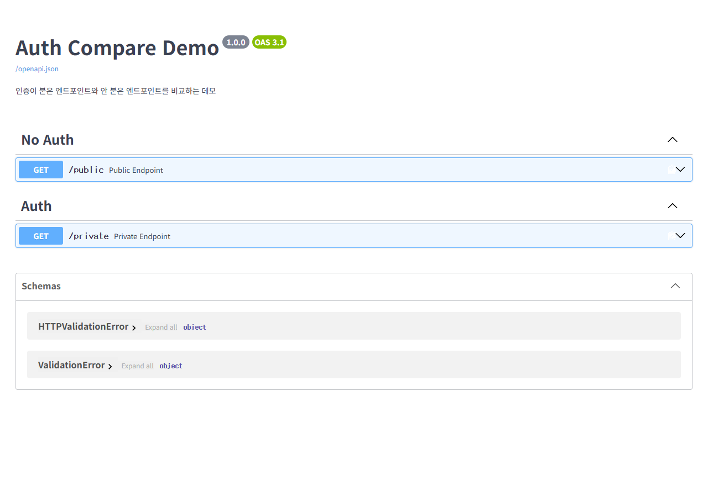

**⑧ 같은 조건(키 없음)에서 /public은 200, /private은 401**

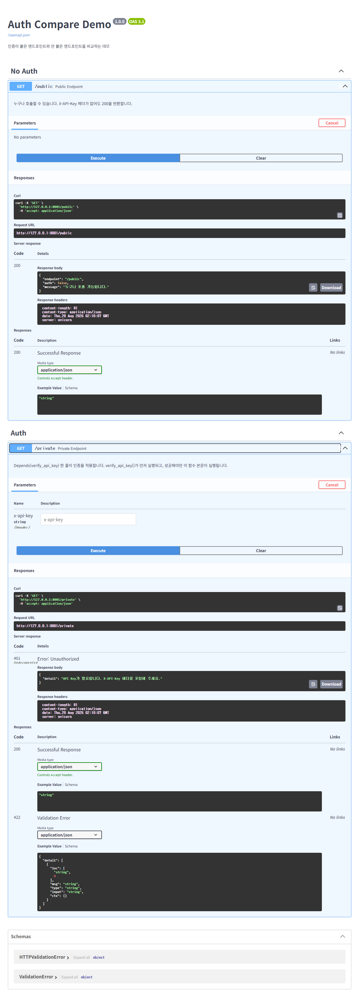

> 정리: 엔드포인트에 `Depends(verify_api_key)` **한 줄**을 넣는 것만으로 접근 통제가 생깁니다.
> 실제 서비스 API에서도 `/health`는 인증 없이(모니터링용), `/predict/image`는 인증을 걸어 두었습니다.

---

## 2. 미션 2 — 업로드 안전장치 (크기 제한 · 형식 검증 · 리사이징)

`app/image_utils.py`의 `validate_and_read_image()`가 4단계를 순서대로 수행합니다.

| 단계 | 검증 | 차단하는 위험 | 결과 |
|---|---|---|---|
| 1 | `content_type in {"image/png","image/jpeg"}` | 엉뚱한 MIME (.txt 등) | 400 |
| 2 | `len(contents) <= 5MB` | 100MB 이미지 → 메모리·디스크 고갈 | 400 |
| 3 | `Image.open(BytesIO(...))` | 위장(.exe→.png)·손상 파일 | 400 |
| 4 | `.convert("L").resize((28,28))` | 10000x10000 → 전처리 폭주 | 자동 변환 |

실제 검증 결과 (테스트 [6]):

```
생성한 대용량 PNG: 7.3MB
  상태 코드: 400 / {'detail': '파일 크기가 5MB를 초과합니다. 현재: 7.3MB'}      ✅ 크기 검증
위장 .exe (MZ 시그니처를 malware.png로 업로드)
  상태 코드: 400 / {'detail': '이미지를 읽을 수 없습니다. ...'}               ✅ 디코딩 검증
1000x1000 RGB 이미지
  상태 코드: 200 / {'success': True, 'label': '9', ...}                    ✅ 자동 리사이징
```

> ⚠️ 1번(MIME)은 클라이언트가 정하는 값이라 **위조 가능**합니다. `.exe`를 `.png`로 바꿔 올리면
> 1번은 통과하고 **3번(PIL 디코딩)에서 걸립니다** — 위 결과가 그 사실을 그대로 보여줍니다.
>
> ⚠️ 2번은 `await file.read()`로 *다 읽은 뒤* 재는 방식이라 "다 받고 나서 거부"입니다.
> 실무에서는 nginx `client_max_body_size`나 청크 단위 읽기로 전송 도중에 끊습니다.

---

## 3. 미션 3·4 — 통합 API + 테스트 5종 (섹션 6 수행 내역)

서버: `python -m uvicorn app.image_api:app --port 8000`
전체 원본 출력: [`docs/integration_test_output.txt`](docs/integration_test_output.txt)

| # | 노트북 절 | 테스트 | 기대 | 실제 |
|---|---|---|---|---|
| 1 | 6.3 | 인증 없이 요청 | 401 | ✅ 401 `API Key가 필요합니다...` |
| 2 | 6.4 | 잘못된 키 (`wrong-key`) | 401 | ✅ 401 `유효하지 않은 API Key입니다.` |
| 3 | 6.5 | 올바른 키 + MNIST 이미지 | 200 | ✅ 200 `{"success":true,"label":"7","confidence":1.0,"user":"사용자A"}` (정답 7) |
| 4 | 6.6 | `text/plain` 업로드 | 400 | ✅ 400 `지원하지 않는 파일 형식입니다: text/plain` |
| 5 | 6.7 | 연속 이미지 5장 | 전부 일치 | ✅ 5/5 (7,2,1,0,4 · 확신도 1.0000) |

```
[5] 테스트 5 — 연속 추론 테스트 5장 (6.7)
    이미지 0: 정답=7, 예측=7, 확신도=1.0000 ✅
    이미지 1: 정답=2, 예측=2, 확신도=1.0000 ✅
    이미지 2: 정답=1, 예측=1, 확신도=1.0000 ✅
    이미지 3: 정답=0, 예측=0, 확신도=1.0000 ✅
    이미지 4: 정답=4, 예측=4, 확신도=1.0000 ✅

============================================================
결과: 12/12 통과
============================================================
```

노트북 `notebooks/모델배포개론06_최종.ipynb`도 셀 1번부터 끝까지 순서대로 전부 실행했고
(에러 0건), 섹션 6.2~6.8의 출력이 그대로 저장되어 있습니다. 아래는 그 실행 화면 캡처입니다.

> **제출 노트북 파일 안내**
> - 제출본은 **`notebooks/모델배포개론06_최종.ipynb`** 입니다.
>   커널을 새로 띄워 위에서 아래로 전부 실행한 상태(Restart Kernel & Run All과 동일)로 저장되어 있어,
>   **코드 셀 25개 전부 `execution_count`가 1~25로 순서대로 찍혀 있고 출력도 모두 들어 있습니다.**
> - 강의에서 받은 원본 `모델배포개론06.ipynb`는 출력이 비어 있는 배포용 파일이며, 제출본이 아닙니다.
>   (원본과 제출본은 파일명이 다르므로 열어 보실 때 `_최종`이 붙은 쪽을 확인해 주세요.)

### 섹션 6 실행 캡처 (노트북)

**6.1 통합 API 서버 코드 — 사전 준비 파일 확인 + `app/image_api.py` 작성**

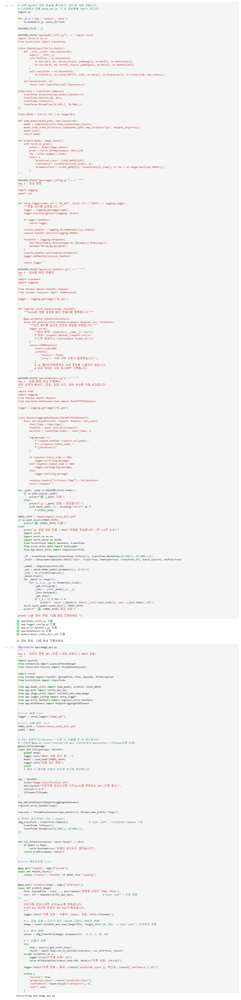

**6.2 서버 실행 — `serve_in_thread("app.image_api:app", port=8000)` → 모델 로드 후 기동**

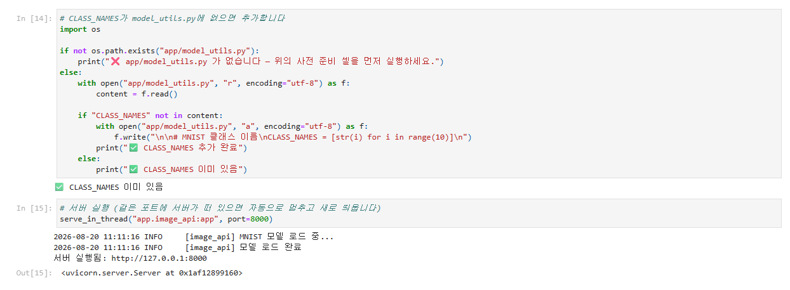

**6.3 테스트 1: 인증 없이 요청 → 401**

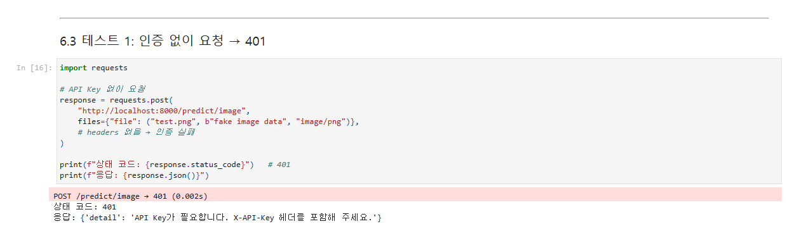

**6.4 테스트 2: 잘못된 키 → 401**

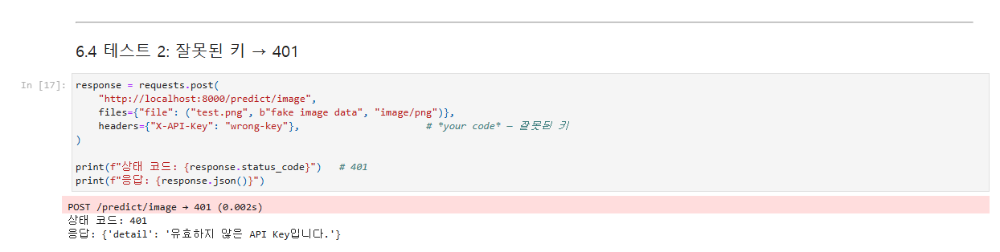

**6.5 테스트 3: 올바른 키 + MNIST 이미지 → 200** (응답 키를 `label`로 변경한 뒤 정답 7 예측)

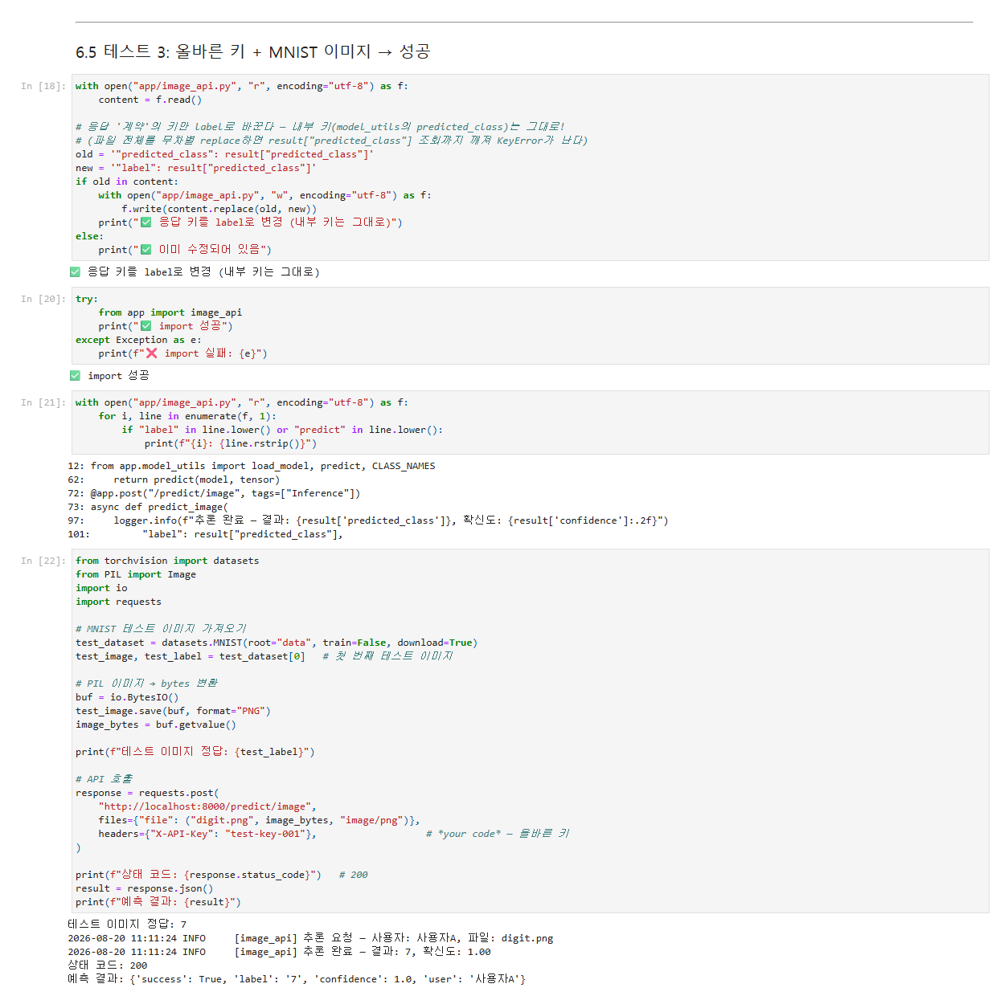

**6.6 테스트 4: 잘못된 파일 형식(`text/plain`) → 400**

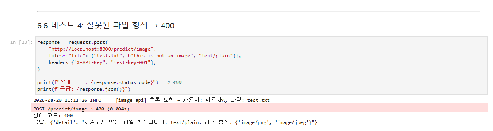

**6.7 테스트 5: 여러 이미지 연속 테스트 — 5장 전부 일치**

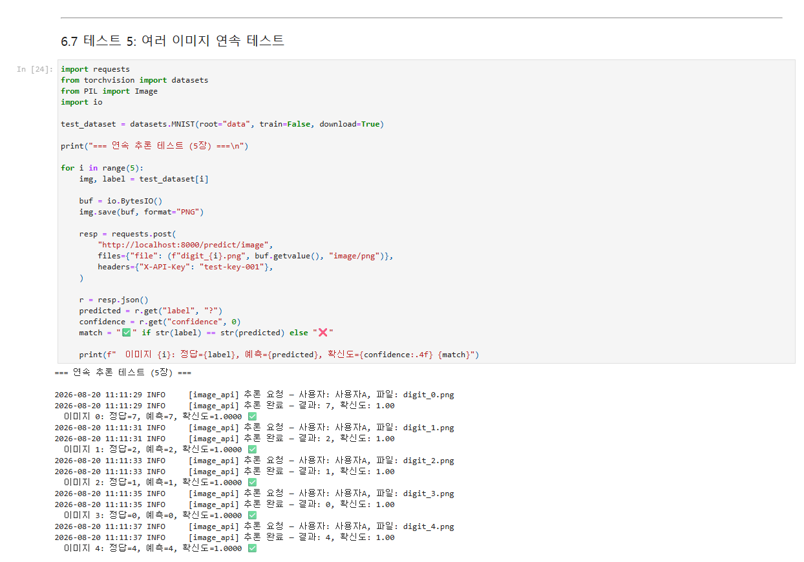

**6.8 Swagger UI에서 테스트 — 노트북 셀 안에 Swagger UI가 실제로 렌더된 화면 (필수 항목)**

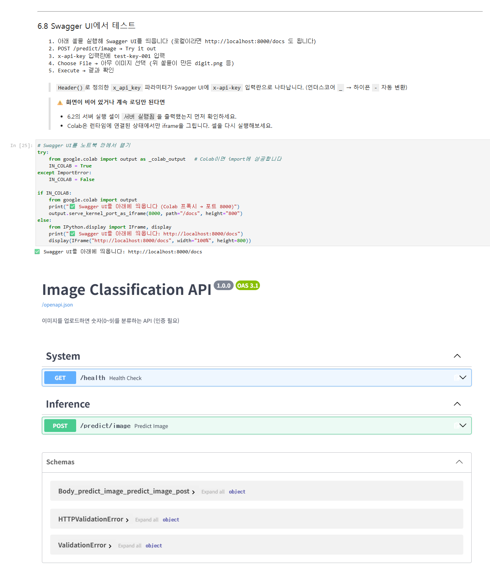

> 6.8에서 띄운 Swagger UI로 직접 이미지를 업로드한 결과는 아래 §4에 이어집니다.

---

## 4. 미션 5 — Swagger UI 직접 업로드 (6.8) + 프로젝트 구조

**① Swagger UI 첫 화면 — `/health`(인증 없음)와 `/predict/image`(인증 있음)**

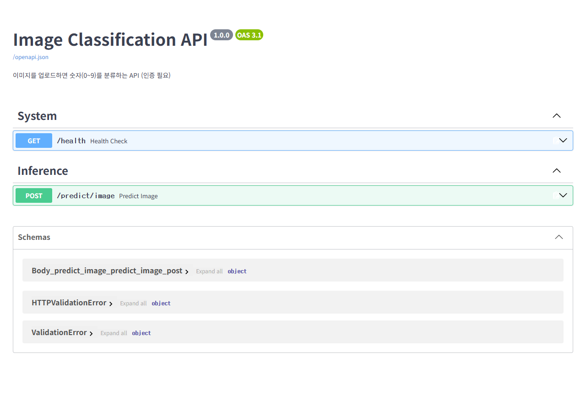

**② Try it out — `x-api-key`에 `test-key-001`, 파일 선택으로 `digit_7.png` 업로드**
`UploadFile`을 쓰면 Swagger UI에 **파일 선택 버튼**이 자동으로 생깁니다.

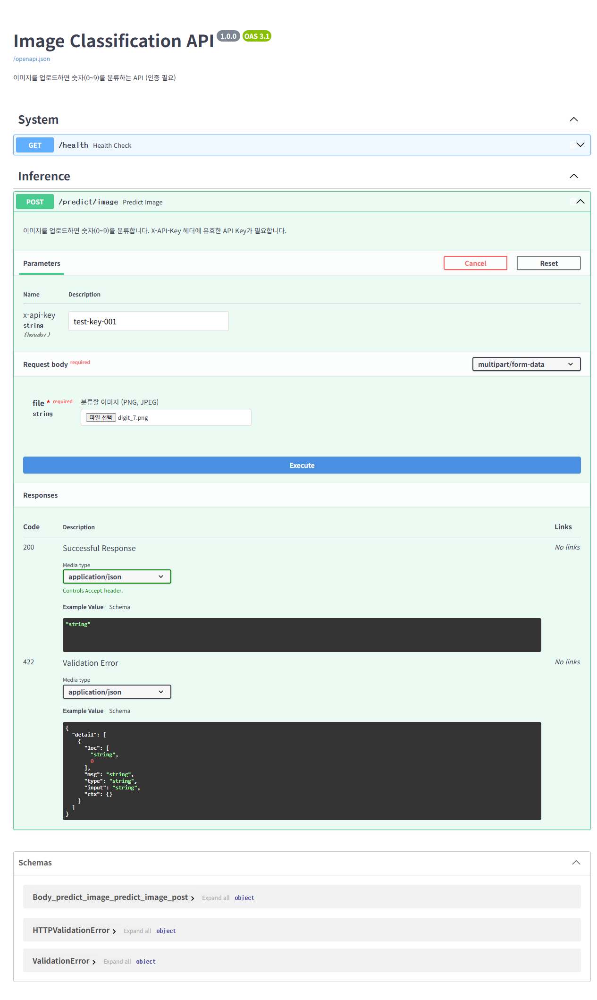

**③ Execute → 200 성공** — `{"success": true, "label": "7", "confidence": 1, "user": "사용자A"}`

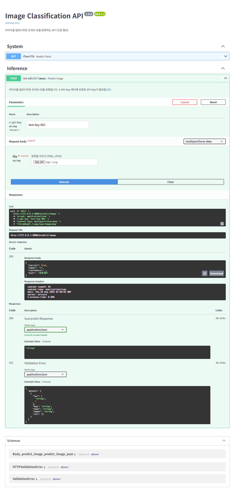

**④ 같은 화면에서 키만 지우고 Execute → 401**


**⑤ 잘못된 키(`wrong-key`) → 401**

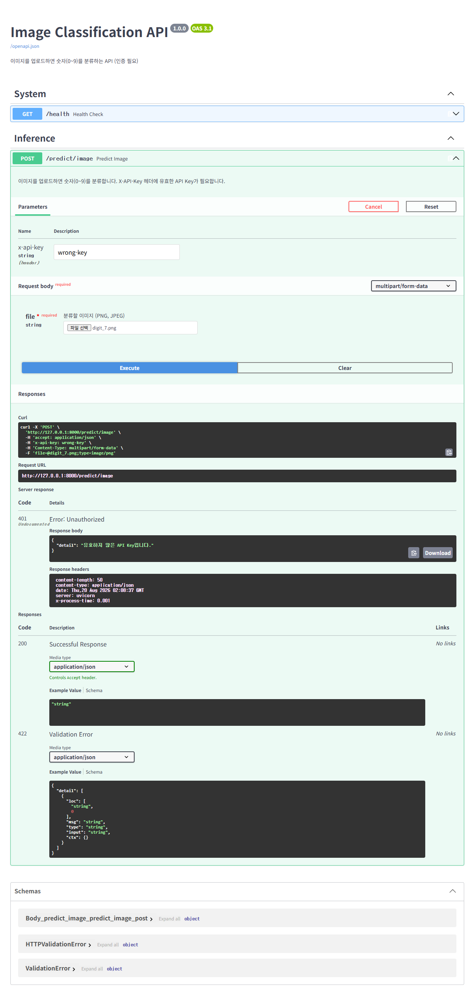

**⑥ `not_an_image.txt`(text/plain) 업로드 → 400**


### 프로젝트 구조

```
day6/
├── app/
│   ├── auth.py                ← 🆕 Day 6: API Key 인증
│   ├── image_utils.py         ← 🆕 Day 6: 이미지 검증/전처리
│   ├── image_api.py           ← 🆕 Day 6: 이미지 분류 API (인증 + 업로드)
│   ├── auth_demo.py           ← 🆕 Day 6: 인증 유무 비교 데모
│   ├── model_utils.py         ← Day 1
│   ├── logger_config.py       ← Day 3
│   ├── error_handlers.py      ← Day 3
│   └── middleware.py          ← Day 3
├── models/mnist_state_dict.pth
├── samples/  digit_7.png · digit_2.png · digit_1.png · not_an_image.txt
├── docs/     캡처 16장 (노트북 6.1~6.8 8장 · Swagger 직접 업로드 6장 · 인증 비교 2장)
│              + 테스트 출력 2건 + 프로젝트 구조 텍스트 1건
├── notebooks/모델배포개론06_최종.ipynb
├── integration_test.py · compare_auth.py
├── requirements.txt · run_server.ps1 · run_auth_demo.ps1 · .gitignore
└── README.md · SUBMISSION_최종.md
```

---

## 5. 체크포인트 답변

### 섹션 1 — API 보안의 필요성

**1. 인증 없는 API가 위험한 이유 (두 가지 이상)**

- **서버 다운(가용성)**: `while True: requests.post("/predict")` 한 줄이면 초당 수백 건이 들어옵니다.
  추론은 CPU/GPU를 많이 쓰기 때문에 서버가 과부하로 죽고, 정상 사용자도 서비스를 못 씁니다.
- **비용 폭탄**: 클라우드 GPU를 쓰면 불특정 다수의 호출이 그대로 요금이 됩니다.
- **모델 도용(Model Stealing)**: 입력–출력 쌍을 대량 수집해 우리 모델을 모방한 모델을 학습할 수 있습니다.
- **추적 불가**: "누가 무엇을 보냈는지"를 알 수 없어 원인 파악도, 악성 사용자 차단도 못 합니다.

**2. API Key 방식이 ML 추론 API에 적합한 이유**

사람이 아니라 **다른 서버·스크립트가 호출**하는 API이기 때문입니다. 로그인 화면·세션·토큰 갱신이
필요 없고, 헤더 한 줄(`X-API-Key`)이면 끝납니다. 그러면서도 키 하나로 **인증과 사용량 추적(과금·쿼터)**
을 동시에 할 수 있어서, OpenAI·Anthropic·Hugging Face 등 대부분의 ML API가 이 방식을 씁니다.
복잡도 대비 실무 효용이 가장 좋은 지점입니다 (API Key < JWT < OAuth 2.0).

### 섹션 2 — API Key 인증 구현

**1. `Header(None)`에서 `None`은 어떤 상황에 들어오는가**

요청에 **`X-API-Key` 헤더가 아예 없을 때**입니다. `Header(...)`(필수)로 두면 FastAPI가 먼저
**422 Unprocessable Entity**를 내버려서, 우리가 원하는 "인증 실패 = 401"을 만들 수 없습니다.
기본값을 `None`으로 두어 헤더를 선택 항목으로 만들고, 함수 안에서 직접 401을 던지는 구조입니다.
실제로 키 없이 호출했을 때 401 + `API Key가 필요합니다...`가 나오는 것을 테스트 1에서 확인했습니다.

**2. `Depends(verify_api_key)`를 추가하면 요청 처리 흐름이 어떻게 바뀌는가**

1. 요청이 들어오면 FastAPI가 **엔드포인트 함수보다 `verify_api_key()`를 먼저** 실행합니다.
2. 성공하면 그 **반환값("사용자A")이 `user` 파라미터로 주입**되어 엔드포인트 본문이 실행됩니다.
3. `HTTPException(401)`이 발생하면 **엔드포인트 본문은 아예 실행되지 않고** 401이 반환됩니다.
   → 모델 추론 코드가 돌기 전에 차단되므로 자원 낭비가 없습니다.

이것이 FastAPI의 **의존성 주입(Dependency Injection)** 이며, DB 커넥션 주입·권한 확인에도 같은 패턴을 씁니다.

**3. HTTP 401의 의미**

**Unauthorized** — "인증 정보가 없거나 유효하지 않다". 이름과 달리 *권한*이 아니라 **인증** 실패입니다.
"너는 누구인지 확인이 안 됐다"가 401이고, "누군지는 알지만 이 자원에 접근할 권한이 없다"는 **403 Forbidden**입니다.
키가 없을 때와 키가 틀렸을 때 모두 401을 쓰되, `detail` 메시지로 구분했습니다.

### 섹션 3·4 — 비정형 데이터와 안전장치

**1. `UploadFile`과 Base64 방식의 핵심 차이**

Base64는 이미지를 **문자열로 인코딩해 JSON에 담는** 방식이라 용량이 약 33% 늘고, 서버는 전체를
메모리에 올려 디코딩해야 합니다. `UploadFile`은 `multipart/form-data`로 **바이너리를 그대로** 보내고,
Starlette이 일정 크기를 넘으면 메모리 대신 **디스크 임시 파일로 스풀링**해 줍니다.
덤으로 Swagger UI에 **파일 선택 버튼**이 자동 생성되어(캡처 ②) 테스트가 훨씬 편합니다.

**2. `file.content_type`으로 타입을 검증하는 이유**

파일 내용을 읽거나 디코딩하기 **전에**, 헤더 값만 보고 명백히 엉뚱한 형식(`text/plain` 등)을
**가장 싸게 걸러내는 1차 거름망**이기 때문입니다. 다만 이 값은 클라이언트가 정하는 것이라 **위조 가능**하므로,
위장 파일의 진짜 차단은 3단계 `PIL.Image.open()` 디코딩이 담당합니다. 두 단계가 역할을 나눠 갖습니다.

**3. 파일 크기를 제한하지 않으면 생기는 문제**

거대한 파일이 그대로 올라와 **메모리·디스크가 고갈**되고(다른 요청까지 실패), 디코딩·리사이징에
CPU 시간이 과하게 들어 **응답이 지연**됩니다. 이를 악용하면 큰 파일 몇 개로 서버를 마비시키는
**DoS**가 되고, 클라우드라면 트래픽·스토리지 **비용**으로 직결됩니다.

### Day 6 최종 체크포인트

**Q1. API Key 인증이 없으면 어떤 위험이 있습니까? (두 가지 이상)**

무제한 호출로 인한 **서버 과부하·다운**, GPU 사용량 폭증에 따른 **비용 폭탄**,
입출력 수집을 통한 **모델 도용**, 그리고 호출자를 특정할 수 없어 **문제 추적·차단이 불가능**해집니다.

**Q2. `Depends(verify_api_key)`는 엔드포인트 실행 전에 어떤 일을 합니까?**

요청 헤더 `X-API-Key`를 꺼내 등록된 키인지 검증하고, 통과하면 사용자 이름을 반환해 `user`
파라미터에 주입합니다. 실패하면 `HTTPException(401)`을 던져 **엔드포인트 본문 실행 자체를 막습니다**.

**Q3. `UploadFile` 방식이 Base64보다 편리한 점은 무엇입니까?**

인코딩 문자열을 만들 필요 없이 파일을 그대로 보내므로 용량 증가(약 33%)가 없고, 대용량은 디스크로
스풀링되어 메모리에 안전합니다. Swagger UI에서 **파일 선택 버튼으로 바로 테스트**할 수 있는 것도 큰 장점입니다.

**Q4. 파일 업로드 시 크기 제한을 하지 않으면 어떤 문제가 생깁니까?**

메모리·디스크 고갈, 전처리 시간 폭증에 따른 응답 지연, 나아가 **DoS와 비용 증가**로 이어집니다.
이번 구현에서는 5MB를 넘는 7.3MB PNG가 400으로 거부되는 것을 실제로 확인했습니다.

**Q5. 이미지를 28x28 그레이스케일로 변환하는 이유는 무엇입니까?**

모델이 **MNIST 기준(1채널 28x28)으로 학습**되었기 때문입니다. 입력 크기·채널 수가 다르면
`Conv2d`/`Linear`의 형상이 맞지 않아 추론 자체가 불가능합니다. 리사이징·그레이스케일 변환은
어떤 해상도·컬러 이미지가 들어와도 **모델이 기대하는 형태로 맞춰 주는 어댑터** 역할이며,
동시에 초대형 이미지가 그대로 모델에 흘러드는 것을 막아 줍니다.
