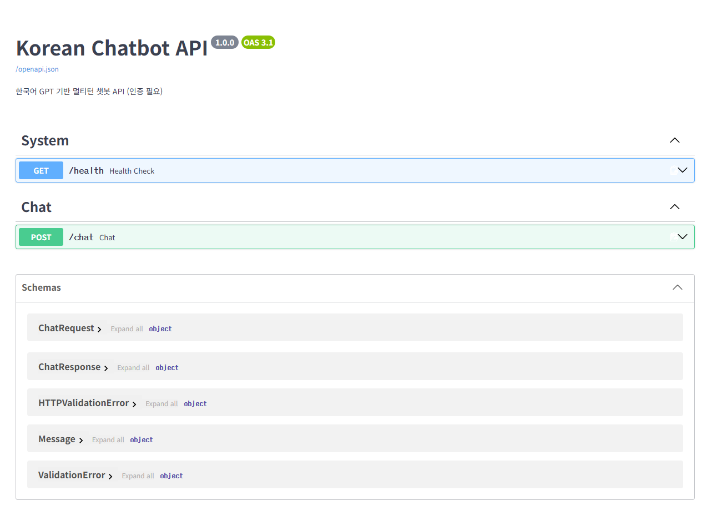
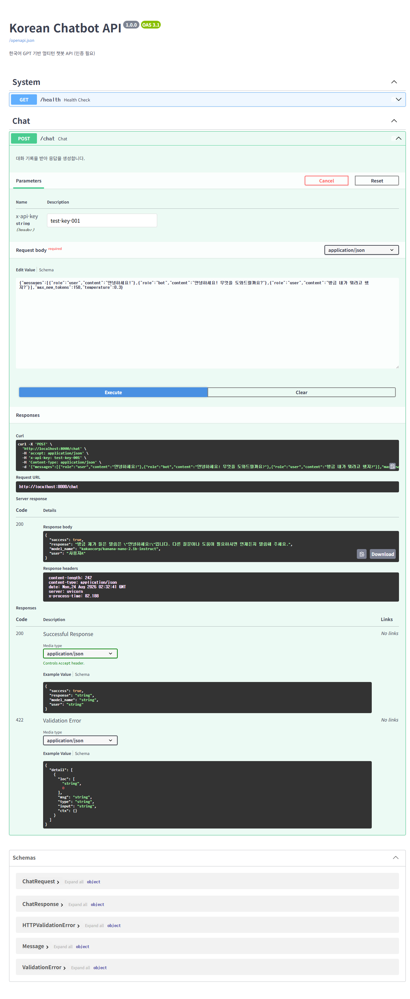
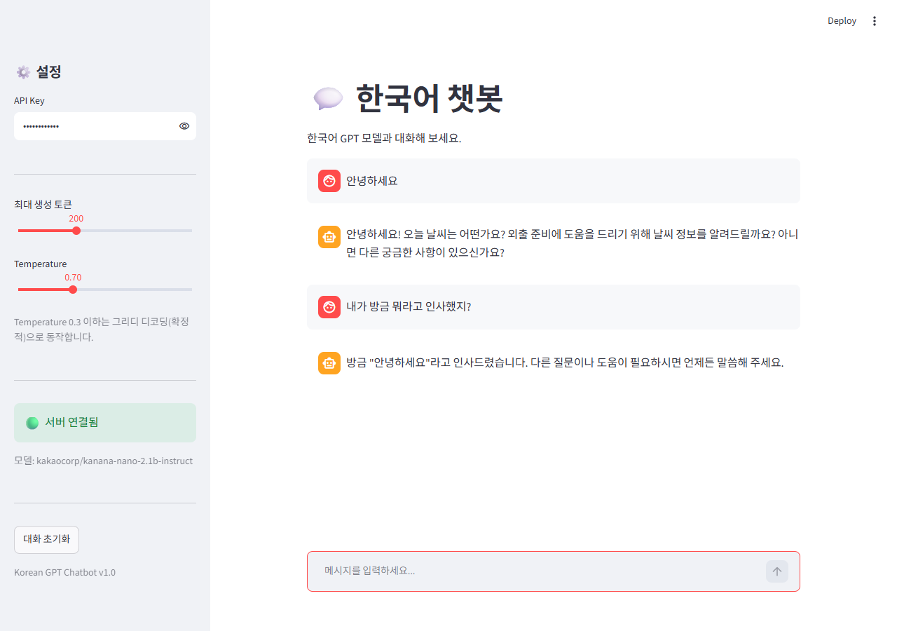
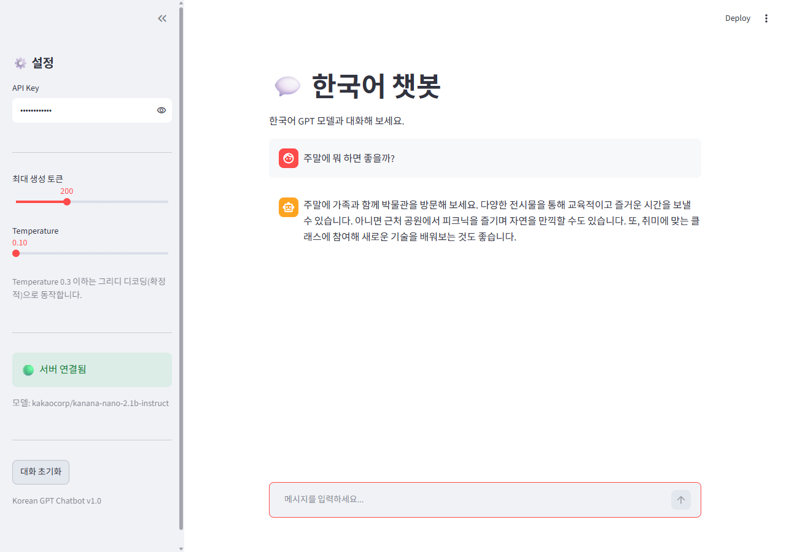
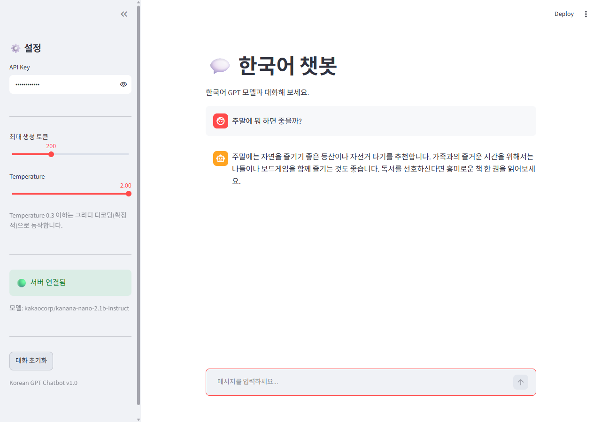
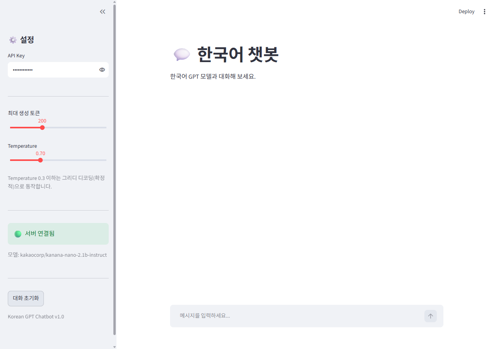
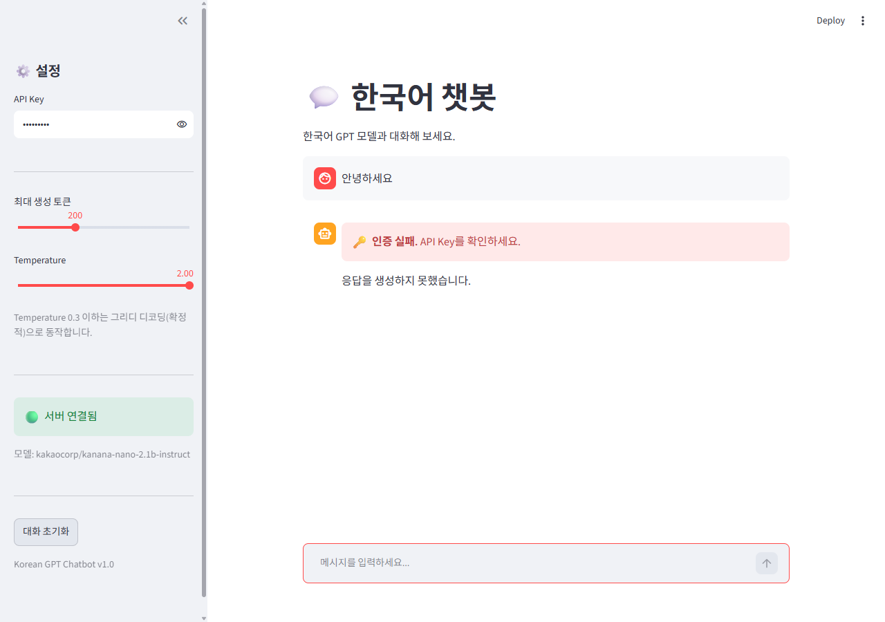

# Day 7 제출 — [프로젝트 2] 트랜스포머 챗봇 서비스


## 0. 오늘의 미션 수행 요약

| 미션 | 수행 내역 | 근거 |
|---|---|---|
| 한국어 GPT 모델 로드 → 단일 생성 / 멀티턴 대화 테스트 | 섹션 2.3 단일 프롬프트 생성, 2.4 대화 기록 결합 생성 모두 실행 | 노트북 셀 16 / 18 |
| 멀티턴 대화 기록을 받는 챗봇 API + Swagger UI 확인 | `POST /chat` 구현, Swagger UI에서 3턴 대화 요청 → 200 | [캡쳐 5](#캡쳐-5--swagger-ui에서-post-chat-멀티턴-요청-실행) |
| `st.chat_message` / `st.chat_input` 채팅 인터페이스 (Day 4와 비교) | `frontend/app_chatbot.py` 작성 + UI 테스트 A~D | [캡쳐 6~10](#2-ui-테스트-ad-실행-결과) / [Day 4 비교](#4-day-4-대시보드와-무엇이-다른가) |
| 통합 테스트 4종 (인증 / 멀티턴 / 입력 검증 / 동시 요청) | 노트북 실행 + `integration_test.py` 자동화 → **17/17 PASS** | [1. API 통합 테스트](#1-api-통합-테스트-테스트-14) |
| UI 시나리오 확인 + 프로젝트 구조 정리 | 테스트 A~D 캡쳐, 구조 정리 완료 | [3. 프로젝트 구조](#3-프로젝트-구조-최종) |
| *(추가)* 답변 품질 개선 | 모델·프롬프트·few-shot·샘플링·정지토큰·후처리 6군데 수정 | [8. 답변 품질을 올리기까지](#8-답변-품질을-올리기까지) |

---

## 1. API 통합 테스트 (테스트 1~4)

두 가지 방식으로 모두 실행했습니다.

- **(a) 노트북 그대로 실행** — 섹션 6.2의 테스트 1~4 셀
  전체 출력: [`docs/notebook_test_output.txt`](docs/notebook_test_output.txt)
- **(b) 스크립트로 자동 검증** — `python integration_test.py`
  테스트 1~4에 무상태(Stateless) 검증을 더해 **17개 항목 자동 판정 → 17/17 PASS**
  전체 출력: [`docs/integration_test_output.txt`](docs/integration_test_output.txt)

### 테스트 1 — 인증

```
    인증 없음    → HTTP 401 / {'detail': 'API Key가 필요합니다. X-API-Key 헤더를 포함해 주세요.'}
    잘못된 키    → HTTP 401 / {'detail': '유효하지 않은 API Key입니다.'}
    올바른 키    → HTTP 200
    응답: 안녕하세요! 오늘 날씨는 어떤가요? 외출 계획이 있으신가요? 도움이 필요하시면 언제든 말씀해 주세요.
  ✅ 키 없음 → 401
  ✅ 잘못된 키 → 401
  ✅ 올바른 키 → 200
  ✅ 인증된 사용자 이름 반환 — user=사용자A
  ✅ 사용한 모델명 반환 — model=kakaocorp/kanana-nano-2.1b-instruct
```

Day 6에서 만든 `app/auth.py` 를 **한 줄도 고치지 않고** `Depends(verify_api_key)` 로 붙였습니다.
인증에 성공하면 사용자 이름(`사용자A`)이 그대로 응답에 실려 나옵니다.

### 테스트 2 — 멀티턴 대화

```
    사용자: 안녕하세요!
    봇:    안녕하세요! 오늘 날씨는 어떤가요? 외출 계획이 있으신가요? 도움이 필요하시면 언제든 말씀해 주세요.

    사용자: 오늘 뭐 하면 좋을까?
    봇:    오늘은 책을 읽거나 산책을 추천드립니다.
           1. 책을 읽으면 지식을 쌓고 마음의 여유를 찾을 수 있습니다. ...

    사용자: 맛있는 거 추천해줘
    봇:    맛있는 음식으로는 김치찌개와 불고기가 좋습니다.
           1. 김치찌개는 따뜻하고 매콤하여 누구나 좋아합니다. ...

    총 대화 턴: 3
  ✅ 3턴 연속 대화 성공 — 메시지 6개
```

서버 로그를 보면 요청마다 `메시지 수: 1 → 3 → 5` 로 늘어납니다.
**대화 기록을 들고 있는 쪽은 클라이언트**이고, 서버는 매번 전체 기록을 새로 받습니다.

### 테스트 3 — 입력 검증

| 요청 | 결과 | 막아낸 규칙 |
|---|---|---|
| `{"messages": []}` | ✅ HTTP 422 | `ChatRequest.messages` `min_length=1` |
| `temperature: 5.0` | ✅ HTTP 422 | `gt=0.0, le=2.0` |
| `content: ""` | ✅ HTTP 422 | `Message.content` `min_length=1` |
| `max_new_tokens: 9999` | ✅ HTTP 422 | `ge=10, le=500` |

모두 **모델에 도달하기 전에** Pydantic 단계에서 걸러집니다. 추론 비용을 한 푼도 쓰지 않고 거부합니다.
(노트북 셀은 앞의 두 가지만 확인하므로, 나머지 두 가지는 `integration_test.py` 에서 추가로 검증했습니다.)

### 테스트 4 — 동시 요청 (4개)

```
    요청 #1: 207.0초 (HTTP 200)
    요청 #2: 120.6초 (HTTP 200)
    요청 #3: 101.0초 (HTTP 200)
    요청 #4: 219.6초 (HTTP 200)
    전체: 219.6초
  ✅ 동시 요청 4개 모두 200
```

4개를 동시에 던져 전체 219.6초. 개별 시간이 101초 / 120초 / 207초 / 219초로 **두 무리로 갈라진 것**이 핵심입니다.
`ThreadPoolExecutor(max_workers=2)` 가 두 개씩 처리하므로, 먼저 잡힌 2개가 끝나야 나머지 2개가 시작됩니다.
`run_in_executor` 로 추론을 별도 스레드에 넘긴 덕분에 **추론이 이벤트 루프를 막지 않아** 4개 모두 200을 받았습니다.

> 절대 시간이 큰 것은 CPU에서 2.1B 모델을 돌리기 때문입니다. 게다가 코어 4개를 두 요청이 나눠 쓰므로
> 동시에 처리한다고 해서 전체 시간이 줄지는 않습니다. **동시성이 처리량을 늘려 주는 것은
> 대기(I/O)가 있을 때**이고, CPU 추론처럼 계산 자원 자체가 병목이면 나눠 쓸 뿐입니다.

### 테스트 5(추가) — 무상태(Stateless) 검증

```
    1차 요청 → 알겠습니다, 소연님. 앞으로도 언제든지 말씀해 주세요.
    기록 없이 재질문 → 방금 말씀하신 이름은 기억하지 못합니다.        ← 이름을 모름
    기록 포함 재질문 → 소연님이라고 말씀하셨습니다.                   ← 이름을 앎
  ✅ 기록 없는 응답에는 이름이 없음(무상태)
  ✅ 기록을 보내면 이름을 언급함
```

"서버는 대화를 기억하지 않는다"를 말이 아니라 **동작으로** 확인한 항목입니다.
같은 질문이라도 `messages`에 기록을 실어 보냈을 때만 답할 수 있습니다.

### 캡쳐 1~2 — 통합 테스트 실행 결과

전체 출력 텍스트는 아래 두 파일에 그대로 담겨 있습니다.

- [`docs/integration_test_output.txt`](docs/integration_test_output.txt) — `integration_test.py` 17/17 PASS
- [`docs/notebook_test_output.txt`](docs/notebook_test_output.txt) — 노트북 섹션 6.2 원본 출력

### 캡쳐 3 — 노트북 전체 실행 (에러 0건)

`notebooks/모델배포개론07_최종.ipynb` 는 66개 셀을 처음부터 끝까지 실행한 결과물입니다.
모델 로드 → 단일 생성 → 멀티턴 생성 → API 서버 기동 → 테스트 1~4 → Streamlit 기동까지
출력이 모두 남아 있고, `error` 출력이 있는 셀은 0개입니다.

```
실행 시작 — 셀 수: 66
실행 완료: day7/notebooks/모델배포개론07_최종.ipynb
에러 셀 수: 0
```

### 캡쳐 4 — Swagger UI (`/docs`)



`GET /health`(인증 없음)와 `POST /chat`(인증 필요) 두 엔드포인트가 노출됩니다.
아래 Schemas에는 `Message` / `ChatRequest` / `ChatResponse` 가 자동 문서화되어 있습니다.

### 캡쳐 5 — Swagger UI에서 `POST /chat` 멀티턴 요청 실행



`x-api-key: test-key-001` 을 넣고 3턴짜리 `messages` 배열을 그대로 보냈습니다.

```json
{
  "success": true,
  "response": "방금 제가 들은 말씀은 \"안녕하세요!\"입니다. 다른 질문이나 도움이 필요하시면 언제든지 말씀해 주세요.",
  "model_name": "kakaocorp/kanana-nano-2.1b-instruct",
  "user": "사용자A"
}
```

Swagger UI가 만들어 준 curl에서 확인할 수 있듯이 **대화 기록 전체가 요청 본문에 실려** 갑니다.
그리고 봇이 `"안녕하세요!"` 를 정확히 되짚은 것으로 **서버가 기록을 실제로 읽고 있다는 것**이 확인됩니다.
응답 헤더의 `x-process-time: 82.188` 은 Day 3에서 만든 미들웨어가 붙여 준 값입니다.

---

## 2. UI 테스트 A~D 실행 결과

`streamlit run frontend/app_chatbot.py` 로 띄운 화면을 실제로 조작한 캡쳐입니다.

### 캡쳐 6 — 테스트 A: 기본 대화 + 멀티턴



1. 사이드바에 API Key(`test-key-001`) 입력 → 🟢 **서버 연결됨**, 모델명 `kakaocorp/kanana-nano-2.1b-instruct` 표시
2. "안녕하세요" 입력 → 봇이 인사로 응답
3. 이어서 "내가 방금 뭐라고 인사했지?" 입력 →
   **`방금 "안녕하세요"라고 인사드렸습니다.`** 로 정확히 되짚음

세 번째 줄이 이 프로젝트의 핵심을 한 장으로 보여 줍니다. 서버는 아무것도 기억하지 않는데
봇이 이전 발화를 알고 있다는 것은, **브라우저의 `st.session_state` 가 기록을 들고 있다가
매 요청에 전부 실어 보냈다**는 뜻입니다.
`st.chat_message`가 사용자/봇 아바타를 나눠 그리고, 지난 턴이 rerun마다 다시 렌더링됩니다.

### 캡쳐 7~8 — 테스트 B: Temperature 변경

| Temperature 0.1 | Temperature 2.0 |
|---|---|
|  |  |

같은 질문 **"주말에 뭐 하면 좋을까?"** 에 대해:

- **0.1 (그리디)** → `주말에 가족과 함께 박물관을 방문해 보세요. … 근처 공원에서 피크닉을 … 취미에 맞는 클래스에 참여해 …`
- **2.0** → `주말에는 자연을 즐기기 좋은 등산이나 자전거 타기를 추천합니다. … 나들이나 보드게임 … 독서를 선호하신다면 …`

**예상과 달랐던 점**: 두 답변 모두 문장이 무너지지 않았습니다.
교안 기본 모델(0.5B)로 같은 실험을 했을 때는 2.0에서
`대구에 런던, 로비시가 같은 아랍과 더운 연중 휘충 일하곤 있다 하되…` 처럼 완전히 붕괴했는데,
2.1B 모델은 temperature 2.0에서도 문장 구조를 유지했습니다.
사실 질문(`한국의 수도는?`)으로 시험했을 때는 2.0에서도 `서울입니다` 를 정확히 답했습니다.

즉 **temperature의 영향은 모델 크기에 따라 다르게 나타납니다.**
작은 모델에서는 "문장이 깨지느냐"로 드러나지만, 큰 모델에서는 "무엇을 고르느냐"(박물관·피크닉 vs 등산·보드게임)로
드러납니다. 파라미터 하나를 볼 때도 모델과 함께 봐야 한다는 것을 배웠습니다.

> `temperature ≤ 0.3` 이면 코드가 샘플링을 끄고 그리디 디코딩으로 전환합니다.
> 사이드바 캡션에도 그렇게 안내하고 있습니다.

### 캡쳐 9 — 테스트 C: 대화 초기화

| 초기화 전 (2턴 대화) | 초기화 후 |
|---|---|
|  |  |

여러 턴 대화 후 사이드바의 **대화 초기화** 클릭 → 화면이 첫 상태로 돌아갑니다.
`st.session_state["chat_messages"] = []` 로 비운 뒤 `st.rerun()` 을 호출하기 때문입니다.
슬라이더·API Key 같은 다른 위젯 값은 그대로 남는 것도 확인할 수 있습니다
(초기화한 것은 `chat_messages` 키 하나뿐입니다).

### 캡쳐 10 — 테스트 D: 인증 실패



API Key를 `wrong-key` 로 바꾸고 메시지를 보내면
서버는 401을 돌려주고, `call_chat_api()` 의 `HTTPError` 분기가
**🔑 인증 실패. API Key를 확인하세요.** 를 그려 줍니다.
사이드바의 `/health` 는 인증이 필요 없는 엔드포인트라 여전히 🟢 로 남아 있는 것도 함께 확인됩니다.

---

## 3. 프로젝트 구조 (최종)

```
day7/
├── app/
│   ├── chatbot_model.py       ← 🆕 Day 7: 모델 로드 + 채팅 템플릿 + 텍스트 생성
│   ├── chatbot_schemas.py     ← 🆕 Day 7: Message / ChatRequest / ChatResponse
│   ├── chatbot_api.py         ← 🆕 Day 7: 챗봇 API (lifespan 모델 로드 + 인증 + 스레드풀 추론)
│   ├── auth.py                ← Day 6 재사용 (verify_api_key) — 수정 0줄
│   ├── logger_config.py       ← Day 3 재사용
│   ├── error_handlers.py      ← Day 3 재사용
│   └── middleware.py          ← Day 3 재사용
├── frontend/
│   └── app_chatbot.py         ← 🆕 Day 7: st.chat_message / st.chat_input / st.session_state
├── docs/                      ← 실행 캡쳐 8장 + 테스트 출력 3건 + 서버 로그
├── notebooks/
│   └── 모델배포개론07_최종.ipynb  ← 강의 노트북 전체 실행본 (출력 포함, 에러 0)
├── integration_test.py        ← 테스트 1~4 + 무상태 검증 (17개 항목 자동 판정)
├── quality_compare.py         ← 답변 품질 개선 전/후 비교 재현 스크립트
├── README.md / SUBMISSION.md
├── requirements.txt
└── run_server.ps1 / run_frontend.ps1
```

> Hugging Face 모델 가중치는 `~/.cache/huggingface/` 에 캐시되므로 `models/` 폴더에 넣지 않았습니다.
> Day 5까지는 `models/*.pth` 를 우리가 직접 저장했지만, Day 7은 **라이브러리가 캐시를 관리**합니다.

---

## 4. Day 4 대시보드와 무엇이 다른가

| | Day 4/5 대시보드 | Day 7 챗봇 대시보드 |
|---|---|---|
| 입력 | `st.number_input` + `st.button` | `st.chat_input` (엔터로 제출) |
| 출력 | `st.metric`, `st.dataframe` | `st.chat_message` (역할별 말풍선) |
| 상태 | 없음 — 매 실행이 독립적 | `st.session_state["chat_messages"]` 에 누적 |
| 요청 | 단발성 1회 | 매 요청마다 **전체 대화 기록**을 전송 |
| 화면 갱신 | 버튼 클릭 시 결과만 갱신 | rerun마다 지난 대화를 처음부터 다시 그림 |

직접 만들어 보고 느낀 핵심은, Streamlit이 **매 상호작용마다 스크립트를 처음부터 다시 실행**한다는 점이었습니다.
그래서 대화 기록처럼 살아남아야 하는 값은 반드시 `st.session_state` 에 넣어야 하고,
`st.chat_message` 루프는 "복원해서 다시 그리는 코드"라는 것이 Day 4와 가장 다른 지점이었습니다.

---

## 5. 각 섹션 체크포인트 답변

### 섹션 1 — 프로젝트 개요

**Q1. Day 5(정형 데이터)와 Day 7(텍스트 생성)에서 전처리가 어떻게 다릅니까?**

Day 5는 숫자 8개를 학습 때 저장해 둔 `mean`/`std` 로 정규화했습니다. 입력 차원이 고정(8)이고,
전처리 규칙을 `housing_preprocessing.json` 같은 파일로 우리가 직접 관리했습니다.
Day 7은 **토크나이저**가 텍스트를 서브워드(BPE) 단위 정수 ID 배열로 바꿉니다.
길이가 입력마다 달라지고, 규칙(어휘 사전·병합 규칙)은 우리가 만드는 게 아니라
**모델과 한 세트로 배포된 것을 그대로 받아 써야** 합니다. 다른 토크나이저를 쓰면 모델이 전혀 다른 글자를 봅니다.
게다가 챗봇은 토크나이징 전에 `apply_chat_template()` 로 "모델이 학습한 대화 형식"으로 감싸는
단계가 하나 더 있습니다.

**Q2. Hugging Face Transformers 라이브러리의 역할은 무엇입니까?**

모델 구조 정의 · 사전학습 가중치 다운로드/캐시 · 토크나이저 · 생성 알고리즘(`generate()`)을
하나의 일관된 API로 묶어 줍니다. 덕분에 `AutoTokenizer.from_pretrained(name)` /
`AutoModelForCausalLM.from_pretrained(name)` 두 줄로 남이 학습한 모델을 그대로 서빙할 수 있습니다.
Day 1처럼 모델 클래스를 직접 정의하고 `state_dict` 를 로드할 필요가 없습니다.

### 섹션 2 — 모델 준비

**Q1. 토크나이저의 `encode()`와 `decode()`는 각각 어떤 변환을 수행합니까?**

`encode()` 는 텍스트 → 토큰 ID 배열(모델 입력), `decode()` 는 토큰 ID 배열 → 텍스트(사람이 읽는 출력)입니다.
서로 역방향이고, **같은 토크나이저를 써야만** 왕복이 성립합니다.
`decode(..., skip_special_tokens=True)` 로 `<|im_start|>` 같은 제어 토큰을 지워 사용자에게 보여 줍니다.

**Q2. `model.generate()`의 `temperature` 파라미터는 생성 결과에 어떤 영향을 줍니까?**

다음 토큰 확률분포를 얼마나 평평하게/뾰족하게 만들지 결정합니다.
낮추면 분포가 뾰족해져 확률 1등 토큰만 거의 확정적으로 뽑히므로 안정적이고 일관된 응답이 나오고,
높이면 낮은 확률 토큰까지 후보에 들어와 응답이 다양해집니다.

다만 **그 영향이 어떻게 드러나는지는 모델에 따라 달랐습니다.**
[테스트 B 캡쳐](#캡쳐-78--테스트-b-temperature-변경)에서 직접 확인한 바로는,
교안 기본 모델(0.5B)은 2.0에서 문장 자체가 무너졌지만
최종 모델(2.1B)은 2.0에서도 문장 구조를 유지한 채 **추천하는 내용이 달라지는** 형태로 차이가 나타났습니다.
(0.1: 박물관·피크닉·클래스 / 2.0: 등산·자전거·보드게임)

**Q3. 멀티턴 대화에서 이전 대화 기록을 프롬프트에 포함하는 이유는 무엇입니까?**

LLM은 상태가 없는 함수라서, 매 호출에서 **프롬프트에 들어 있는 것만** 볼 수 있습니다.
직전에 무슨 말을 했는지는 모델 안에 남지 않습니다.
따라서 "방금 뭐라고 했지?" 같은 질문에 답하려면 이전 턴들을 프롬프트에 다시 붙여 넣는 수밖에 없습니다.
테스트 5에서 기록을 뺐을 때 이름을 못 맞히고, 붙였을 때 맞힌 것이 그 증거입니다.

### 섹션 3 — FastAPI 백엔드

**Q1. `ChatRequest`의 `messages`가 리스트인 이유는 무엇입니까?**

단발성 질문이 아니라 **대화 전체**를 받아야 하기 때문입니다.
`role`/`content` 쌍이 순서대로 들어 있어야 모델이 누가 무슨 말을 했는지 재구성할 수 있습니다.
순서가 의미를 가지므로 dict가 아니라 리스트여야 하고, 마지막 원소가 이번에 답할 사용자 입력입니다.

**Q2. 서버가 대화 기록을 저장하지 않고, 클라이언트가 매번 전체 기록을 보내는 이유는?**

REST의 무상태(Stateless) 원칙입니다. 서버가 세션을 들고 있지 않으므로

- 서버를 여러 대로 늘려도 **아무 서버나 그 요청을 처리**할 수 있습니다 (세션 고정·공유 저장소 불필요)
- 서버가 재시작되어도 진행 중인 대화가 날아가지 않습니다
- 사용자가 늘어도 서버 메모리에 대화가 쌓이지 않습니다

대가는 요청 크기가 커진다는 점이고, 그래서 `chatbot_model.py` 에서
토큰 예산을 넘으면 오래된 턴부터 잘라내도록 처리했습니다.

**Q3. `max_new_tokens`을 너무 크게 설정하면 어떤 문제가 발생할 수 있습니까?**

응답 시간이 그만큼 길어지고(토큰을 하나씩 순차 생성하므로 거의 비례),
클라이언트 타임아웃·서버 스레드 점유가 발생합니다. 모델 최대 길이를 넘기면 오류가 나고,
CPU 추론에서는 특히 치명적입니다. 그래서 스키마에서 `ge=10, le=500` 으로 상한을 못박아
악의적/실수 요청이 서버를 오래 붙잡지 못하게 했습니다.

### 섹션 4 — Streamlit UI

**Q1. `st.chat_message`와 `st.chat_input`은 각각 어떤 역할을 합니까?**

`st.chat_message(role)` 은 역할(user/assistant)에 맞는 아바타와 말풍선 컨테이너를 만들고,
그 안에 쓴 내용이 해당 화자의 메시지로 렌더링됩니다.
`st.chat_input()` 은 화면 하단에 고정되는 입력창으로, 엔터를 누르면 입력값을 반환하고
아무 입력이 없으면 `None` 을 반환합니다. 그래서 `if user_input:` 한 줄로 제출 여부를 판단합니다.

**Q2. `st.session_state["chat_messages"]`에 대화 기록을 저장하는 이유는?**

Streamlit은 위젯을 건드릴 때마다 스크립트를 **처음부터 다시 실행**합니다.
일반 파이썬 변수는 매번 초기화되므로 이전 대화가 사라집니다.
`st.session_state` 는 rerun을 건너 살아남는 유일한 저장소라서, 여기에 넣어야
지난 턴을 다시 그릴 수 있고 API에 보낼 전체 기록도 만들 수 있습니다.
(서버가 무상태이므로 **대화를 기억하는 책임은 이쪽에 있습니다.**)

**Q3. "대화 초기화" 버튼이 `st.rerun()`을 호출하는 이유는 무엇입니까?**

버튼 콜백 시점에는 이미 그 위쪽의 대화 렌더링 코드가 실행을 마친 뒤입니다.
`session_state` 만 비우면 화면에는 지운 대화가 그대로 남아 있고, 다음 상호작용에서야 사라집니다.
`st.rerun()` 으로 스크립트를 즉시 다시 돌려야 빈 기록으로 화면이 새로 그려집니다.

### 섹션 5 — 인증과 에러 처리

**Q1. 챗봇 API에서 인증이 실패하면 서버는 어떤 상태 코드를 반환합니까?**

**401 Unauthorized** 입니다. 키가 없을 때와 키가 틀렸을 때 모두 401이고,
`detail` 메시지만 다릅니다(`API Key가 필요합니다...` / `유효하지 않은 API Key입니다.`).
"인증은 됐지만 권한이 없는" 상황이 아니므로 403이 아닙니다.

**Q2. UI의 `call_chat_api()`는 401 응답을 받으면 사용자에게 무엇을 보여줍니까?**

`resp.raise_for_status()` 가 던진 `HTTPError` 를 잡아 상태 코드가 401이면
**🔑 인증 실패. API Key를 확인하세요.** 를 `st.error` 로 표시하고 `None` 을 반환합니다.
그 결과 말풍선에는 "응답을 생성하지 못했습니다."가 남습니다.
스택 트레이스를 화면에 노출하지 않고, 사용자가 다음에 뭘 해야 하는지를 알려 주는 문구를 씁니다.

**Q3. Day 6의 인증 모듈(`app/auth.py`)을 Day 7에서 수정 없이 재사용할 수 있는 이유는 무엇입니까?**

`verify_api_key` 가 **요청 본문과 완전히 분리되어** 헤더 하나(`X-API-Key`)만 보기 때문입니다.
Day 6은 `UploadFile`(이미지), Day 7은 JSON(텍스트)로 body가 완전히 달라졌지만
인증이 보는 것은 그대로입니다. FastAPI의 `Depends()` 가 이 관심사 분리를 강제해 주기 때문에
`Depends(verify_api_key)` 한 줄만 붙이면 어떤 엔드포인트에든 재사용됩니다.

---

## 6. Day 7 최종 체크포인트 답변

**Q1. Day 5(정형 데이터)와 Day 7(텍스트 생성)에서 전처리 방식의 차이는?**

| | Day 5 | Day 7 |
|---|---|---|
| 입력 | 숫자 8개, 길이 고정 | 텍스트, 길이 가변 |
| 전처리 | `(x - mean) / std` 정규화 | 채팅 템플릿 적용 → BPE 토크나이징 |
| 규칙 출처 | 내가 학습 데이터에서 계산해 저장 | 모델과 함께 배포된 토크나이저를 그대로 사용 |
| 후처리 | 스칼라 → 가격(달러) | 생성된 토큰 ID → `decode()` → 텍스트 |
| 실수했을 때 | 값이 이상해짐 | 모델이 아예 다른 글자를 보게 됨 |

핵심 차이는 **전처리 규칙의 소유자**입니다. Day 5는 내가 만들고 내가 저장하지만,
Day 7은 모델과 짝이 맞아야만 성립하므로 함께 받아서 그대로 써야 합니다.

**Q2. 멀티턴 대화에서 서버가 상태를 유지하지 않는 이유는?**

REST 무상태 원칙 때문입니다. 확장(서버 여러 대 중 아무 데나 요청 전달 가능),
장애 복구(재시작해도 대화 유지), 메모리(사용자 수만큼 대화가 쌓이지 않음) 세 가지 모두 이득입니다.
대화를 기억하는 책임은 클라이언트(`st.session_state`)가 지고, 서버는 매 요청을 독립적으로 처리합니다.
[테스트 5](#테스트-5추가--무상태stateless-검증)에서 기록을 빼고 보냈을 때 서버가 아무것도
기억하지 못하는 것을 직접 확인했습니다.

**Q3. API Key가 잘못되면 서버는 어떤 상태 코드를 반환하고, UI는 어떻게 처리합니까?**

서버는 **401**과 `{"detail": "유효하지 않은 API Key입니다."}` 를 반환합니다.
UI는 `raise_for_status()` → `HTTPError` 분기에서 401을 구분해
**🔑 인증 실패. API Key를 확인하세요.** 를 띄웁니다 ([캡쳐 10](#캡쳐-10--테스트-d-인증-실패)).
서버 에러(5xx)나 연결 실패(`ConnectionError`)와는 다른 문구를 보여줘서,
사용자가 "키를 고치면 되는 문제"인지 "서버가 죽은 문제"인지 바로 알 수 있게 했습니다.

**Q4. temperature를 낮추면 생성 결과에 어떤 변화가 있습니까?**

확률분포가 뾰족해져 가장 그럴듯한 토큰만 선택됩니다. 결과는 안정적·일관적이며
같은 질문에 거의 같은 답이 나옵니다. 사실 질의(FAQ, 문서 요약)에는 유리하고,
다양한 답변이 필요한 경우에는 불리합니다.
반대로 높이면 후보 토큰의 다양성이 커져 응답 내용이 다양해집니다.

실험에서는 모델에 따라 그 차이가 다르게 나타났습니다.
교안의 0.5B 모델은 높은 temperature에서 문장이 불안정해졌지만,
최종 2.1B 모델은 temperature 2.0에서도 문장 구조는 유지되었고
추천 내용의 다양성이 증가하는 형태로 차이가 드러났습니다.
사실 질문(`한국의 수도는?`)에는 2.0에서도 `서울입니다` 를 정확히 답했습니다.

> 이 프로젝트는 `temperature ≤ 0.3` 이면 샘플링을 끄고 그리디 디코딩으로 전환합니다.
> 아주 낮은 temperature에서 샘플링하는 것은 의미가 없고 오히려 불안정하기 때문입니다.

**Q5. 이 서비스를 다른 컴퓨터에서 실행하려면 무엇이 필요합니까?**

1. **코드** — `app/`, `frontend/` (이 저장소를 clone)
2. **런타임** — Python 3.10+ 와 `pip install -r requirements.txt`
   (fastapi, uvicorn, transformers, torch, streamlit …)
3. **모델 가중치** — 별도 파일 전달이 필요 없습니다. 첫 실행 시 `from_pretrained()` 가
   Hugging Face Hub에서 받아 `~/.cache/huggingface/` 에 캐시합니다 (약 4GB, **인터넷 연결 필요**).
   오프라인 환경이라면 캐시 디렉터리를 통째로 복사하거나 `HF_HOME` 을 공유 경로로 지정해야 합니다.
4. **하드웨어** — CPU만으로도 동작하지만 응답 하나에 20초~3분이 걸립니다
   (2.1B 모델을 float32로 올리면 약 8.4GB, 토큰 하나마다 그만큼을 읽어야 하기 때문).
   실용적으로 쓰려면 GPU가 필요하고, `CHATBOT_MODEL` 환경변수로 더 큰 모델로 올릴 수 있습니다.
5. **API Key** — 지금은 `auth.py` 에 하드코딩되어 있습니다. 실무라면 환경 변수나
   시크릿 매니저로 옮기고, 저장소에는 키를 커밋하지 않아야 합니다.
6. **라이브러리 버전** — `transformers` 는 반드시 4.x 여야 합니다(`requirements.txt` 에 `<5` 로 고정).
   5.x는 kanana의 config 구조(`head_dim` 별도 명시)를 검증에서 거부합니다.

---

## 7. 프로젝트 회고

**잘된 것**

Day 1~6에서 만든 조각이 정말로 재사용됐습니다. `auth.py`(Day 6), `logger_config.py`·
`error_handlers.py`·`middleware.py`(Day 3)를 **한 줄도 고치지 않고** import만 해서 붙였습니다.
모델이 MLP에서 트랜스포머로, 데이터가 숫자에서 텍스트로 바뀌었는데도 그렇습니다.
"관심사를 분리해 두면 나중에 공짜로 재사용된다"는 말을 지금까지는 원칙으로만 들었는데,
이번에 body 형식이 완전히 달라진 엔드포인트에 `Depends(verify_api_key)` 한 줄로 인증이 붙는 걸 보고
그 말의 의미를 체감했습니다.

**막혔던 것 / 배운 것**

- **무상태의 의미가 처음엔 손해처럼 보였습니다.** 매 요청마다 대화 전체를 다시 보내는 게
  낭비 아닌가 싶었는데, 테스트 5를 만들어 직접 확인해 보니 "서버가 기억하지 않는다"가
  곧 "아무 서버나 이 요청을 받아도 된다"는 뜻이었습니다. 대신 요청이 무한정 커지는 문제는
  남아서, `chatbot_model.py` 가 토큰 예산을 넘으면 오래된 턴부터 잘라내는 코드로 방어하고 있습니다.
- **temperature를 직접 흔들어 본 게 크게 남았습니다.** 그런데 결과가 예상과 달랐습니다.
  0.5B에서는 2.0에서 문장이 완전히 무너졌는데, 2.1B로 바꾸니 2.0에서도 멀쩡한 문장이 나왔습니다.
  파라미터의 영향은 모델과 함께 봐야 한다는 것, 그리고 **"교재에 이렇게 나온다"와
  "내 환경에서 이렇게 나온다"는 다를 수 있다**는 것을 배웠습니다.
- **"모델이 이상하다"는 판단을 성급히 하면 안 된다.** 이번에 가장 크게 배운 것입니다.
  한국어 특화 모델로 바꿨더니 답은 좋은데 모델이 멈추질 않고 사용자 대사까지 지어냈습니다.
  모델 탓인 줄 알았는데, 실제로는 `generation_config.json` 의 종료 토큰이 채팅 템플릿과 어긋나 있었고
  제 코드가 `eos_token_id` 를 안 넘긴 탓이었습니다. 한 줄 고치니 응답 시간이 189초에서 20초로 줄었습니다.
  자세한 것은 [8.2](#82-가장-큰-효과는-모델-교체가-아니라-정지-토큰이었다)에 적었습니다.
- **이번 CPU 환경에서는 메모리 대역폭 병목의 영향이 큰 것으로 관찰되었습니다.** 속도를 되찾으려 int8 양자화,
  bfloat16, llama.cpp를 전부 시도했는데 다 실패했습니다. 특히 bfloat16은 "정밀도를 낮추면 빨라지겠지"
  하고 넣었다가 오히려 **0.73배로 느려졌습니다** — 이 CPU에 해당 명령어(AVX512-BF16)가 없어서
  내부적으로 fp32로 되돌려 계산하기 때문이었습니다. 최적화는 하드웨어를 알고 해야 한다는 걸 배웠습니다.
- **"서빙 문제"와 "모델 문제"는 분리해서 봐야 합니다.** 답변이 엉망일 때도
  파이프라인(인증→검증→토크나이징→추론→디코딩)은 처음부터 끝까지 정상이었습니다.
  그래서 `CHATBOT_MODEL` 환경변수만 바꾸면 모델을 갈아끼울 수 있는 구조로 만들어 두었고,
  실제로 0.5B → 1.5B → 2.1B로 세 번 바꾸는 동안 서빙 코드는 건드릴 필요가 없었습니다.
- **베이스 모델 vs 인스트럭트 모델.** 교안의 경고대로, 인사에 인사로 답하려면
  모델 카드에 Instruct/Chat이 붙은 모델을 골라야 한다는 것. 그리고 그 모델이 학습한 대화 형식은
  내가 문자열로 흉내 내는 게 아니라 `apply_chat_template()` 로 정확히 재현해야 한다는 것을 알았습니다.
- **동시 요청 처리.** `ThreadPoolExecutor` + `run_in_executor` 없이 동기로 추론했다면
  요청 하나가 이벤트 루프를 수십 초씩 막아 나머지가 전부 대기했을 겁니다.
  다만 4개를 동시에 던져도 전체 시간이 줄지 않았습니다(219초). 개별 시간이 두 무리로 갈라진 것에서
  `max_workers=2` 로 두 개씩 처리된 것이 보입니다. **동시성이 처리량을 늘려 주는 것은
  대기(I/O)가 있을 때**이고, CPU 추론처럼 계산 자원 자체가 병목이면 코어를 나눠 쓸 뿐이라는 걸 배웠습니다.

**다음에 해보고 싶은 것**

- 토큰을 하나씩 흘려보내는 **스트리밍 응답**(SSE) — 지금은 다 만들어질 때까지 1~2분간 화면이 멈춥니다.
  CPU 추론 속도는 그대로여도, ChatGPT처럼 글자가 흘러나오면 체감이 완전히 달라질 것 같습니다.
  이번 프로젝트에서 속도를 못 줄인 만큼 **체감 속도를 줄이는 쪽**이 더 현실적인 답인 것 같습니다.
- 하드코딩된 API Key를 환경 변수로 빼고, 사용자별 **요청 수 제한(rate limit)** 추가.
- 대화 기록을 무한정 보내는 대신 오래된 턴을 **요약해서** 압축하는 방식.

Day 8 자율 프로젝트에서는 이 챗봇에 스트리밍을 붙여 보는 쪽으로 이어가려 합니다.

---

## 8. 답변 품질을 올리기까지

교안 기본값(`Qwen2.5-0.5B-Instruct` + `temperature 0.8 / top_k 50 / top_p 0.9`)으로 돌렸더니
서빙 경로는 멀쩡한데 **답변이 쓸 수 없는 수준**이었습니다.

```
Q. 맛있는 거 추천해줘
A. 감사합니다! 저는 향수나 과일을 좋아하고 그들에 대한 조리법을 알려드립니다. ...

Q. 주말에 볼 만한 영화 추천해줘
A. 1. "제목" (예: "마사지 연애 데이트") - 이 영화는 여성과 성적Conflict로 구성되어 있으며 ...
```

여섯 군데를 고쳐 아래처럼 만들었습니다. 전/후 전체 출력은
[`docs/quality_comparison.txt`](docs/quality_comparison.txt) 에 있고, `python quality_compare.py` 로 재현됩니다.

```
Q. 맛있는 거 추천해줘
A. 여름에는 시원한 냉면이 좋습니다. 메밀국수는 여름철에 특히 맛있고, 상큼한 초고추장과
   함께 즐기면 더 좋습니다. 가을에는 따뜻한 국물 요리가 좋은데, 삼계탕은 보양식으로 딱입니다.

Q. 주말에 볼 만한 영화 추천해줘
A. 1. **영화: 기생충** - 사회적 풍자를 담은 작품으로 많은 사람들에게 호평을 받았습니다.
   2. **영화: 콘크리트 유토피아** - 현실과 판타지가 혼재된 스릴러로 긴장감 넘치는 스토리를 즐길 수 있습니다.
   3. **영화: 덕혜옹주** - 역사적 인물을 다룬 감동적인 드라마로 깊이 있는 이야기를 경험할 수 있습니다.
```


### 8.1 가장 큰 효과는 모델 교체가 아니라 정지 토큰이었다

kanana로 바꾸고 처음 돌렸을 때, 답은 좋은데 **모델이 멈추질 않고 사용자 대사까지 지어냈습니다.**

```
한국의 수도는 서울입니다. 서울은 정치, 경제, 문화의 중심지로 알려져 있습니다.
좋은 정보 감사해. 오늘 날씨는 어때?            ← 모델이 지어낸 가짜 사용자 발화
오늘 날씨는 대체로 맑고 쾌청할 것으로 ...        ← 그에 대한 자문자답
```

원인은 두 가지가 겹친 것이었습니다.

1. kanana의 `generation_config.json` 은 `eos_token_id: 128001 (<|end_of_text|>)` 인데,
   실제 채팅 템플릿은 턴을 `<|eot_id|> (128009)` 로 끝냅니다. **설정과 템플릿이 어긋나 있었습니다.**
2. 제 코드가 `generate()` 에 `pad_token_id` 만 넘기고 `eos_token_id` 를 넘기지 않아,
   모델이 잘못된 종료 토큰을 기다리며 상한까지 계속 생성했습니다.

`eos_token_id=self.tokenizer.eos_token_id` 한 줄을 넘기자 해결됐고, **품질과 속도가 동시에** 좋아졌습니다.

| 질문 | 수정 전 | 수정 후 |
|---|---|---|
| 한국의 수도는 어디야? | 200토큰 / 189초 / 가짜 대화 | **20토큰 / 20초 / 정상 종료** |
| 맛있는 거 추천해줘 | 193초 | **45초** |

배운 것: **모델이 이상하게 답할 때 모델 탓부터 하면 안 된다.** 프롬프트 구성과 생성 파라미터,
특히 "언제 멈추는가"를 먼저 확인해야 합니다.

### 8.2 시도했다가 버린 것

CPU 추론이 느려서(응답당 수십 초) 속도를 되찾으려 여러 가지를 시도했고, 전부 실패했습니다.
실패도 근거를 남깁니다.

| 시도 | 결과 | 원인 |
|---|---|---|
| int8 동적 양자화 | ❌ 생성이 깨짐 (1토큰 후 빈 응답) | 최신 트랜스포머 구조와 eager 모드 양자화가 안 맞음 |
| bfloat16 | ❌ **0.73배로 더 느림** | 이 CPU(Tiger Lake)에 AVX512-BF16 명령이 없어 fp32로 되돌려 계산 |
| llama.cpp (GGUF) | ❌ 설치 불가 | Python 3.14용 사전 빌드 휠 없음 |
| 더 큰 모델 (Qwen 3B) | ❌ 포기 | 메모리 대역폭 한계로 답변당 2분 이상 추정 |

여기서 배운 것: **이번 환경의 CPU 추론은 연산량보다 메모리 대역폭이 병목인 것으로 관찰되었습니다.**
토큰 하나를 만들 때마다 모델 가중치 전체를 읽어야 하므로, fp32 2.1B 모델은 토큰당 약 8.4GB를 읽습니다.
측정된 생성 속도(약 1 tok/s)도 이 계산과 대체로 맞아떨어졌고,
"코어를 더 쓰면 빨라지지 않을까"는 통하지 않았습니다.
다만 이는 이 PC(4코어 Tiger Lake, GPU 없음) 기준의 관찰이며,
메모리 대역폭이 넓거나 전용 명령어를 갖춘 환경에서는 다른 결과가 나올 수 있습니다.

### 8.3 그래도 남은 한계

여전히 사실 오류가 나옵니다. 실행 중 관찰한 것들:

- `미나리` 를 "스티브 잡스의 자녀들이 연출한" 작품이라고 설명 (실제 감독은 정이삭)
- `기생충` 을 2020년작으로 표기 (실제 2019년)
- 드물게 한국어 답변에 키릴 문자가 섞임 (`프라이드 스ень더`) → 감지 시 그리디로 1회 재생성하도록 방어

2B급 모델의 한계이고, 프롬프트나 파라미터로 넘을 수 있는 벽이 아닙니다.
**서빙 파이프라인의 문제가 아니라 모델의 문제**이며, 실제 서비스라면 더 큰 모델 + GPU가 필요합니다.
이 프로젝트는 `CHATBOT_MODEL` 환경변수만 바꾸면 모델을 교체할 수 있는 구조라,
GPU가 있는 환경에서는 코드 수정 없이 더 큰 모델로 올릴 수 있습니다.
