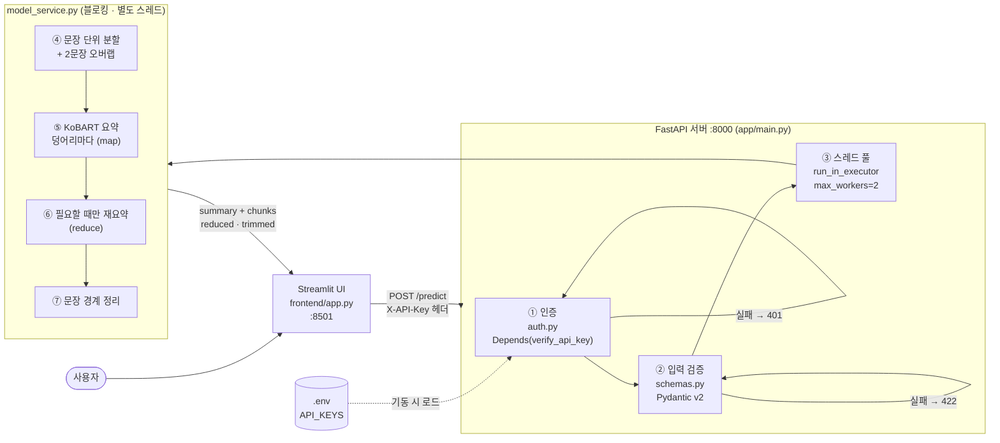
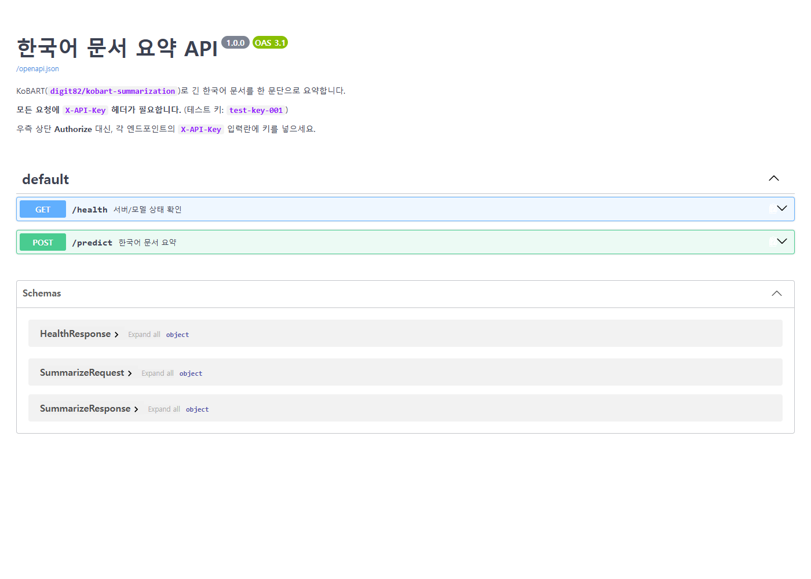
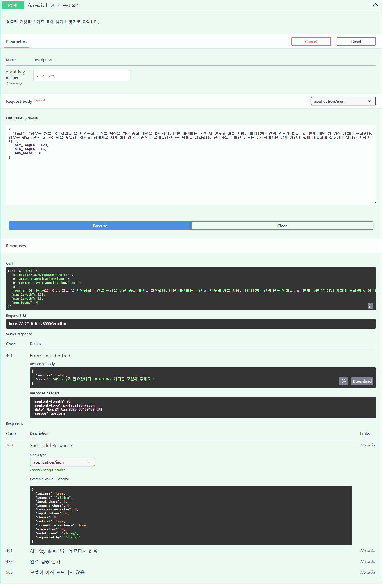
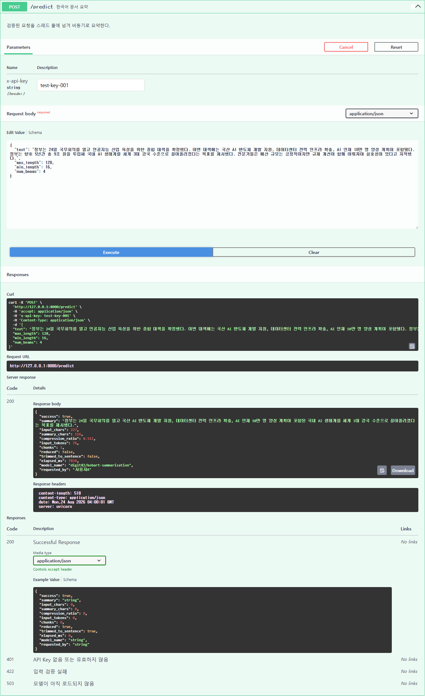
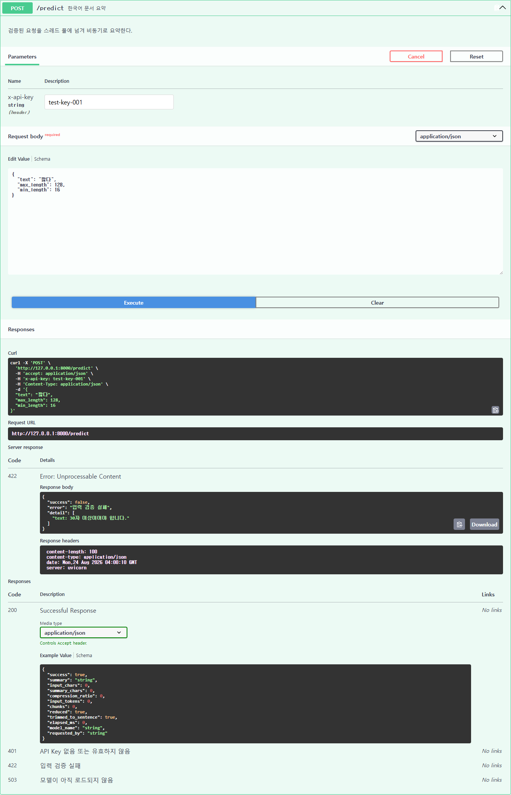
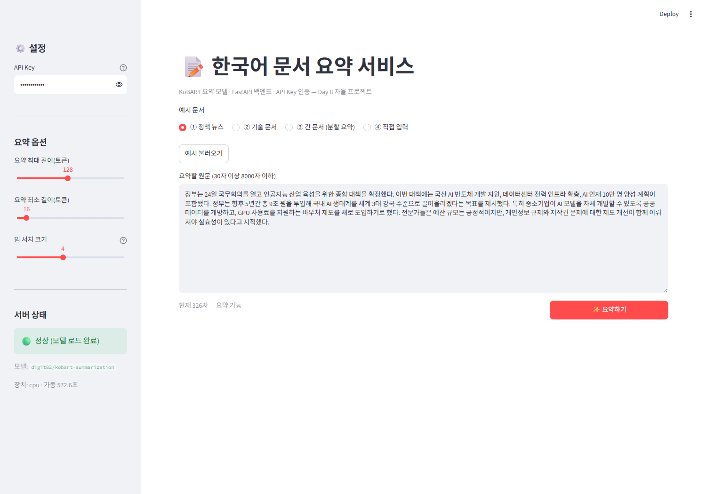
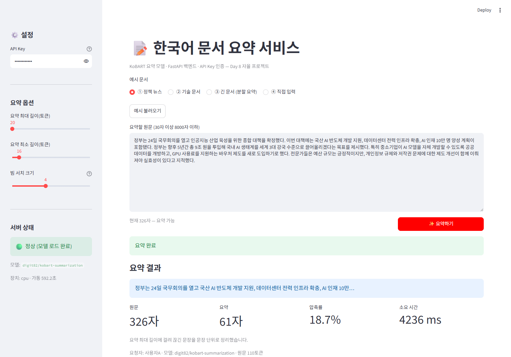
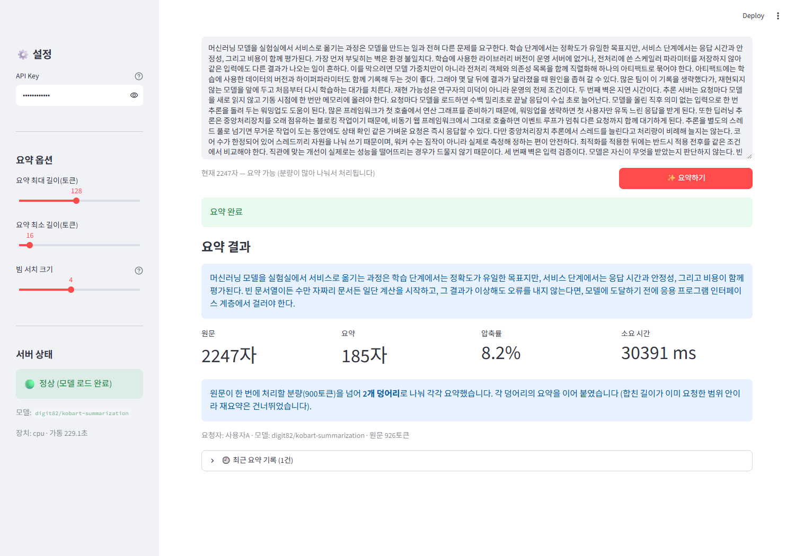
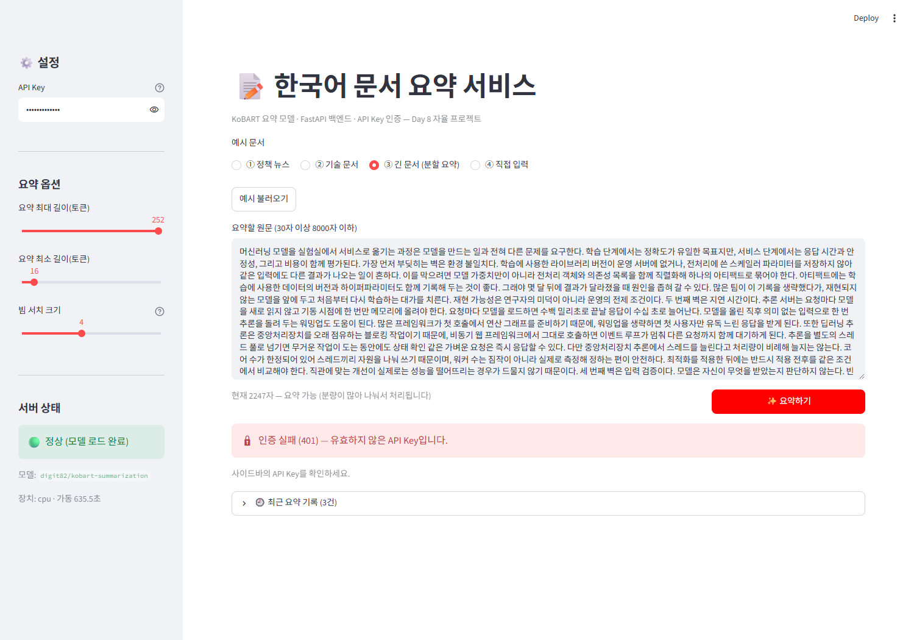
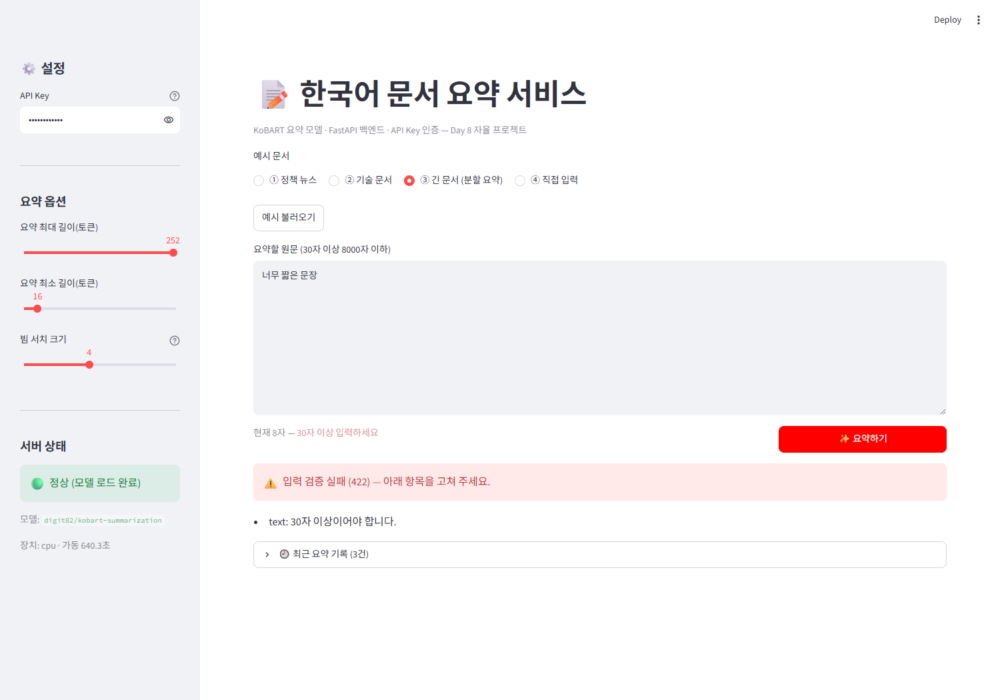

# Day 8 자율 프로젝트 제출 — 한국어 문서 요약 서비스


## 0. 시스템 구조



`.env` → 인증 → 검증 → 스레드 풀 → 분할·요약·후처리 순으로 흐릅니다.
①②에서 걸리면 모델은 아예 호출되지 않고, ③ 덕분에 ④~⑦이 도는 동안에도
`/health` 같은 가벼운 요청은 즉시 응답합니다.

---

## 0-1. 이 프로젝트에서 직접 설계한 것

교안이 요구한 항목(추론 엔드포인트 · Pydantic 검증 · 비동기 추론 · API Key 인증 ·
Streamlit UI · 에러 처리)은 모두 구현했습니다.
그 위에, **요약 서비스를 만들면서 직접 발견한 문제들**을 풀었습니다.

| 발견한 문제 | 어떻게 알았나 | 어떻게 고쳤나 |
|---|---|---|
| 요약이 문장 중간에서 끊긴다 | 길이 옵션을 낮춰 보다가 `"...향후 5년간 국내 AI"` 라는 결과를 봄 | 마지막 완결 문장까지만 남기고, 남길 문장이 없으면 말줄임표로 표시 |
| 긴 문서의 뒷부분이 조용히 버려진다 | 모델 한도가 1024토큰인데 입력 상한을 3000자로 뒀던 것을 확인 | 문장 경계로 나눠 각각 요약(map)하고, 필요할 때만 합쳐 재요약(reduce) |
| **덩어리 경계에서 맥락이 끊긴다** | 회고에 한계로 적어 둔 것을 그대로 두지 않고 실제로 측정 | 앞 덩어리의 **마지막 2문장을 뒤 덩어리 앞에 겹쳐** 넣음 (실험 4) |
| **API Key가 코드에 하드코딩돼 있다** | "배포하려면 환경변수로 옮겨야 한다"고 써 놓고 안 옮긴 것을 발견 | `.env`의 `API_KEYS`에서 읽도록 변경, `.env`는 `.gitignore` 처리 |

앞의 세 가지는 **동작은 하지만 결과가 나쁜** 종류의 문제라, 테스트가 통과한다고
발견되지 않습니다. 직접 값을 바꿔 가며 결과를 읽어야 보였습니다.

---

## 1. 프로젝트 실행 내역

### 1-1. 서버 기동 — 모델은 startup에서 한 번만 로드

```
2026-08-24 12:52:04 | INFO | summarizer.api   | 서버 startup — 모델 로드를 시작합니다.
2026-08-24 12:52:04 | INFO | summarizer.model | 모델 로드 시작: digit82/kobart-summarization (device=cpu)
2026-08-24 12:52:08 | INFO | summarizer.model | 모델 로드 완료 (4.1초)
2026-08-24 12:52:08 | INFO | summarizer.api   | 서버 준비 완료. 요청을 받을 수 있습니다.
INFO:     Uvicorn running on http://127.0.0.1:8000 (Press CTRL+C to quit)
```

요청마다 모델을 읽지 않고 `lifespan`에서 한 번만 올립니다.
로드 직후 워밍업 추론을 한 번 돌려, 첫 요청만 유독 느린 현상을 기동 시점에 흡수했습니다.
전체 로그: [docs/server_log.txt](docs/server_log.txt)

---

### 1-2. Swagger UI — API 문서



`/health`와 `/predict` 두 엔드포인트가 노출됩니다.
`/predict`에는 401 / 422 / 503 응답을 미리 문서화해 뒀고, 요청 본문에는
`json_schema_extra`로 예시 기사를 넣어 두어 **Try it out을 누르면 바로 실행**할 수 있습니다.

---

### 1-3. Swagger UI — ① API Key 없이 요청하면 401



`x-api-key` 칸을 비우고 Execute → **401**.
`{"success": false, "error": "API Key가 필요합니다. X-API-Key 헤더를 포함해 주세요."}`

`Depends(verify_api_key)`가 라우트 함수 본문보다 먼저 실행되므로,
인증에 실패하면 **모델은 아예 호출되지 않습니다.**

---

### 1-4. Swagger UI — ② 정상 키로 요약 성공 (200)



`x-api-key: test-key-001`로 Execute → **200**.

```json
{
  "success": true,
  "summary": "정부는 24일 국무회의를 열고 국산 AI 반도체 개발 지원, 데이터센터 전력 인프라 확충, AI 인재 10만 명 양성 계획이 포함된 국내 AI 생태계를 세계 3대 강국 수준으로 끌어올리겠다는 목표를 제시했다.",
  "input_chars": 227,
  "summary_chars": 116,
  "compression_ratio": 0.511,
  "input_tokens": 76,
  "chunks": 1,
  "reduced": false,
  "trimmed_to_sentence": false,
  "elapsed_ms": 7834,
  "model_name": "digit82/kobart-summarization",
  "requested_by": "사용자A"
}
```

요약문만 주지 않고 **무슨 처리가 일어났는지를 함께** 돌려줍니다.
`chunks`(몇 덩어리로 나눴는지) · `reduced`(합친 뒤 재요약했는지) ·
`trimmed_to_sentence`(끊긴 문장을 정리했는지)가 그것입니다.
사용자가 받은 요약이 어떤 경로로 만들어졌는지 숨기지 않기 위한 필드입니다.

---

### 1-5. Swagger UI — ③ 30자 미만 입력은 422



`{"text": "짧다"}` → **422**, `["text: 30자 이상이어야 합니다."]`
Pydantic이 걸러 주기 때문에 이 요청은 모델까지 내려가지 않습니다.

---

### 1-6. Streamlit UI — 초기 화면



- **사이드바**: API Key(가려서 입력) · 요약 길이/빔 크기 옵션 · 서버 상태 표시등
- **본문**: 예시 문서 4종 · 원문 입력창 · 실시간 글자 수 안내
- 사이드바 하단은 `/health`를 직접 호출해 **모델 로드 여부와 가동 시간**을 보여줍니다.
  서버가 꺼져 있으면 🔴로 바뀌고 실행 방법을 안내합니다.

---

### 1-7. Streamlit UI — 요약 성공


326자 원문 → **99자 요약, 압축률 30.4%**.
결과 아래에 원문/요약/압축률/소요 시간을 지표로 배치했고, 요청자와 모델명을 함께 표시합니다.

---

### 1-8. Streamlit UI — 길이 옵션과 문장 단위 정리



`요약 최대 길이`를 128 → **20토큰**으로 낮추면 요약이 짧아집니다.
이때 모델 출력은 문장 한가운데서 끊기는데, 서버가 **문장 단위로 정리한 뒤**
"요약 최대 길이에 걸려 끊긴 문장을 문장 단위로 정리했습니다"라고 알려 줍니다.

---

### 1-9. Streamlit UI — 긴 문서 분할 요약 ⭐



2247자(926토큰) 문서 → **185자 요약, 압축률 8.2%**.

> 원문이 한 번에 처리할 분량(900토큰)을 넘어 **2개 덩어리**로 나눠 각각 요약했습니다.
> 각 덩어리의 요약을 이어 붙였습니다 (합친 길이가 이미 요청한 범위 안이라 재요약은 건너뛰었습니다).

입력창 아래에도 `현재 2247자 — 요약 가능 (분량이 많아 나눠서 처리됩니다)` 라고
**미리** 안내합니다. 사용자가 왜 이 요청만 오래 걸리는지 알 수 있어야 하기 때문입니다.

---

### 1-10. Streamlit UI — 잘못된 API Key (401)



`wrong-key-999`로 요청 → 🔒 **인증 실패 (401) — 유효하지 않은 API Key입니다.**
서버가 준 메시지를 그대로 보여주고, "사이드바의 API Key를 확인하세요"라는 다음 행동을 안내합니다.

---

### 1-11. Streamlit UI — 입력 검증 실패 (422)



8자짜리 입력 → ⚠️ **입력 검증 실패 (422)** 와 함께
`text: 30자 이상이어야 합니다.` 를 항목별로 나열합니다.
Pydantic의 영어 메시지를 서버의 `_korean_message()`에서 한국어로 옮겨 내보낸 결과입니다.

---

### 1-12. 통합 테스트 6종 — 27개 항목 전부 통과

```
[테스트 1] 서버 / 모델 상태 확인                     → 3건 PASS
[테스트 2] API Key 인증                             → 4건 PASS
[테스트 3] 입력 검증 (Pydantic)                     → 7건 PASS
[테스트 4] 요약 결과와 옵션 반영                     → 6건 PASS
[테스트 5] 동시 요청 (run_in_executor)              → 2건 PASS
[테스트 6] 한 번에 처리할 분량을 넘는 긴 문서         → 5건 PASS

결과: 27건 성공 / 0건 실패 (총 27건)
```

**테스트 5 — 비동기 추론의 증거**

```
단일 요청 1건: 5.31초
동시 요청 4건: 39.10초 (상태 코드 [200, 200, 200, 200])
추론이 도는 중 /health 응답: 200 (10ms)
```

무거운 추론이 도는 **중에도** `/health`가 10ms에 응답했습니다.
`run_in_executor` 없이 `async def` 안에서 그대로 추론했다면 이벤트 루프가 막혀
`/health`까지 몇 초를 기다려야 했을 것입니다.

**테스트 6 — 분할 요약의 증거**

```
원문 2490자 / 1021토큰 → 덩어리 2개 · 요약 148자 · 압축률 5.9%
요약: 머신러닝 모델을 실험실에서 서비스로 옮기는 과정은 학습 단계에서는 정확도가 유일한
      목표지만, 서비스 단계에서는 응답 시간과 안정성, 비용이 함께 평가된다.
      토큰 수만 세어 기계적으로 자르면 문장이 반 토막 나지만, 문장 단위로 모으면
      각 덩어리가 그 자체로 읽힌다.
```

앞 덩어리(도입부)와 뒤 덩어리(입력 길이 문제) 내용이 **모두** 담겼습니다.

전체 출력: [docs/integration_test_output.txt](docs/integration_test_output.txt)

---

### 1-13. 품질 비교 실험 3종

`python quality_compare.py` — 전체 출력: [docs/quality_comparison.txt](docs/quality_comparison.txt)

**실험 1. 빔 서치 크기를 키우면 실제로 좋아지는가?**

| `num_beams` | 요약 길이 | 소요 시간 | 결과 |
|---|---|---|---|
| 1 | 86자 | 2843ms | "…종합 대책을 확정했다."에서 멈춤 |
| 2 | 86자 | 3160ms | 1과 동일 |
| 4 | 99자 | 5971ms | "AI 산업 육성을 위한" 이 추가됨 |
| 8 | 116자 | 8965ms | 예산 목표(세계 3대 강국)까지 담음 |

빔을 키울수록 요약이 **실제로 구체적**으로 바뀌었지만, 시간도 3배 이상 늘었습니다.
기본값 4를 그 절충점으로 정했습니다.

**실험 2. 길이를 줄이면 짧아지는가, 잘리는가?**

| `max_length` | 결과 | 문장 정리 |
|---|---|---|
| 20 | 61자 — `"...AI 인재 10만…"` | ✅ 잘렸음을 표시 |
| 32 | 97자 — `"...종합 대책을 확정…"` | ✅ 잘렸음을 표시 |
| 64 / 128 / 256 | 99자 — `"...종합 대책을 확정했다."` | 불필요 (모델이 스스로 멈춤) |

64 이상에서는 결과가 같습니다. 모델이 스스로 끝내므로 상한을 더 올려도 의미가 없습니다.

**실험 3. 긴 문서를 잘라 넣으면 무엇을 잃는가?**

| 방식 | 입력 | 결과 | 시간 |
|---|---|---|---|
| ① 앞부분 2000자만 | 831토큰 · 1덩어리 | 도입부 이야기만 남음 | 11253ms |
| ② 전체 2490자 분할 | 1021토큰 · 2덩어리 | 앞뒤 내용 모두 반영 | 21628ms |

①은 뒤쪽 490자를 **아예 읽지 못합니다.** ②는 1.9배 느린 대신 문서 전체를 읽습니다.
**속도를 내주고 정확도를 사는 선택**이며, 그래서 응답에 `chunks`를 담아
사용자가 왜 오래 걸렸는지 알 수 있게 했습니다.

**실험 4. 덩어리를 겹치지 않게 나누면 경계에서 무엇을 잃는가?** ⭐

회고에 *"덩어리를 독립적으로 요약하기 때문에 앞 덩어리의 맥락이 뒤 덩어리에 반영되지 않는다"*
고 적어 둔 한계를, 그대로 두지 않고 직접 고친 뒤 전후를 비교했습니다.

분할 지점은 이랬습니다.

```
앞 덩어리 끝  ...여러 덩어리로 나누어 각각 처리한 뒤 그 결과를 다시 합치는 편이 낫다.
뒤 덩어리 시작 토큰 수만 세어 기계적으로 자르면 문장이 반 토막 나지만, ...
```

뒤 덩어리는 "무엇을" 나눈다는 것인지 모른 채 요약을 시작합니다.
그래서 **앞 덩어리의 마지막 2문장을 뒤 덩어리 앞에 겹쳐** 넣었습니다.

```
오버랩 없음   [문장 1 ~ 25] [문장 26 ~ 54]
오버랩 2문장  [문장 1 ~ 25] [문장 24 ~ 54]      ← 24, 25번이 겹침
```

| 방식 | 요약 길이 | 시간 | 결과 |
|---|---|---|---|
| ① 오버랩 없음 | 148자 | 21399ms | 뒤 덩어리가 앞 문단 맥락 없이 요약됨 |
| ② **오버랩 2문장** | 187자 | 21945ms | 앞 문단 내용이 뒤 덩어리 요약에 실제로 섞여 들어감 |

**정직하게 밝히면, 이 개선은 절반의 성공입니다.**
맥락은 실제로 이어졌지만, 그 부작용으로 원래 서로 다른 두 문단의 내용이
한 문장에 억지로 붙으며 문법이 어색해졌습니다.

```
② 오버랩 적용 결과 중:
   "...사용자는 앞부분만 반영된 결과를 받는 서비스라면, 인증 없이 열린
    추론 엔드포인트는 그 자체로 공격 표면이 된다."
                    ↑ 여기서 서로 다른 문단이 억지로 이어졌습니다
```

**맥락 보존과 문장 자연스러움이 항상 함께 좋아지지는 않는다**는 것을 실측으로 확인했습니다.
겹치는 문장 수를 1개로 줄이거나 덩어리를 더 잘게 나누면 완화될 여지가 있지만,
이번 프로젝트에서는 여기까지 확인하고 트레이드오프를 문서에 남기는 것으로 마무리했습니다.

시간 비용은 청크당 토큰이 늘어난 만큼(약 1.3%)으로 미미했습니다.

---

### 1-14. 사람이 직접 매긴 품질 평가

**자동 테스트는 시스템의 정상 동작 여부를 검증하지만, 요약 품질 자체를 보장하지는 않습니다.**
27개 항목이 전부 통과해도 "요약이 읽을 만한가"는 답하지 못합니다.
그래서 서로 다른 성격의 문서 5개를 실제로 넣고, **핵심 정보 보존 · 문장 자연스러움 ·
중복 · 문장 완결성** 네 가지 기준으로 결과를 직접 읽으며 평가했습니다.

| 문서 | 길이 | 덩어리 | 핵심정보 보존 | 문장 자연스러움 | 중복 | 문장 완결 |
|---|---|---|---|---|---|---|
| 뉴스1 (정책) | 326자 | 1 | 5/5 | 5/5 | 없음 | ✅ |
| 뉴스2 (경제) | 319자 | 1 | **2/5** | 5/5 | 없음 | ✅ |
| 기술 문서 | 359자 | 1 | 4/5 | 5/5 | 없음 | ✅ |
| 긴 문서1 (배포) | 2247자 | 2 | 3/5 | 4/5 | 없음 | ✅ |
| 긴 문서2 (배포 변형) | 2490자 | 2 | 4/5 | **2/5** | 없음 | ✅ |

**문장 완결성은 5개 문서 전부 통과했습니다** — `_trim_to_sentence()`가 실제로 작동한다는
증거입니다. 중복도 `no_repeat_ngram_size=3` 덕분에 관찰되지 않았습니다.

낮은 점수를 준 곳은 다음과 같습니다.

**뉴스2 (핵심정보 2/5)** — 가장 중요한 사실인 *"기준금리를 연 3.25%로 동결"* 이 빠졌습니다.

```
원문 첫 문장: "한국은행이 22일 기준금리를 연 3.25%로 동결했다."
요약:         "금융통화위원회는 물가 상승률이 목표치인 2%에 근접했지만,
               가계부채 증가세가 여전히 우려된다며 신중한 태도를 유지했다."
```

두 번째 문장만 뽑고 **결론(동결)을 통째로 놓쳤습니다.** KoBART가 추출·재구성에는
강하지만 "무엇이 이 기사의 핵심인가"를 판단하지는 못한다는 것을 보여 주는 사례입니다.

**긴 문서1 (핵심정보 3/5)** — 요약이 *"세 번째 벽은 입력 길이의 한계"* 라고 했지만,
원문에서 입력 길이는 **네 번째** 벽입니다. 덩어리를 나눠 요약하면서 번호가 어긋난 것으로 보입니다.
사실관계를 틀리게 재구성한 경우라 감점했습니다.

**긴 문서2 (자연스러움 2/5)** — 위 실험 4에서 설명한 오버랩 부작용입니다.

**종합**: 짧고 구조가 단순한 뉴스·기술 문서에서는 실무에 쓸 만한 품질이 나오지만,
**핵심 문장을 골라내는 판단력과 긴 문서의 사실관계 유지에는 한계가 뚜렷합니다.**
이 평가는 자동 테스트로는 전혀 드러나지 않았고, 결과를 직접 읽어야만 보였습니다.

---

## 2. 체크포인트 답변

### Q1. 본인의 프로젝트에서 Pydantic 검증은 어떤 잘못된 입력을 막아줍니까?

7가지를 막고, 전부 **422**로 돌려보냅니다.

| 잘못된 입력 | 막지 않았다면 |
|---|---|
| `text` 누락 | `KeyError` → 500 |
| 30자 미만 | 요약할 내용이 없어 모델이 원문을 그대로 반복 |
| **공백만 있는 문자열** | `min_length`만으로는 통과 → 모델이 빈 토큰을 받아 예외 |
| 8000자 초과 | 덩어리 수가 늘어 CPU를 수 분씩 점유 |
| `min_length >= max_length` | 생성 조건이 모순돼 `generate()`가 예외 |
| `num_beams` 범위 초과 | `num_beams=999` 한 번에 서버 전체가 멈춤 |
| `max_length`에 문자열 | 타입 오류로 500 |

핵심은 **공백만 있는 문자열**과 **`min_length >= max_length`** 입니다.
둘 다 필드 하나만 봐서는 알 수 없어서 `@model_validator(mode="after")`로 따로 검사했습니다.
정리하면 Pydantic은 *모델을 지키는 방화벽*이고, 덕분에 `model_service.py`는
"검증된 입력만 온다"고 가정하고 짧게 쓸 수 있습니다.

### Q2. `Depends(verify_api_key)`를 제거하면 어떤 위험이 있습니까?

1. **누구나 호출 가능** — 요약 1건이 CPU를 5초, 긴 문서는 30초까지 점유하므로
   열린 엔드포인트는 그대로 DoS 표적이 됩니다.
2. **호출자를 구분할 수 없음** — 사용량 제한·과금·감사 로그가 전부 불가능해집니다.
   지금은 응답의 `requested_by`와 서버 로그 `[사용자A] 요약 요청 — 2247자`로 추적됩니다.
3. **차단 수단이 없음** — 특정 사용자만 끊으려 해도 구분할 키가 없습니다.

반대로 `/health`에는 **일부러 인증을 걸지 않았습니다.** 로드밸런서와 모니터링이
키 없이 상태를 확인해야 하고, 노출되는 정보가 상태·모델명·가동 시간뿐이기 때문입니다.
보안은 모든 문을 잠그는 일이 아니라 **문마다 다른 기준을 적용하는 일**이라고 이해했습니다.

### Q3. `run_in_executor`를 사용한 이유는 무엇입니까?

KoBART 추론은 CPU를 수 초 붙잡는 **블로킹 작업**입니다.
`async def` 안에서 그냥 호출하면 그동안 이벤트 루프가 멈춰 **다른 모든 요청이 대기**합니다.

`ThreadPoolExecutor(max_workers=2)`에 넘긴 결과, 추론 중에도 `/health`가 **10ms**에 응답했습니다.
분할 요약을 넣은 뒤로는 이 점이 더 중요해졌습니다. 긴 문서 한 건이 30초씩 걸리는데,
그동안 서버 전체가 멈춰 있다면 쓸 수 없는 서비스이기 때문입니다.

다만 정직하게 덧붙이면, **CPU 추론에서 처리량 자체는 코어 수에 묶입니다** —
동시 4건이 순차 처리보다 빨라지지 않았습니다.
`run_in_executor`가 사 주는 것은 *처리량*이 아니라 **응답성**이라는 걸 실측으로 확인했습니다.

`max_workers=2`로 제한한 이유도 같습니다. 실제로 `torch.set_num_threads()`로 코어를
절반씩 나눠 줬더니 10.6초 → 16.2초로 악화돼 원복했고,
그 사실을 `app/model_service.py` 주석에 남겼습니다.

### Q4. Day 1~8 중 가장 많이 참고한 Day는 어디였습니까? 왜?

**Day 5**입니다. `schemas / model_service / main` 3단 분리 구조를 그대로 가져왔습니다.
이 구조 덕분에 나중에 분할 요약을 넣을 때 **`model_service.py`만 고치면 됐습니다.**
`main.py`와 `auth.py`는 한 줄도 건드리지 않았고, `schemas.py`는 응답 필드 두 개만 늘렸습니다.
설계를 나눠 둔 값을 리팩터링할 때 체감했습니다.

그다음은 **Day 6**(`auth.py`는 **한 줄도 고치지 않고** 재사용)과
**Day 3**(`run_in_executor`, 예외 핸들러, 로깅)입니다.

### Q5. 이 서비스를 실제로 배포하려면 추가로 무엇이 필요합니까?

| 지금 | 배포하려면 |
|---|---|
| ~~API Key가 `auth.py` 상수~~ → **`.env`로 분리 완료** | 다음 단계는 시크릿 매니저(AWS Secrets Manager 등)와 키 발급·폐기 절차 |
| `python -m uvicorn` 수동 실행 | Docker 이미지로 패키징 (환경 불일치 제거) |
| 긴 문서 요청이 워커를 30초씩 점유 | 요청 큐 + 작업 ID 방식(비동기 폴링) + 사용자별 rate limit |
| 로그가 로컬 파일 | 중앙 로그 수집, `/health` 기반 오토스케일링, 메트릭 대시보드 |
| HTTP · CORS 미설정 | HTTPS 종료와 CORS 정책 |
| 모델 버전이 코드에 하드코딩 | 모델 레지스트리 + 버전 롤백 |

**API Key는 이번에 실제로 옮겼습니다.** "향후 개선"으로만 적어 두면 검증되지 않은
계획으로 남기 때문입니다. `.env`의 `API_KEYS="키:이름,키:이름"` 형식에서 읽고,
`.env`는 `.gitignore`에, `.env.example`만 저장소에 커밋합니다.
`.env`가 없어도 노트북·테스트가 돌아가도록 폴백 키를 두었고, 두 경우 모두 검증했습니다.

```python
# app/auth.py
load_dotenv()
VALID_API_KEYS = _load_api_keys()   # API_KEYS 환경변수 → dict, 없으면 폴백
```

특히 **긴 문서 처리를 동기 요청으로 두면 안 됩니다.** 30초짜리 요청이 워커 2개 중
하나를 붙잡으면 나머지 사용자가 밀립니다. 실제 배포라면 요청을 큐에 넣고
작업 ID를 즉시 돌려준 뒤 결과를 따로 받아 가게 만들어야 합니다.

---

## 3. 프로젝트 회고

### Day 1~7 교안 없이 코드를 작성할 수 있었는가?

**뼈대는 가능했습니다.** `schemas → model_service → main` 순서와 각 파일의 역할이
머리에 남아 있어서, 빈 파일 앞에서 막히지는 않았습니다.
`Depends`로 인증을 거는 것, `lifespan`에서 모델을 한 번만 올리는 것도 보지 않고 썼습니다.

**교안을 다시 찾아본 곳**은 두 군데입니다.
`run_in_executor`에 인자를 어떻게 넘기는지(결국 `lambda`로 감쌌습니다)와,
`RequestValidationError` 핸들러에서 `exc.errors()`의 구조가 어떻게 생겼는지였습니다.

교안에 없던 부분 — 문장 경계 정리와 분할 요약 — 은 참고할 데가 없어서
**결과를 직접 읽어 가며** 만들었습니다. 이번 프로젝트에서 가장 오래 걸렸고, 가장 많이 배운 대목입니다.

### 가장 어려웠던 부분

**첫째, `localhost` 2초 지연.**

동시 요청 테스트에서 "추론 중 `/health` 응답 2030ms"가 계속 찍혔습니다.
처음엔 `run_in_executor`가 동작하지 않는다고 의심했는데,
**아무 요청도 없는 유휴 상태에서도 2041ms**가 나오는 걸 보고 방향을 틀었습니다.

```
http://127.0.0.1:8000/health   ->  29ms / 30ms / 5ms
http://localhost:8000/health   ->  2049ms / 2036ms / 2051ms
```

Windows에서 `localhost`는 IPv6(`::1`)로 먼저 해석되는데 서버는 IPv4에만 바인딩돼 있어,
폴백까지 매 요청 2초가 붙고 있었습니다. `127.0.0.1`로 바꾸니 2030ms → **10ms**.

배운 것: **"느리다"의 원인이 항상 내가 의심하는 코드에 있지는 않다.**
비교 대상(유휴 상태)을 먼저 측정했더라면 훨씬 빨리 찾았을 문제였습니다.

**둘째, 고친 것이 다시 문제를 만든 경우.**

분할 요약을 넣고 나서 2490자 문서를 넣었더니 요약이 **86자**밖에 나오지 않았습니다.
덩어리별 요약을 합친 뒤 한 번 더 요약(reduce)하면서 뒤쪽 내용이 통째로 날아간 것입니다.
"합친 결과가 이미 짧으면 재요약을 건너뛴다"로 바꾸니 **148자**로 늘며 앞뒤가 모두 담겼습니다.

배운 것: **기능을 넣는 것과 결과가 좋아지는 것은 다른 문제다.**
분할은 처음부터 동작했지만, 결과를 읽어 보기 전까지 나빠진 걸 몰랐습니다.

**셋째, 최적화가 항상 통하지는 않는다.**

동시 처리량을 올리려고 `torch.set_num_threads()`로 코어를 절반씩 나눠 줬더니
오히려 10.6초 → 16.2초로 느려져 원복했습니다.
추측으로 고치지 말고 **재보고 판단해야 한다**는 걸 다시 확인했습니다.

### 다음에 다시 만든다면 무엇을 다르게 하겠는가?

1. **결과를 눈으로 확인하는 절차를 처음부터 넣겠습니다.**
   `quality_compare.py`를 마지막에 만들었는데, 이걸 먼저 만들었다면
   문장 절단도 과압축도 훨씬 일찍 발견했을 것입니다.
   테스트는 "죽지 않는가"를 보고, 비교 실험은 "좋아졌는가"를 봅니다. 둘 다 필요했습니다.

2. **성능 판정 기준을 부하에 흔들리지 않게 잡겠습니다.**
   "동시 4건이 순차보다 빠르다"는 조건은 다른 프로그램이 CPU를 쓰면 그때그때 뒤집혔습니다.
   결국 처리량은 참고 수치로만 남기고, 판정은 "전부 200"과 "이벤트 루프 응답성"으로 바꿨습니다.
   **환경에 따라 흔들리는 값은 합격 기준으로 쓰면 안 된다**는 걸 배웠습니다.

3. **긴 문서를 비동기 작업으로 만들겠습니다.**
   지금은 30초짜리 요청이 워커를 붙잡고 있습니다. 이번엔 분할 요약까지 해냈지만,
   실제로 쓰이는 서비스라면 요청을 큐에 넣고 작업 ID를 즉시 돌려주는 구조가 필요합니다.

### 회고에 적었던 한계를 실제로 고친 것

이전 회고에서 **"덩어리를 독립적으로 요약하기 때문에 앞 덩어리의 맥락이
뒤 덩어리에 반영되지 않는다"** 고 적었습니다.
한계를 적어 두는 것과 고치는 것은 다르다고 판단해, 이번에 실제로 구현했습니다.

앞 덩어리의 **마지막 2문장을 뒤 덩어리 앞에 겹쳐** 넣는 방식(실험 4)이고,
전후를 같은 문서로 비교해 결과를 문서에 남겼습니다.

여기서 배운 것이 하나 더 있습니다. **고쳤다고 무조건 좋아지지는 않는다는 것**입니다.
맥락은 실제로 이어졌지만 문장 자연스러움은 오히려 떨어졌습니다(5/5 → 2/5).
"개선"이라고 부르려면 무엇이 좋아지고 무엇이 나빠졌는지 둘 다 재야 한다는 걸
이번에 처음 몸으로 알았습니다.

`.env` 분리도 같은 이유로 실제로 옮겼습니다. Q5에 "환경변수로 옮겨야 한다"고
써 놓고 코드에는 상수로 남겨 두는 것은 앞뒤가 맞지 않기 때문입니다.

### 아직 남은 한계

정직하게 적으면 이 서비스에는 아직 이런 한계가 있습니다.

- **오버랩의 부작용**을 아직 해결하지 못했습니다. 맥락은 이어졌지만 서로 다른 문단이
  한 문장에 붙으며 문법이 어색해지는 경우가 생깁니다(실험 4).
  겹치는 문장 수를 1개로 줄이거나 덩어리를 더 잘게 나누면 완화될 여지가 있습니다.
- KoBART는 추출·재구성에 강하지만 **어느 문장이 핵심인지 판단하지는 못합니다.**
  뉴스2에서 "기준금리 동결"이라는 결론을 통째로 놓친 것이 대표적입니다(품질 평가표).
- **긴 문서에서 사실관계가 어긋날 수 있습니다.** 긴 문서1에서 원문의 "네 번째 벽"을
  "세 번째 벽"으로 잘못 인용했습니다.
- 상한 8000자는 CPU 기준으로 정한 값이라, GPU 환경이면 훨씬 늘릴 수 있습니다.
